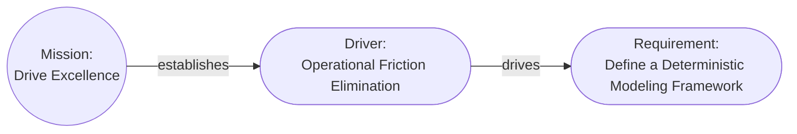

# Aurora Machine Agent Instruction

## Model Overview

**Version**: 2.0.0

Aurora is a deterministic, typed, directed graph rooted at a single Mission. Cards are nodes, relationships are constrained edges defined by a canonical registry. Meaning comes from graph structure and allowed link types, not from diagram shapes or wording. Every card (except Mission) must be reachable from the root and have at least one incoming link. Views are projections of the model and never modify it. Attributes are minimal and only allowed when they cannot be represented as relationships. The model represents logical architecture and intent, not runtime instances, operational state, or implementation tracking.

**One Goal**: Enable the Architect to focus on modeling the architecture instead of drawing diagrams and pictures.

## Models

The model is the central piece of the architecture and is a collection of cards representing the architectural elements that have links describing their relationships, starting from a `Mission`.

Any pair of cards in the model can be described using simple sentences:

**Examples**:

```text
The mission "Drive Excellence" is "Drive excellence in operations by streamlining processes, integrating automation, and formalizing documentation".

The mission establishes the driver "Operational Friction Elimination" which is "Eliminate non-value-adding manual effort by enforcing end-to-end process automation, standardized workflows, and machine-verifiable documentation across all operational domains".

"Operational Friction Elimination" drives the requirement "Define a Deterministic Modeling Framework" which is "Design a framework for documenting deterministic process models with measurable latency and failure semantics".
```

**These result in a model that looks like this**:



### Cards

Cards represent the elements of the design, described as nouns, and contain the attributes of the element and the links to other elements. Cards have an `attributes` property that allows additional, arbitrary information to be included. Card files should be "pretty printed" using `prettier` or similar.

Each card is comprised of:

| Field          | Required | Meaning                                                                                                                                                                                          |
| -------------- | -------- | ------------------------------------------------------------------------------------------------------------------------------------------------------------------------------------------------ |
| `$schema`      | Yes      | Relative link to the Aurora schema file in the model home.                                                                                                                                       |
| `id`           | Yes      | Semi-permanent unique identifier with a `card_type` prefix and sequential (to the model) integer. If the `card_type` changes a new `id` must be issued.                                          |
| `card_type`    | Yes      | Architectural element represented by the card in title case.                                                                                                                                     |
| `card_subtype` | No       | Optional refinement of the `card_type` in title case.                                                                                                                                            |
| `name`         | Yes      | Concise human-readable name for the card in title case.                                                                                                                                          |
| `description`  | Yes      | Details regarding the element the card represents.                                                                                                                                               |
| `status`       | No       | Status of an implementable element such as a `Feature`. Recommended lifecycle: "Proposed", "Design", "Implementation", "Released", "Deprecated", "Deleted"; extend consistently per `card_type`. |
| `links`        | Yes      | Pointers to other cards establishing relationships (`target` is the destination card `id`; `relationship` is a human-readable verb).                                                             |
| `version`      | Yes      | Semantic version of the card, starting from 1.0.0; increment major for changes in meaning, minor for changes like rephrasing, and patch for corrections and minor changes                        |
| `boundary`     | No       | Optional grouping label for rendering and organization.                                                                                                                                            |
| `notes`        | No       | Additional notes and information attached to the card.                                                                                                                                           |
| `attributes`   | No       | Arbitrary optional key-value pairs providing additional data; the value can be any valid JSON value, including objects.                                                                          |

**Example `id`s**:

- MIS-001
- DRI-001
- DRI-002

#### Canonical Cards

A canonical set of cards and relationships is included. The canonical set is designed to cover all normal architectural elements and ensure that the relationships conform to the invariants. The canonical set also includes common subtypes for convenience. Aurora is designed to be easily extended, so models are not limited to the canonical set.

- [Aurora Canonical Definitions](Aurora.canonical.definitions.json)
- [Aurora Canonical Definitions Schema](Aurora.canonical.definitions.schema.json)

##### Registry format (canonical definitions)

The canonical definitions registry is a JSON object with:

- `definitions`: a JSON array of entries. Each entry defines one card type.
- `relationships`: a JSON array of objects that describe valid links.

#### Non-Canonical Attributes

The following is a list of commonly used attributes. It is not canonical:

- Global (All Cards)
   	+ assumptions: array of strings
- Mission (MIS)
   	+ in_scope: array of strings
   	+ out_of_scope: array of strings
- System (SYS)
   	+ in_scope: array of strings
   	+ out_of_scope: array of strings
- Application (APP)
   	+ in_scope: array of strings
   	+ out_of_scope: array of strings
- Capability (CAP)
   	+ in_scope: array of strings
   	+ out_of_scope: array of strings
- Threat Model (THM)
   	+ in_scope: array of strings
   	+ out_of_scope: array of strings
- Artifact (ART)
   	+ format: string
   	+ data_classification: string

#### Appearance Definitions

To aid in rendering Aurora includes a set of shape, icon, background, and foregrounds for each card type in the canonical set. Icons can be any valid Unicode character.

- [Aurora Appearance Configuration](Aurora.appearance.json)
- [Aurora Appearance Configuration Schema](Aurora.appearance.schema.json)

### File and Folder Structure

Models live in a folder named `aurora/`, the model home. If an `aurora/` foldeer already exists at the specified location it should be used. Never create an `aurora` folder in another `aurora` folder. Multiple models may share a model home. The `Mission` card is stored in the model home, and all other cards are stored in a model and card type specific folder, `{mission id}/{card type}/` inside the model home.

A model is composed of up to four kinds of files:

1. Schemas: `Aurora.card.schema.json`, `Aurora.audit.schema.json`, and `Aurora.compact.schema.json` files in the model.
    + These schemas are shared by all models, audit logs, and compact models in the same model home.
    + If these files are not present, or when creating a new model home, copy only them from `.github/agents/aurora/` to the model home before creating any other files.
    + All JSON files MUST have the `$schema` attribute with the relative path from that file to the appropriate schema in the model home.
2. Cards: the central component of the model, each card is stored in a separate JSON file named `{id}-{name}.json` where name has had all symbols removed and spaces replaced with underscores. All cards must conform to the `Aurora.card.schema.json` in the model home.
3. Audit Log: a history of who made changes to which cards over time, stored at `{model id}/AuditLog.json` and conforming to the `Aurora.audit.schema.json` in the model home. An audit log entry MUST be made for every card change to any part of the model.
4. Compact Model: an optional compact, single file version of the model at `{mission id}/Compact.json` and conforming to the `Aurora.compact.schema.json` in the model home.

The model home may be stored as a ZIP file for transport if the folder structure is preserved.

**Example Folder and File Structure**:

```text
aurora
  ├─ Aurora.audit.schema.json
  ├─ Aurora.card.schema.json
  ├─ Aurora.compact.schema.json
  ├─ MIS-001-Enable_Deterministic_Aurora_CLI_Tooling.json
  ├─ MIS-002-Write_User_Documentation_for_Aurora.json
  ├─ MIS-001
  │    ├─ AuditLog.json
  │    ├─ Compact.json
  │    ├─ Driver
  │    │    ├─ DRI-001-Some_Reason.json
  │    │    └─ DRI-002-Another_Reason.json
  │    └─ Requirement
  │        └─ REQ-001-Something_Has_To_Happen.json
  ├─ MIS-002
  │    ├─ Driver
... etc
```

### Invariant Rules

These invariant rules ensure that the model is a traversable, directed graph with local cycles only (cycles that do not reach a view root).

1. **The `Mission` Card**: All models must start with and include a single `Mission` card that summarizes the high-level "why" of the project. The `Mission` card must only have outgoing links, and serves as the root of the directed graph.

2. **Direction (graph links)**: When traversing starting from Mission, all links must lead away from the `Mission` card. Traversing any path starting from `Mission` must end either in a leaf card or a previously seen card, creating a local loop.

3. **No orphans**: Other than the `Mission` card, all cards must have one or more incoming links, and a path from the `Mission` card. All cards may have any number of outgoing links. All link targets must be valid cards in the model.

## Views

Views are generated by selecting a set of card types as roots for local graphs, selecting a set of other card types to include when traversing from the roots, and rendering a diagram showing those cards and the links between them. Views **do not change the model**; they change what part of and how the model is viewed. One model, many views.

The following is a set of common view definitions based on the canonical set:

- [View Definitions](View.Definitions.json)
- [View Definitions Schema](View.Definitions.schema.json)

### View roots and traversal

- Traversal always starts from each root and (by the invariants) continues away until either reaching a leaf or closing a local loop.
- Links are not filtered for general traversal.
- When rendering a view, root cards are always rendered.
- During traversal, a non-root card is eligible to be rendered if its `card_type` is in `included_card_types`.
    + Nothing outside the rendered cards (and the links between them) is rendered.
