# Aurora Machine Agent Instruction

## Model Overview

**Version**: 2.0.0

Aurora is a deterministic architectural model where architectural elements are cards, relationships between cards are links, and the model forms a directed graph. The model is designed so that any interpretation (such as view diagrams) can be generated from the model, and for direct machine consumption by LLMs, agents, reasoners, and automated tools. The model invariants guarantee unambiguous interpretation and reasoning about the model.

Semantics are derived from the invariant rules: cards and relationship verbs are descriptive only, and meaning comes from interpretation (views, impact analysis, traceability).

**One Goal**: Enable the Architect to focus on modeling the architecture instead of drawing diagrams and pictures.

## Canonical registries

These files are the canonical registries for the Aurora vocabulary and should be updated instead of duplicating lists in this document:

- [Card Definitions](details/Card_Definitions.md)
- [View Definitions](details/View_Definitions.md)
- [Relationship Definitions](details/Relationship_Definitions.md)

## Models

The model is the central piece of the architecture: a collection of cards connected by links, starting from a `Mission` card. Cards are nouns (elements of the design). Links describe how elements relate and interact, and are tagged with verbs (for human convenience).

Any pair of cards in the model can be described using simple sentences:

**Examples**:

```text
The mission "Drive Excellence" is "Drive excellence in operations by streamlining processes, integrating automation, and formalizing documentation".

The mission establishes the driver "Operational Friction Elimination" which is "Eliminate non-value-adding manual effort by enforcing end-to-end process automation, standardized workflows, and machine-verifiable documentation across all operational domains".

"Operational Friction Elimination" drives the requirement "Define a Deterministic Modeling Framework" which is "Design a framework for documenting deterministic process models with measurable latency and failure semantics".

The capability "Deterministic Process Authoring & Validation Workflow" which is "A machine-verifiable, executable representation of every operational workflow with deterministic guarantees" satisfies the requirement "Define a Deterministic Modeling Framework".

The feature "Deterministic Workflow Modeling Engine (DWME)" which is "Software tools to create, manage, and render machine-verifiable executable representations of operational workflows" satisfies the requirement "Define a Deterministic Modeling Framework" and enables the capability "Deterministic Process Authoring & Validation Workflow".

The mission necessitates the system "Workflow Model Tooling" which integrates the application "Workflow Modeler".

Workflow Modeler implements the feature "Deterministic Workflow Modeling Engine".
```

**These result in a model that looks like this**:

```mermaid
%%{init: {'flowchart': {'defaultRenderer': 'elk'}, 'themeVariables': { 'clusterBkg': 'transparent' }}}%%
graph LR
	drive_excellence(("`Mission:<br />Drive Excellence`"))
	operational_friction_elimination(["`Driver:<br />Operational Friction Elimination`"])
	define_a_deterministic_modeling_framework(["`Requirement:<br />Define a Deterministic Modeling Framework`"])
	deterministic_process_authoring(["`Capability:<br />Deterministic Process Authoring & Validation Workflow`"])
	deterministic_workflow_modeling_engine(["`Feature:<br />Deterministic Workflow Modeling Engine (DWME)`"])
	workflow__model_tooling["`System:<br />Workflow Model Tooling`"]@{shape: div-rect}
	workflow_modeler["`Application:<br />Workflow Modeler`"]@{shape: lin-rect}

	drive_excellence -- establishes --> operational_friction_elimination
	operational_friction_elimination -- drives --> define_a_deterministic_modeling_framework
	deterministic_process_authoring -- satisfies --> define_a_deterministic_modeling_framework
	deterministic_workflow_modeling_engine -- satisfies --> define_a_deterministic_modeling_framework
	deterministic_workflow_modeling_engine -- enables --> deterministic_process_authoring
	drive_excellence -- necessitates --> workflow__model_tooling
	workflow__model_tooling -- integrates --> workflow_modeler
	workflow_modeler -- implements --> deterministic_workflow_modeling_engine
```



### Cards

A card contains information about an element of the model and links to other elements. See [Model Overview](#model-overview) for determinism and semantics. Cards also have an `attributes` property for additional arbitrary information. Card files should be "pretty printed" using `prettier`.

Each card is comprised of:

| Field          | Required | Meaning                           |
| -------------- | -------- | --------------------------------- |
| `$schema`      | Yes      | Schema reference.                 |
| `id`           | Yes      | Stable unique identifier.         |
| `card_type`    | Yes      | Card type (title case).           |
| `card_subtype` | No       | Optional card type refinement.    |
| `name`         | Yes      | Human-readable name (title case). |
| `description`  | Yes      | Card description.                 |
| `status`       | No       | Optional lifecycle status.        |
| `links`        | No       | Outgoing relationship links.      |
| `audit_trail`  | Yes      | Semver audit history.             |
| `attributes`   | No       | Additional optional data.         |

Field semantics:

- `$schema`: Relative link to the Aurora schema file included with the model(s) in the model home.
- `id`: Unique (to the model) identifier with a `card_type` prefix and sequential integer. Once issued, the `id` MUST NOT change; if `card_type` changes, issue a new card and move the original to `status` "Deleted" with an audit history entry.
- `card_type`: Architectural element represented by the card in title case. See [Card Definitions](details/Card_Definitions.md).
- `card_subtype`: Optional refinement of the `card_type` in title case.
- `name`: Concise human-readable name for the card in title case.
- `description`: Details regarding the element the card represents.
- `status`: Status of an implementable element such as a `Feature`. Recommended lifecycle: "Proposed", "Design", "Implementation", "Released", "Deprecated", "Deleted"; extend consistently per `card_type`.
- `links`: Pointers to other cards establishing relationships (`target` is the destination card `id`; `relationship` is a human-readable verb).
- `audit_trail`: Semver audit: major for meaning changes or `Deleted`, minor for non-meaning updates, patch for typos; include history entries with `editor`, RFC3339 `timestamp`, and `event` (`created`, `edited`, `deleted`); optional SHA256 `hash` uses `null` placeholder for calculation.
- `attributes`: Arbitrary optional key-value pairs providing additional data; the value can be any valid JSON value, including objects.

### IDs, files, and layout

#### Example IDs

- MIS-001
- DRI-001
- DRI-002

#### File format and naming rules

- You MUST use the extension `jsjson`. JSJSON files are functionally identical to JSON files.
- Any time the `name` property is used in a file name, the spaces MUST be replaced with underscores (`Sanitized_Name`).

#### Model layout rules

- Model home: `aurora/` contains `Aurora.schema.jsjson`, `Aurora.compact.schema.jsjson`, and root `Mission` card files. Mission cards are placed in the model home to provide a consistent, easy-to-find starting point.
- Root `Mission` file name: `MIS-###-<Sanitized_Name>.jsjson`, using sequential numbering per card type.
- Mission home: `aurora/<MISSION_ID>/` with subfolders per `card_type`; all other cards are stored as `<CARD_ID>-<Sanitized_Name>.jsjson`.
- All cards conform to `Aurora.schema.jsjson`; if missing, copy `.github/instructions/details/Aurora.schema.jsjson` before creating the first `Mission` card.
- Optional compact model: `AGENT-<MISSION_ID>.jsjson` in the model home, conforming to `Aurora.compact.schema.jsjson`, with a top-level `cards` array and `audit_trail` removed; copy `.github/instructions/details/Aurora.compact.schema.jsjson` if missing. The compact file should not be "pretty-printed" to save whitespace.
- The model home may be stored as a ZIP file if the folder structure is preserved.

**Example Folder and File Structure**:

```text
aurora
  ├─ Aurora.schema.jsjson
  ├─ Aurora.compact.schema.jsjson
  ├─ MIS-001-Enable_Deterministic_Aurora_CLI_Tooling.jsjson
  ├─ MIS-002-Write_User_Documentation_for_Aurora.jsjson
  ├─ MIS-001
  │    ├─ Driver
  │    │    ├─ DRI-001-Do_Something.jsjson
  │    │    └─ DRI-002-Do_Something_Else.jsjson
  │	   └─ Requirement
  │	   	    └─ REQ-001-Can_Do_Something.jsjson
  ├─ MIS-002
  │    ├─ Driver
... etc
```

#### Common Cards

The canonical card palette, prefixes, and common subuses (subtypes) are defined in [Card Definitions](details/Card_Definitions.md).

#### Common Relationships

Relationship verbs are descriptive (see [Model Overview](#model-overview)). The canonical registry of relationships (including allowed source and target card types, and the full list of verbs defined or used by Aurora) is [Relationship Definitions](details/Relationship_Definitions.md).

#### Special cards

Each special card follows the standard card fields plus the exceptions noted below.

##### `Mission`

- Purpose: Root of the model that captures the overarching purpose.
- Required fields: Standard card fields.
- Allowed links: Outgoing only; no incoming links.

##### `Boundary` (BND)

- Purpose: Logical grouping of other cards.
- Required fields: Standard card fields; optional `attributes.recursive` boolean (default false).
- Allowed links: Parent includes the `Boundary`; the `Boundary` contains a single target card, in parallel to another link between parent and target.
- Exception: When `recursive` is true, the boundary includes all descendants of the target in the current view; traversal must avoid loops.

##### `Note` (NOT)

- Purpose: Annotation on another card; does not add new model elements.
- Required fields: Standard card fields.
- Allowed links: Incoming only; always a leaf node.

### Logical Structure

The logical structure of Aurora is designed to be easily extended to meet the needs of any architecture. While the structure and rules here are inviolate, they do not limit what is represented in the model and impose only necessary limitations on links.

By using `Boundary` cards and card subtypes almost any structure can be mapped onto a model.

### Invariant Rules

1. **The `Mission` Card**: All models must start with and include a single `Mission` card that summarizes the high-level "why" of the project. The `Mission` card must only have outgoing links, and serves as the root of a directed graph.

2. **Direction (graph links)**: All links must lead away from the `Mission` card. There must be a route from `Mission` to every card. The graph is not acyclic; local loops can and often do exist, for example when a state model returns to the starting state. Traversing any path starting from `Mission` must have an increasing number of links and end either in a leaf card or a previously seen card (local loop).

3. **Hierarchy**: The model forms a directed graph rooted in the `Mission` card. Local cycles are allowed for bounded subgraphs such as state machines (for example: `State` → `Condition` → `State`) and event/action-driven transitions, as long as no link creates a path back to `Mission`. This ensures that all loops terminate locally.

4. **Semantics**: See [Model Overview](#model-overview). Relationship verbs are descriptive; meaning comes from interpretation.

5. **Every other card**: Other than the `Mission` card, all cards must have at least one incoming link. They must also have a path from the `Mission` card. These cards may have more than one incoming or any number of outgoing links.

6. **Validation**: All `links[].target` values must reference existing cards by `id`.

7. **Annotative Cards**: The `Boundary` and `Note` cards are not semantically meaningful in the graph; the `Boundary` exists to delineate logical segments, and the `Note` exists to provide additional information for implementers.

## Views

Views are generated by selecting a set of card types (and optionally subtypes) to include and rendering a diagram showing those cards, and the links between them. Views always include the `Boundary` and `Note` cards that have incoming links from other graph cards. Views **do not change the model**; they change what part of and how the model is viewed. One model, many views.

In general, a view should display the `card_type`, `card_subtype`, and `name` fields as the text for each node.

## Default Tooling

### `aurora_cli`

Inputs and outputs are not required. When the model is at `docs/design/aurora/` and the output is `docs/design/`, this is the usual layout. The CLI defaults to  `docs/design/aurora/` for input.

**Simple Validation**:

```text
aurora_cli validate
```

**Simple Generation**:

```text
aurora_cli render-all -o docs/design/
```

**Other Commands**:

```text
aurora_cli [OPTIONS] <COMMAND>

Commands:
  validate
  render-aurora
  render-views
  render-all
  compact
  bump-patch
  bump-minor
  bump-major
  help           Print this message or the help of the given subcommand(s)

Options:
  -i, --input <INPUT_PATH>  [default: docs/design/aurora/]
  -l, --log <LOG_LEVEL>     [default: INFO]
  -h, --help                Print help
  -V, --version             Print version
```
