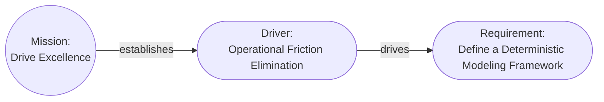

# Aurora Machine Agent Instruction

## Model Overview

**Version**: 2.0.0

Aurora is a deterministic architectural model designed so that any interpretation, such as view diagrams, can be generated from the model; and for direct machine consumption by LLMs, agents, reasoners, and automated tools. The model invariants guarantee unambiguous interpretation and reasoning about the model.

Semantics are derived from the invariant rules: relationship verbs are descriptive only, and meaning comes from interpretation (views, impact analysis, traceability).

**One Goal**: Enable the Architect to focus on modeling the architecture instead of drawing diagrams and pictures.

## Models

The model is the central piece of the architecture and is a collection of cards representing the architectural elements that have links describing their relationships, starting from a `Mission`.

Any pair of cards in the model can be described using simple sentences:

**Examples**:

```text
The mission "Drive Excellence" is "Drive excellence in operations by streamlining processes, integrating automation, and formalizing documentation".

The mission establishes the driver "Operational Friction Elimination" which is "Eliminate non-value-adding manual effort by enforcing end-to-end process automation, standardized workflows, and machine-verifiable documentation across all operational domains".

"Operational Friction Elimination" drives the requirement "Define a Deterministic Modeling Framework" which is "Design a framework for documenting deterministic process models with measurable latency and failure semantics".
```

**These result in a model that looks like this**:



### Cards

Cards represent the elements of the design, described as nouns, and contain the attributes of the element and the links to other elements. Cards have an `attributes` property that allows additional, arbitrary information to be included. Card files should be "pretty printed" using `prettier` or similar.

Each card is comprised of:

| Field                 | Required | Meaning                                                                                                                                                                                          |
| --------------------- | -------- | ------------------------------------------------------------------------------------------------------------------------------------------------------------------------------------------------ |
| `$schema`             | Yes      | Relative link to the Aurora schema file in the model home.                                                                                                                                       |
| `id`                  | Yes      | Semi-permanent unique identifier with a `card_type` prefix and sequential (to the model) integer. If the `card_type` changes a new `id` must be issued.                                          |
| `card_type`           | Yes      | Architectural element represented by the card in title case.                                                                                                                                     |
| `card_subtype`        | No       | Optional refinement of the `card_type` in title case.                                                                                                                                            |
| `name`                | Yes      | Concise human-readable name for the card in title case.                                                                                                                                          |
| `description`         | Yes      | Details regarding the element the card represents.                                                                                                                                               |
| `status`              | No       | Status of an implementable element such as a `Feature`. Recommended lifecycle: "Proposed", "Design", "Implementation", "Released", "Deprecated", "Deleted"; extend consistently per `card_type`. |
| `links`               | Yes      | Pointers to other cards establishing relationships (`target` is the destination card `id`; `relationship` is a human-readable verb).                                                             |
| `audit_trail`         | Yes      | `version`: Semver, change major for meaning changes or deletions, minor for non-meaning updates, patch for typos; includes a history                                                             |
| `audit_trail.history` | Yes      | A record of edits; entries consist of an RFC3339 `timestamp`, `editor`, and `event` - one of "created", "edited", "deleted".                                                                     |
| `attributes`          | No       | Arbitrary optional key-value pairs providing additional data; the value can be any valid JSON value, including objects.                                                                          |

**Example `id`s**:

- MIS-001
- DRI-001
- DRI-002
- REQ-001
- REQ-002

#### Canonical Cards and Relationships

A canonical set of cards and relationships is included. The canonical set is designed to cover all normal architectural elements and ensure that the relationships conform to the invariants. Aurora is designed to be easily extended, so models are not limited to the canonical set.

- [Canonical Cards](../agents/details/1-Card_Definitions.json)
- [Canonical Relationship Verbs](../agents/details/2-Relationship_Definitions.json)

#### Special cards

Each special card follows the standard card fields plus the exceptions noted below.

##### `Mission`

- Purpose: Root of the model that captures the overarching purpose.
- Required fields: Standard card fields.
- Allowed links: Outgoing only; no incoming links.

##### `Boundary`

- Purpose: Logical grouping of other cards.
- Required fields: Standard card fields; optional `attributes.recursive` boolean (default false).
- Allowed links: a single "includes" incoming link and one or more "contains" outgoing links. A `Boundary` is a logical grouping and does not replace semantic links; it always exists in parallel to them.
- Rendering: When `recursive` is true, the boundary includes all descendants of the target _in the current view_.

##### `Note`

- Purpose: Annotation on another card; does not add new model elements.
- Required fields: Standard card fields.
- Allowed links: Incoming only; always a leaf node.

### Invariant Rules

These invariant rules ensure that the model is a traversable, directed graph with local cycles only.

1. **The `Mission` Card**: All models must start with and include a single `Mission` card that summarizes the high-level "why" of the project. The `Mission` card must only have outgoing links, and serves as the root of the directed graph.

2. **Direction (graph links)**: When traversing starting from Mission, all links must lead away from the `Mission` card. There must be a route from `Mission` to every card. Traversing any path starting from `Mission` must end either in a leaf card or a previously seen card, creating a local loop.

3. **No orphans**: Other than the `Mission` card, all cards must have one or more incoming links, and a path from the `Mission` card. With the exception of `Note`, all cards may have any number of outgoing links. All link targets must be valid cards in the model.

### Model Storage

- The model home is a folder named `aurora/`.
- Each root `Mission` is named `MIS-{number}-{name_with_underscores}.json`. All other cards are named `{id}.json`.
- The `Mission` card is stored in the model home. Multiple models may share a model home.
- All other cards are in a folder named for the `Mission.id`, e.g., `aurora/{mission id}/`, with subfolders per `card_type`.
- An optional compact model named `{mission id}.agent.json` may exist in the model home.
- The model home must contain the schema files: `Aurora.schema.json` and `Aurora.compact.schema.json`.
   	+ If missing, copy them from `.github/agents/details/` before creating the first `Mission` card.
   	+ All cards must conform to the `Aurora.schema.json` schema. The compact model must conform to `Aurora.compact.schema.json`.
- The model home may be stored as a ZIP file if the folder structure is preserved.

**Example Folder and File Structure**:

```text
aurora
  ├─ Aurora.schema.json
  ├─ MIS-001-Enable_Deterministic_Aurora_CLI_Tooling.json
  ├─ MIS-002-Write_User_Documentation_for_Aurora.json
  ├─ MIS-001
  │    ├─ Driver
  │    │    ├─ DRI-001.json
  │    │    └─ DRI-002.json
  │	   └─ Requirement
  │	   	    └─ REQ-001.json
  ├─ MIS-002
  │    ├─ Driver
... etc
```

## Views

Views are generated by selecting a set of card types (and optionally subtypes) as roots for local graphs, selecting a set of other card types (and optionally subtypes) to include when traversing from the roots, and rendering a diagram showing those cards and the links between them. Views **do not change the model**; they change what part of and how the model is viewed. One model, many views.

A set of common views can be found in [View Definitions](../agents/details/3-View_Definitions.json).

## Default Tooling

### `aurora_cli`

- Validates models
- Generates human readable Markdown copies
- Generates Markdown files containing views
- Generates the compact model files
