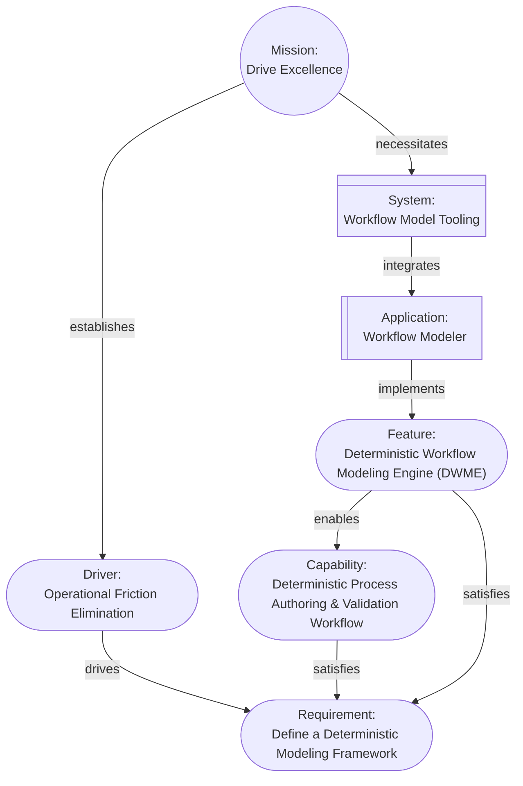
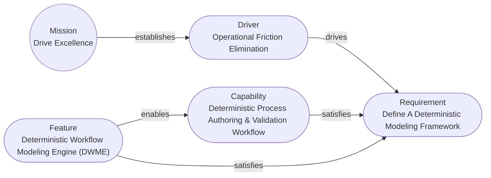
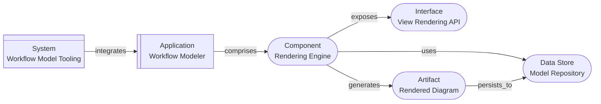
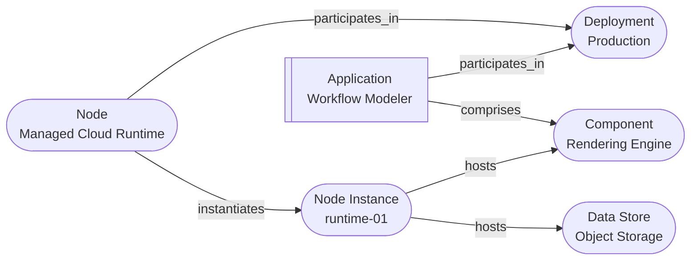
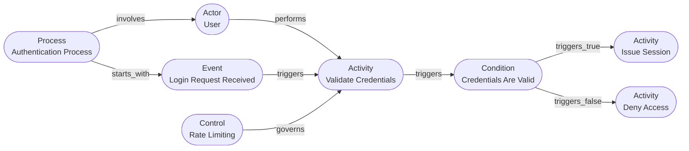
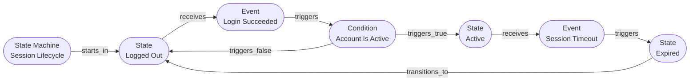

# Aurora Machine Agent Instruction

## Model Overview

**Version**: 2.0.0

Aurora is a deterministic architectural model where architectural elements are cards, the relationships between cards are represented as links, and the model forms a Directed Graph. The model is designed for direct machine consumption by LLMs, agents, reasoners, and automated tools; in addition any view a human wants can be automatically generated.

**One Goal**: Enable the Architect to focus on modeling the architecture instead of drawing diagrams and pictures.

## Models

The model is the central piece of the architecture and is a collection of cards that have links describing their relationships. Cards represent the elements of the design, described as nouns. Links represent how the elements interact, and are tagged with verbs (for human convenience).

Any pair of cards in the model can be described using simple sentences:

**Examples**:

```text
The mission "Drive Excellence" is "Drive excellence in operations by streamlining processes, integrating automation, and formalizing documentation".

The mission establishes the driver "Operational Friction Elimination" which is "Eliminate non-value-adding manual effort by enforcing end-to-end process automation, standardized workflows, and machine-verifiable documentation across all operational domains".

"Operational Friction Elimination" drives the requirement "Define a Deterministic Modeling Framework" which is "Design a framework for documenting deterministic process models with measurable latency and failure semantics".

The capability "Deterministic Process Authoring & Validation Workflow" which is "A machine-verifiable, executable representation of every operational workflow with deterministic guarantees" satisfies the requirement "Define a Deterministic Modeling Framework".

The feature "Deterministic Workflow Modeling Engine (DWME)" which is "Software tools to create, manage, and render machine-verifiable executable representations of operational workflows" satisfies the requirement "Define a Deterministic Modeling Framework" and enables the capability "Deterministic Process Authoring & Validation Workflow".

The mission necessitates the system "Workflow Model Tooling" which integrates the application "Workflow Modeler".

Workflow Modeler implements the feature "Deterministic Workflow Modeling Engine".
```

**These result in a model that looks like this**:



### Cards

A card contains the information about an element of the model. The cards themselves and the links between them do not encode semantic meaning; they represent the elements of the architecture and their connections.

Each card is comprised of:

- `$schema` - the relative link to the Aurora schema file included with the model(s). The schema used to construct the model MUST be placed in the same folder as the `Mission` card. Multiple models sharing the same `aurora` folder MUST share the same schema.
- `id` - A unique identifier assigned to the card composed from a predefined prefix per `card_type` followed by a sequentially assigned integer per card type. Once issued to a card the `id` MUST NOT change.

**Example Names**:

- MIS-001
- DRI-001
- DRI-002
- REQ-001
- REQ-002

- `card_type` - The architectural element represented by the card in title case. See [Common Cards](#common-cards) for examples
- `card_subtype` - An optional refinement of the `card_type` in title case. See [Common Cards](#common-cards) for examples.
- `name` - A concise human-readable name for the card in title case
- `description` - Details regarding the element the card represents
- `status` - the status of an implementable element such as a `Feature`, in title case
	+ One of: "Proposed", "Backlog", "Design", "Implementation", "Review", "Pre-Release", "Deployed", "Deprecated", "Retired".
	+ or any other series of lifecycle states that make sense for the model may be used, as long as they are kept consistent per type across the model.
- `links` - pointers to other cards establishing relationships
	+ `target` - the destination card `id`
	+ `relationship` - verb describing the impact for human reference.
- `audit_trail` - a record of the version and a history of the events (created/edited/deleted) the card has been through
	+ `version` - A semver version number for the card that is incremented when the card changes. The major version is incremented for changes which alter the meaning or definition of the element, such as the changing the `card_type`, `card_subtype`, or `name`; or `description` changing in a way that alters the meaning. The minor version is incremented for changes which do not alter the elements definition, such as a revision to the phrasing of the `description` that does not alter the meaning, or a change in `status`. Insignificant changes, such as typographic or grammatic corrections increase the patch.
	+ `hash` - an SHA256 hash of the card with the hash temporarily set to `null` to calculate the hash
	+ `history` - an array of objects capturing the audit history of the card
		* `editor` - the identity of the entity making the change. Agents should use the name of their host (e.g. "Copilot") and, if acting as a particular role, a colon followed by a space and the agent role name, for example "Copilot: BackendDeveloper".
		* `timestamp` - the UTC time of the edit in RFC3339 format with millisecond resolution
		* `event` - the type of change event, one of: `created`, `edited`
- `attributes` - Arbitrary, optional key-value pairs providing additional data; the value can be any valid JSON value, including objects. See [Common Cards](#common-cards) for examples.

#### Common Cards

The following list contains a set of common cards (enough for a complete model) that can be used as a starting point. It is a refined, internally consistent card list aligned to the Aurora semantics, BPMN-inclusive, and AI-friendly. The prefix for file names is in parentheses after the card type and colon.

- **Mission**: (MIS) The fundamental purpose that gives the model intent and meaning and from which all drivers originate.
	+ Examples: "Modernize operations through automation", "Protect sensitive information at scale", "Enable reliable digital service delivery", "Ensure regulatory compliance and trust", "Support equitable access to services"

- **Driver**: (DRI) A motivating force that explains why requirements exist.
	+ Examples: "Grow Responsibly", "Comply with Laws, Rules, and Regulations", "Prevent Data Breaches", "Reduce Operational Risk", "Improve User Trust"

- **Requirement**: (REQ) A verifiable statement of need or obligation that must be satisfied.
	+ Examples: "Users are authenticated", "Access to resources is controlled", "Security-relevant events are recorded", "Users can recover account access", "Transaction history is maintained"

- **Capability**: (CAP) A stable, implementation-independent ability required to satisfy one or more requirements.
	+ Examples: "Authenticate identities", "Authorize actions", "Manage configuration changes", "Monitor operational health", "Respond to security incidents"

- **Feature**: (FEA) An externally observable system behavior that realizes one or more requirements.
	+ Examples: "Single sign-on using an external identity provider", "Document upload and download", "Administrative approval workflow", "Audit log viewer", "Password reset via email link"

- **System**: (SYS) A bounded collection of interacting applications organized to achieve a mission.
	+ Examples: "Identity and Access System", "Payment Processing System", "Customer Management System", "Monitoring and Alerting System", "Content Delivery System"

- **Application**: (APP) A deployable software system that implements features.
	+ Examples: "Web Portal", "Mobile Application", "Background Service", "API Provider", "Desktop Console"

- **Component**: (COM) A modular unit with a single responsibility and explicit interfaces.
	+ Examples: "User Interface", "Authorization Service", "Notification Dispatcher", "Data Ingestion Pipeline", "Reporting Engine"

- **Interface**: (INT) A defined contract governing interaction across a boundary.
	+ Examples: "Authentication API", "GraphQL API", "Command Line Interface", "Webhook Endpoint", "Message Consumer Interface"

- **Artifact**: (ART) A concrete work product produced or consumed by the system.
	+ Examples: "Configuration File", "Executable Binary", "Deployment Package", "Generated Report", "Log File"

- **Asset**: (AST) Information or resources that have value and require protection or management.
	+ Examples: "User Credentials", "Customer Personal Data", "Transaction Records", "System Configuration Data", "Audit Logs"

- **Data Store**: (DTS) A persistent resource that robustly stores and recovers data for its intended lifetime.
	+ Examples: "Database", "File System", "Cache", "Message Queue", "Object Storage"

- **Deployment**: (DEP) A defined environment or configuration in which software is executed.
	+ Examples: "Development", "Integration Test", "User Acceptance Test", "Production", "Disaster Recovery"

- **Node**: (NOD) A logical or physical execution environment capable of hosting components or data stores.
	+ Examples: "Virtual Machine", "Docker Container", "Physical Server", "Edge Device", "Managed Cloud Runtime"

- **Node Instance**: (NIN) A concrete, identifiable runtime realization of a node.
	+ Examples: "app-server-03", "db-primary-us-east-1", "container-instance-7f9c8d", "edge-node-12", "worker-node-a"

- **Process**: (PRO) An ordered sequence of activities and decisions required to enable a capability.
	+ Examples: "Authentication Process", "Customer Onboarding Process", "Incident Response Process", "Configuration Update Process", "Metrics Collection Process"

- **Activity**: (ATV) A unit of behavior performed by an actor as part of a process.
	+ Examples: "Log In", "Submit Form", "Review Request", "Approve Change", "Reset Password"

- **Actor**: (ACT) An external role that interacts with the system or imposes obligations on it.
	+ Examples: "User", "Administrator", "Support Agent", "Threat Actor", "Department of the Treasury"

- **Story**: (STR) A concise narrative expressing a desired behavior or outcome from an actor’s perspective.
	+ Examples: "User logs in to access their account", "Administrator resets a user password", "Customer cancels an order", "Operator investigates a security alert", "Regulator reviews compliance evidence"

- **Event**: (EVT) A discrete occurrence that initiates a process or triggers behavior.
	+ Examples: "Login request received", "Password reset requested", "Configuration change submitted", "Alert generated", "Message received"

- **State Machine**: (STM) A behavioral model defining allowable states and transitions.
	+ Examples: "User Account Lifecycle", "Order Fulfillment Lifecycle", "Session Lifecycle", "Incident Lifecycle", "Deployment Lifecycle"

- **State**: (STA) A persistent, observable condition of an element until a transition occurs.
	+ Examples: "Logged Out", "Pending Approval", "Active", "Suspended", "Completed"

- **Condition**: (CON) A binary predicate that evaluates to true or false and influences behavior.
	+ Examples: "User is authenticated", "Input is valid", "Account is active", "Quota is exceeded", "Error is detected"

- **Control**: (CTL) A mechanism that governs or constrains a process.
	+ Examples: "Authorization Check", "Input Validation", "Rate Limiting", "Approval Gate", "Encryption Enforcement"

- **Constraint**: (CNS) A rule or limitation that restricts allowable behavior or solutions.
	+ Examples: "GDPR data minimization requirement", "PCI-DSS encryption requirement", "Retain audit logs for seven years", "Maximum transaction value limit", "Accessibility compliance obligation"

- **Risk**: (RIS) The potential for loss or harm arising from threats and vulnerabilities.
	+ Examples: "Unauthorized account access", "Sensitive data exposure", "Service outage during peak usage", "Privilege escalation by insider", "Loss of audit trail integrity"

- **Threat**: (THR) A potential cause of an unwanted impact on the system or mission.
	+ Examples: "Data exfiltration", "Credential theft", "Denial of service", "Unauthorized configuration change", "Malware injection"

- **Test**: (TES) A defined procedure used to verify that a feature satisfies its requirements.
	+ Examples: "Verify successful user login", "Validate access denial without authentication", "Confirm password reset email delivery", "Ensure audit log entry is created", "Measure API response time under load"

- **Note**: (NOT) A non-structural annotation attached to another element.

#### Common Relationships

Links are intentionally free-form; the `relationship` verb is descriptive for humans and does not encode semantic meaning by itself. The following relationships appear in the examples in this document and are recommended conventions for consistency:

- `contains` - used by `Boundary` to indicate containment (structural membership)
- `includes` - used to indicate membership without containment (e.g., view/topology constructs like `Deployment`, and associating a parent element with a `Boundary` in a view)
- `establishes` - introduces a downstream motivation element (e.g., `Mission` → `Driver`)
- `drives` - indicates a motivating element influences a downstream need (e.g., `Driver` → `Requirement`)
- `satisfies` - indicates a downstream element fulfills a need (e.g., `Capability`/`Feature` → `Requirement`)
- `enables` - indicates an element makes another feasible/possible (e.g., `Feature` → `Capability`)
- `necessitates` - indicates a higher-level goal requires an element to exist (e.g., `Mission` → `System`)
- `integrates` - indicates a container/system pulls together sub-elements (e.g., `System` → `Application`)
- `comprises` - indicates composition (e.g., `Application` → `Component`)
- `implements` - indicates an element realizes another (e.g., `Component` → `Feature`)
- `exposes` - indicates an element provides an interface (e.g., `Component` → `Interface`)
- `generates` - indicates an element produces an artifact (e.g., `Component` → `Artifact`)
- `uses` - indicates a dependency or consumption (e.g., `Component` → `Artifact`)
- `to_call` - indicates an invocation path (e.g., `Artifact` → `Interface`)
- `persists_to` - indicates persistence of an artifact to storage (e.g., `Artifact` → `Data Store`)
- `validates` - indicates a test verifies behavior (e.g., `Test` → `Component`/`Feature`)
- `participates_in` - indicates involvement in a topology (e.g., `Application` → `Deployment`)
- `hosts` - indicates a runtime host relationship (e.g., `Node`/`Node Instance` → `Component`/`Data Store`)
- `instantiates` - indicates a node creates a runtime instance (e.g., `Node` → `Node Instance`)
- `involves` - indicates a process or mission includes an actor (e.g., `Process`/`Mission` → `Actor`)
- `desires` - indicates an actor has a story/goal (e.g., `Actor` → `Story`)
- `performs` - indicates an actor executes an activity (e.g., `Actor` → `Activity`)
- `explains` - indicates a story elaborates on a capability/feature (e.g., `Story` → `Capability`)
- `implies` - indicates a story suggests a constraint (e.g., `Story` → `Constraint`)
- `starts_with` - indicates the first event of a process (e.g., `Process` → `Event`)
- `receives` - indicates a state receives an event (e.g., `State` → `Event`)
- `starts_in` - indicates the initial state of a state machine (e.g., `State Machine` → `State`)
- `transitions_to` - indicates a transition edge (e.g., `State`/`Activity` → `State`)
- `triggers` - indicates an event/activity triggers another element (e.g., `Event` → `State`)
- `triggers_true` / `triggers_false` - indicates conditional branching outcomes (e.g., `Condition` → `State`)
- `limits` - indicates a constraint bounds another element (e.g., `Constraint` → `Feature`)
- `governs` - indicates control/assurance applies to an element (e.g., `Control` → `Capability`)
- `presents` - indicates an actor presents a threat (e.g., `Actor` → `Threat`)
- `imposes` - indicates a threat introduces a risk (e.g., `Threat` → `Risk`)
- `impacts` - indicates a risk affects another element (e.g., `Risk` → `Feature`)
- `mitigates` - indicates that a feature or capability addresses a risk (e.g., `Feature` → `Risk`)

#### Special cards

##### The `Mission` card

The root card of the model is _always_ a `Mission` card. The `Mission` card captures the overarching purpose and goal of the model. A given model must only have a single `Mission` card. All paths must lead away from the `Mission`.

##### The `Boundary` card

The `Boundary` card represents a logical grouping of other cards, in other words, they contain them. For simplicity in the model, a parent card includes a `Boundary` and a boundary contains a link to a single target card; in order to represent complex boundaries, a `Boundary` card may include an attribute named `recursive` (boolean, default false). If true, the boundary includes all descendants of the contained card (the contains target) in the current view. Because the cards contained by a boundary may form local loops rendering engines have to be careful when traversing the descendants. `Boundary` cards frequently "contain" `System`, `Application`, `Node`, `Process`, `State Machine`, and similar higher-level cards, and optionally their descendants. They are linked between a parent and the contained card, e.g., parent -- includes --> `Boundary` -- contains --> target, always in parallel to another link.

When recursing, descendants are determined by link traversal and then filtered to only those cards included in the current view. Tooling should consider warning when a recursive boundary could expand to an unusually large number of nodes in common views.

**Example of a Boundary in a Model**:

```mermaidconfig:
  layout: elkgraph LR
	a(A)
	boundary([Boundary])
	b(B)

	a -- verb --> b
	a -- includes --> boundary
	boundary -- contains --> b
```

**Example of a Boundary Rendered in a View**:

```mermaidconfig:
  layout: elk%%{init: {'themeVariables': { 'clusterBkg': 'transparent' }}}%%
graph LR
	a(A)

	subgraph Boundary
		b(B)
	end

	a -- verb --> b

classDef dashed stroke-dasharray:5 5;
class Boundary dashed
```

##### The `Note` Card

The `Note` card is purely an annotation to the model. They only have an incoming link and are always leaf nodes. The `Note` card does not add any new elements to the model; it expands on the target card and is for additional information. When rendered, the link to a `Note` card is often drawn as a dotted or dashed line.

**Example**:

```mermaidconfig:
  layout: elkgraph LR
	card[Card]
	note[Note]@{shape: card}

	card -.- note
```

#### Card Files

Cards are stored as JSON files, one file per card. The model always starts from the `Mission` and forms a directed graph. `Note` cards are leaf annotations (with only an incoming link) attached to another card. Files are named in the form `{id}.json`, matching the exact case of the `id`. If a `card_subtype` exists, name it as `{card_subtype}-{id}.json`.

The model is stored in a folder named `aurora`, with subfolders named for the `card_type` in title case, e.g., `aurora/Requirement`. The only exception is the `Mission` card, which should always be stored at `aurora/{name with spaces replaced with underscores}.json` to provide a consistent entry point.

If a repo has a `schemas/Aurora.schema.json` then that is the canonical version. Second, the version included with a particular model is canonical _to that model_ since it will be the version the model was built against. The copy at `.github/instructions/Aurora.schema.json` is for agent use; it should be updated if out of sync with the canonical version.

To prevent issues with validation across high-security environments and multiple schema versions, any tooling or agent starting a model should place a copy of the schema with the `Mission` card and require all card JSON files to include a `"$schema"` entry that points to that local copy.

An `aurora/` folder containing a schema copy and one or more Mission card files (`MIS-*.json`) is considered a model root. Each `Mission` card roots a separate model; multiple models may share the same `aurora/` folder.

An entire model may be stored in a ZIP-compressed file to allow for portability as long as the folder structure is preserved.

**Example**:

```text
aurora
  ├─ MIS-001.json
  ├─ Driver
  │    └─ DRI-001.json
  ├─ Requirement
  │	   └─ REQ-001.json
```

The exact format can be found in the canonical JSON schema at `schemas/Aurora.schema.json`.

### Logical Structure

The logical structure of Aurora is designed to be easily extended to meet the needs of any architecture. While the structure and rules here are inviolate, they do not limit what is represented in the model and impose only necessary limitations on links.

By using `Boundary` cards and card subtypes almost any structure can be mapped onto a model.

### Invariant Rules

1. **The `Mission` Card**: All models must start with a single `Mission` card that summarizes the high-level "why" of the project. The `Mission` card must only have outgoing links, and serves as the root of a directed graph.

2. **Direction (graph links)**: All links must lead away from the `Mission` card. There must be a route from `Mission` to every card. The graph is not acyclic; local loops can and often do exist, for example when a state model returns to the starting state.

3. **Hierarchy**: The model forms a directed graph rooted in the `Mission` card. Local cycles are allowed for bounded subgraphs such as state machines (for example: `State` → `Condition` → `State`) and event/action-driven transitions, as long as those links do not create a path out of the local area and back to `Mission`.

4. **Semantics**: links have a `relationship` field that describes them but does not convey semantic meaning by itself. The relationship is meant to describe how one element impacts another, primarily for humans. Semantic meaning is derived from the link and relationship when interpreted for a purpose, such as generating a view, performing impact analysis, or producing traceability narratives.

5. **Every other card**: Other than the `Mission` card, all cards must have at least one incoming link. They must also have a path from the `Mission` card. Cards may have more than one incoming or any number of outgoing links.

6. **Validation**: All `links[].target` values must reference existing cards by `id`.

## Views

Views are generated by selecting a set of card types (and optionally subtypes) to include and rendering a diagram showing those cards, and the links between them. Views **do not change the model**; they change what part of and how the model is viewed. One model, many views.

In general, a view should display the `card_type`, `card_subtype`, and `name` fields as the text for each node. The text should be wrapped in outer quotation marks and inner graves (back ticks), e.g., ``"`Type<br />Name Property'"`` or ``"`Type (subtype)<br />Name Property'"`` to allow the use of Markdown for formatting (like line breaks).

Our tools add a few enhancements to improve the look and readability of the diagrams:

- Mermaid shapes are used to help distinguish different types of cards.
- Boundaries are rendered as a dashed outline around the elements they contain.
- Links to `Note` cards are rendered as dotted lines.

## Examples of Common Views

### Everything View

- Cards included:
	+ All cards in the model (every `card_type` present).
	+ Common types include:
		* `Mission`
		* `Driver`
		* `Requirement`
		* `Capability`
		* `Feature`
		* `System`
		* `Application`
		* `Component`
		* `Interface`
		* `Artifact`
		* `Data Store`
		* `Asset`
		* `Deployment`
		* `Node`
		* `Node Instance`
		* `Process`
		* `Activity`
		* `Actor`
		* `Event`
		* `State Machine`
		* `State`
		* `Condition`
		* `Control`
		* `Constraint`
		* `Risk`
		* `Threat`
		* `Test`
		* `Boundary`
		* `Note`

```mermaid
%%{init: {'flowchart': {'defaultRenderer': 'elk'}, 'themeVariables': { 'clusterBkg': 'transparent' }}}%%
graph LR
	mission(("`Mission<br />Drive Excellence`"))
	driver(["`Driver<br />Operational Friction Elimination`"])
	requirement(["`Requirement<br />Define a Deterministic Modeling Framework`"])
	capability(["`Capability<br />Deterministic Process Authoring & Validation Workflow`"])
	feature(["`Feature<br />Deterministic Workflow Modeling Engine (DWME)`"])

	system["`System<br />Workflow Model Tooling`"]@{shape: div-rect}
	boundary_core(["`Boundary<br />Core Platform Boundary`"])
	application["`Application<br />Workflow Modeler`"]@{shape: lin-rect}
	component(["`Component<br />Rendering Engine`"])
	interface(["`Interface<br />View Rendering API`"])
	data_store(["`Data Store<br />Model Repository`"])
	artifact(["`Artifact<br />Rendered Diagram`"])
	asset(["`Asset<br />Model Files`"])

	deployment(["`Deployment<br />Production`"])
	node(["`Node<br />Managed Cloud Runtime`"])
	node_instance(["`Node Instance<br />runtime-01`"])

	process(["`Process<br />Authentication Process`"])
	actor(["`Actor<br />User`"])
	story(["`Story<br />User Logs In to Access Account`"])
	event_login(["`Event<br />Login Request Received`"])
	activity_validate(["`Activity<br />Validate Credentials`"])
	condition_valid{"`Condition<br />Credentials Are Valid`"}
	control(["`Control<br />Rate Limiting`"])
	constraint(["`Constraint<br />Retain Audit Logs for Seven Years`"])

	state_machine(["`State Machine<br />Session Lifecycle`"])
	state_logged_out(["`State<br />Logged Out`"])
	state_active(["`State<br />Active`"])
	state_expired(["`State<br />Expired`"])
	event_timeout(["`Event<br />Session Timeout`"])
	condition_account{"`Condition<br />Account Is Active`"}

	threat_actor(["`Actor<br />Threat Actor`"])
	threat(["`Threat<br />Credential Theft`"])
	risk(["`Risk<br />Unauthorized Account Access`"])

	test(["`Test<br />Verify Successful User Login`"])
	note["`Note<br />Notes are leaf annotations`"]@{shape: card}

	mission -- establishes --> driver
	driver -- drives --> requirement
	capability -- satisfies --> requirement
	feature -- satisfies --> requirement
	feature -- enables --> capability

	mission -- necessitates --> system
	system -- includes --> boundary_core
	boundary_core -- contains --> application
	system -- integrates --> application
	application -- comprises --> component
	component -- exposes --> interface
	component -- uses --> data_store
	component -- uses --> asset
	component -- generates --> artifact
	artifact -- persists_to --> data_store

	application -- participates_in --> deployment
	node -- participates_in --> deployment
	node -- instantiates --> node_instance
	node_instance -- hosts --> component
	node_instance -- hosts --> data_store

	process -- involves --> actor
	actor -- desires --> story
	story -- explains --> capability
	story -- implies --> constraint
	constraint -- limits --> feature
	process -- starts_with --> event_login
	event_login -- triggers --> activity_validate
	control -- governs --> activity_validate
	activity_validate -- triggers --> condition_valid

	state_machine -- starts_in --> state_logged_out
	state_logged_out -- receives --> event_login
	event_login -- triggers --> condition_account
	condition_account -- triggers_true --> state_active
	condition_account -- triggers_false --> state_logged_out
	state_active -- receives --> event_timeout
	event_timeout -- triggers --> state_expired
	state_expired -- transitions_to --> state_logged_out

	threat_actor -- presents --> threat
	threat -- imposes --> risk
	risk -- impacts --> feature
	feature -- mitigates --> risk

	test -- validates --> feature
	feature -.- note

	class boundary_core boundary;
	class mission mission;
	class driver driver;
	class requirement requirement;
	class capability capability;
	class feature feature;
	class system system;
	class application application;
	class component component;
	class interface interface;
	class data_store data_store;
	class artifact artifact;
	class asset asset;
	class deployment deployment;
	class node node;
	class node_instance node_instance;
	class process process;
	class actor,threat_actor actor;
	class story story;
	class event_login,event_timeout event;
	class activity_validate activity;
	class condition_valid,condition_account condition;
	class control control;
	class constraint constraint;
	class state_machine state_machine;
	class state_logged_out,state_active,state_expired state;
	class threat threat;
	class risk risk;
	class test test;
	class note note;

	classDef boundary stroke-dasharray:5 5,stroke-width:4;
	classDef mission fill:##022c22,color:#FFFFFF;
	classDef driver fill:#064e3b,color:#FFFFFF;
	classDef requirement fill:#065f46,color:#FFFFFF;
	classDef capability fill:#052e16,color:#FFFFFF;
	classDef feature fill:#14532d,color:#FFFFFF;
	classDef actor fill:#1a2e05,color:#FFFFFF;
	classDef story fill:#365314,color:#FFFFFF;
	classDef condition fill:#422006,color:#FFFFFF;
	classDef control fill:#713f12,color:#FFFFFF;
	classDef constraint fill:#854d0e,color:#FFFFFF;
	classDef system fill:#172554,color:#FFFFFF;
	classDef application fill:#1e3a8a,color:#FFFFFF;
	classDef component fill:#1e40af,color:#FFFFFF;
	classDef interface fill:#082f49,color:#FFFFFF;
	classDef test fill:#022c22,color:#FFFFFF;
	classDef data_store fill:#075985,color:#FFFFFF;
	classDef artifact fill:#1e293b,color:#FFFFFF;
	classDef asset fill:#334155,color:#FFFFFF;
	classDef deployment fill:#1e1b4b,color:#FFFFFF;
	classDef node fill:#312e81,color:#FFFFFF;
	classDef node_instance fill:#3730a3,color:#FFFFFF;
	classDef process fill:#2e1065,color:#FFFFFF;
	classDef activity fill:#4c1d95,color:#FFFFFF;
	classDef event fill:#5b21b6,color:#FFFFFF;
	classDef state_machine fill:#4a044e,color:#FFFFFF;
	classDef state fill:#701a75,color:#FFFFFF;
	classDef risk fill:#881337,color:#FFFFFF;
	classDef threat fill:#4c0519,color:#FFFFFF;
	classDef note fill:#1f2937,color:#FFFFFF;
```



### Requirements View

- Cards included:
	+ `Mission`
	+ `Driver`
	+ `Requirement`
	+ `Capability`
	+ `Feature`



### System Composition View

- Cards included:
	+ `System`
	+ `Application`
	+ `Component`
	+ `Interface`
	+ `Data Store`
	+ `Artifact`



### Deployment Topology View

- Cards included:
	+ `Deployment`
	+ `Node`
	+ `Node Instance`
	+ `Application`
	+ `Component`
	+ `Data Store`



### Process Flow View

- Cards included:
	+ `Process`
	+ `Actor`
	+ `Event`
	+ `Activity`
	+ `Condition`
	+ `Control`



### State Machine View

- Cards included:
	+ `State Machine`
	+ `State`
	+ `Event`
	+ `Condition`


