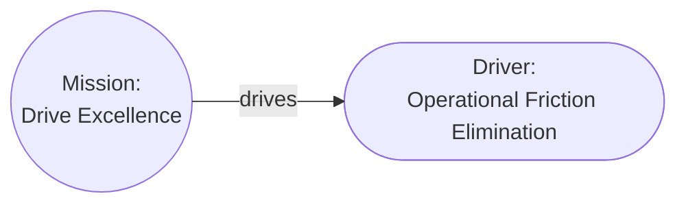

# Aurora Machine Agent Instruction

## Model Overview

**Version**: 2.1.0

Aurora is a deterministic architectural model where architectural elements are cards, relationships between cards are links, and the model forms a directed graph. The model is designed so that any interpretation (such as view diagrams) can be generated from the model, and for direct machine consumption by LLMs, agents, reasoners, and automated tools. The model invariants guarantee unambiguous interpretation and reasoning about the model.

Semantics are derived from the invariant rules: cards and relationship verbs are descriptive only, and meaning comes from interpretation (views, impact analysis, traceability).

**One Goal**: Enable the Architect to focus on modeling the architecture instead of drawing diagrams and pictures.

## Canonical registries

Even though Aurora is designed to allow any element and any relationship, by default we include a set of cards and relationships covering all common architectural elements. These files are the canonical registries for the Aurora vocabulary and should be updated instead of duplicating lists in this document.

**Note**: File paths below are relative to this instruction file's location (`.github/instructions/`).

- The canonical relationships are defined in [1-Relationship_Matrix.md](details/1-Relationship_Matrix.md)
    + The Card acronyms are expanded in [1a-Card_Definitions](details/1a-Card_Definitions.md)
    + The Relationship verbs are described in [1b-Relationship_Definitions.md](details/1b-Relationship_Definitions.md)
- The canonical Views are defined in [2-View_Definitions.md](details/2-View_Definitions.md)
    + A Styling Guide for views is included in [2a-View_Styling_Guide](details/2a-View_Styling_Guide.md)

## Models

The model is the central piece of the architecture: a collection of cards connected by links, starting from a `Mission` card. Cards are nouns (elements of the design). Links describe how elements relate and interact, and are tagged with verbs (for human convenience).

Any pair of cards in the model can be described using simple sentences of the form `element verb element`:

**Examples**:

```text
The mission "Drive Excellence" is "Drive excellence in operations by streamlining processes, integrating automation, and formalizing documentation".

The mission establishes the driver "Operational Friction Elimination" which is "Eliminate non-value-adding manual effort by enforcing end-to-end process automation, standardized workflows, and machine-verifiable documentation across all operational domains".
```

**These result in a model that looks like this**:



### Cards

A card contains information about an element of the model and links to other elements. See [Model Overview](#model-overview) for determinism and semantics. Cards also have an `attributes` property for additional arbitrary information. Card files should be "pretty printed" using `prettier`, with the exception of the Compressed Model. The Compressed Model should be compacted to remove extraneous white space.

Each card is comprised of:

| Field          | Required | Meaning                                                                         |
| -------------- | -------- | ------------------------------------------------------------------------------- |
| `$schema`      | Yes      | Schema reference (relative path to the schema file in Model Home).              |
| `id`           | Yes      | Stable unique identifier. See [IDs, Files, and Layouts](#ids-files-and-layouts) |
| `card_type`    | Yes      | Card type (title case) See [Canonical Registries](#canonical-registries)        |
| `card_subtype` | No       | Optional card type refinement.                                                  |
| `name`         | Yes      | Human-readable name (title case).                                               |
| `description`  | Yes      | Card description.                                                               |
| `status`       | No       | Optional lifecycle status.                                                      |
| `links`        | No       | Outgoing relationship links.                                                    |
| `audit_trail`  | Yes      | Semver, hash, & audit history.                                                  |
| `attributes`   | No       | Additional optional data.                                                       |

**Notes**:

- Once issued, the `id` MUST NOT change; to change `id` or if `card_type` changes, issue a new card and move the original to `status` "Deleted" with an audit history entry.
- Any lifecycle can applied to an implementable element, and can be used for Aurora. The included lifecycle is: "Proposed", "Design", "Implementation", "Released", "Deprecated", "Deleted"
- The Audit History includes a semver version number specific to the card as well as an audit history. Semver audit: major for meaning changes or `Deleted`, minor for non-meaning updates, patch for typos; include history entries with `editor`, RFC3339 `timestamp`, and `event` (`created`, `edited`, `deleted`). Hash is reserved for future use.
- Attributes are arbitrary optional key-value pairs providing additional data; the value can be any valid JSON value, including objects.

### IDs, Files, and Layouts

IDs are, by default, a three letter acronym for the `card_type` (see [Canonical Registries](#canonical-registries)) followed by a serially issued integer. Since each model is in a separate folder, each model has its own set of numbers.

#### Example IDs

- MIS-001
- DRI-001
- DRI-002

### File format and naming rules

- You MUST use the extension `jsjson`. JSJSON files are functionally identical to JSON files.
    + Treat `.jsjson` as **strict JSON** (RFC 8259): double quotes, no comments, no trailing commas, UTF-8, and a single trailing newline.
    + Formatting and content rules should match the repository's JSON conventions for `*.json` files, except where this document explicitly overrides them (for example, the compact model whitespace guidance).
- Any time the `name` property is used in a file name, special characters MUST be stripped, and the spaces MUST be replaced with underscores (`Sanitized_Name`).
- All card files MUST be named `<id>-<Sanitized_Name>.jsjson`, e.g. `MIS-001-Do_Something.jsjson`

### Model layout rules

- Model Home: Always an `aurora/` folder containing `Aurora.schema.jsjson`, and `Aurora.compact.schema.jsjson`. Mission cards are placed in the Model Home to provide a consistent, easy-to-find starting point. Multiple Models may share a Model Home.
- Root `Mission` cards. Mission numbering increases monotonically per model. Multiple Mission cards and Models may share a Model Home. (e.g., `MIS-...`, `MIS-002...`)
- Each Model has a Mission home, a subfolder named for the Mission card ID, e.g., `aurora/<MISSION_ID>/` with a subfolders per `card_type`. Each card is stored according to type.
- All cards conform to `<Model Home>/Aurora.schema.jsjson`; if missing, copy `.github/instructions/details/Aurora.schema.jsjson` before creating the first `Mission` card.
- Optional compact model: There may also be an `AGENT-<MISSION_ID>.jsjson` in the Model Home, conforming to `<Model Home>/Aurora.compact.schema.jsjson`, with a top-level `cards` array and `audit_trail` removed; copy `.github/instructions/details/Aurora.compact.schema.jsjson` if missing. The compact file should not be "pretty-printed" to save whitespace.
- The Model Home may be stored as a ZIP file if the folder structure is preserved.

**Example Folder and File Structure**:

```text
aurora
  ├─ Aurora.schema.jsjson
  ├─ Aurora.compact.schema.jsjson
  ├─ MIS-001-Enable_Deterministic_Aurora_CLI_Tooling.jsjson
  ├─ MIS-002-Write_User_Documentation_for_Aurora.jsjson
  ├─ MIS-001
  │    ├─ Driver
  │    │    ├─ DRI-001-Do_Something.jsjson
  │    │    └─ DRI-002-Do_Something_Else.jsjson
  │	   └─ Requirement
  │	   	    └─ REQ-001-Can_Do_Something.jsjson
  ├─ MIS-002
  │    ├─ Driver
... etc
```

## Views

Views (see [Canonical Registries](#canonical-registries)) are generated by selecting a set of card types (and optionally subtypes) to include and rendering a diagram showing those cards, and the links between them. Views always include the `Boundary` and `Note` cards that have incoming links from other graph cards. Views **do not change the model**; they change what part of and how the model is viewed. One model, many views.

In general, a view should display the `card_type`, `card_subtype`, and `name` fields as the text for each node.

## Logical Structure

The logical structure of Aurora is designed to be easily extended to meet the needs of any architecture. While the structure and rules here are inviolate, they do not limit what is represented in the model and impose only necessary limitations on links.

By using `Boundary` cards and card subtypes almost any structure can be mapped onto a model.

### Invariant Rules

1. **The `Mission` Card**: All models must start with and include a single `Mission` card that summarizes the high-level "why" of the project. The `Mission` card must only have outgoing links, and serves as the root of a directed graph.

2. **Direction (graph links)**: All links must lead away from the `Mission` card. There must be a route from `Mission` to every card. The graph is not acyclic; local loops can and often do exist, for example when a state model returns to the starting state. Traversing any path starting from `Mission` must have an increasing number of links and end either in a leaf card or a previously seen card (local loop).

3. **Hierarchy**: The model forms a directed graph rooted in the `Mission` card. Local cycles are allowed for bounded subgraphs such as state machines (for example: `State` → `Condition` → `State`) and event/action-driven transitions, as long as no link creates a path back to `Mission`. This ensures that all loops terminate locally.

4. **Semantics**: See [Model Overview](#model-overview). Relationship verbs are descriptive; meaning comes from interpretation.

5. **Every other card**: Other than the `Mission` card, all cards must have at least one incoming link. They must also have a path from the `Mission` card. These cards may have more than one incoming or any number of outgoing links.

6. **Validation**: All `links[].target` values must reference existing cards by `id`.

7. **Annotative Cards**: The `Boundary` and `Note` cards are not semantically meaningful in the graph; the `Boundary` exists to delineate logical segments, and the `Note` exists to provide additional information for implementers.

## Default Tooling

### `aurora_cli`

The `aurora_cli` tool (if installed) is provided to assist in validating the model, rendering the human readable cards, rendering the SVG views, and generating the compact model. The `-i` input must come before the `command` and the `-o` output after it, e.g., `aurora_cli -i docs/design/aurora/ render-all -o docs/design/`. The `bump*` commands are provided for humans to bump the version and add an audit entry.

**Simple Validation**:

This will, when run from the root of a repository, look in docs/design/aurora/ and validate all models found:

```bash
aurora_cli validate
```

**Generate Human Readable Cards & SVG Diagrams**:

```bash
aurora_cli render-all -o docs/design/
```

**Other Commands**:

```text
aurora_cli [-i <input_path>] <COMMAND> [-o <output_path>]

Commands:
  validate
  render-aurora
  render-views
  render-all
  compact
  bump-patch
  bump-minor
  bump-major
  help           Print this message or the help of the given subcommand(s)

Options:
  -i, --input <INPUT_PATH>  [default: docs/design/aurora/]
  -l, --log <LOG_LEVEL>     [default: INFO]
  -h, --help                Print help
  -V, --version             Print version
```
