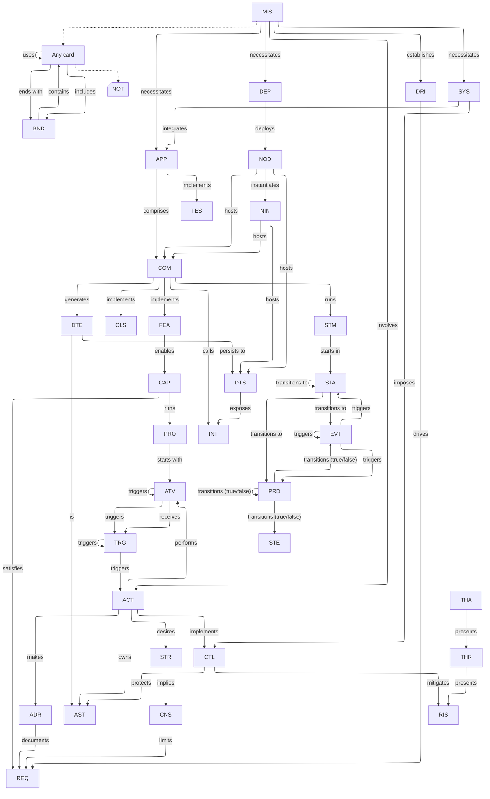

# Matrix View

```mermaid
---
config:
  layout: elk
---
graph

%% Note: ast is not a card type, it represents the wildcard
	MIS -.-> ast["`Any card`"]
	ast -- includes --> BND -- contains --> ast
	ast -- ends with --> BND
	ast -.-> NOT@{shape: card}
	ast -- uses --> ast

	ACT -- desires --> STR
	ACT -- implements --> CTL
	ACT -- makes --> ADR
	ACT -- owns --> AST
	ACT -- performs --> ATV
	ADR -- documents --> REQ
	APP -- comprises --> COM
	APP -- implements --> TES
	ATV -- receives --> TRG
	ATV -- triggers --> ATV
	ATV -- triggers --> TRG
	CAP -- runs --> PRO
	CAP -- satisfies --> REQ
	CNS -- limits --> REQ
	COM -- calls --> INT
	COM -- generates --> DTE
	COM -- implements --> CLS
	COM -- implements --> FEA
	COM -- runs --> STM
	CTL -- mitigates --> RIS
	CTL -- protects --> AST
	DEP -- deploys --> NOD
	DRI -- drives --> REQ
	DTE -- is --> AST
	DTE -- persists to --> DTS
	DTS -- exposes --> INT
	EVT -- triggers --> EVT
	EVT -- triggers --> PRD	
	EVT -- triggers --> STA
	FEA -- enables --> CAP
	MIS -- establishes --> DRI
	MIS -- involves --> ACT
	MIS -- necessitates --> APP
	MIS -- necessitates --> DEP
	MIS -- necessitates --> SYS
	NIN -- hosts --> COM
	NIN -- hosts --> DTS
	NOD -- hosts --> COM
	NOD -- hosts --> DTS
	NOD -- instantiates --> NIN
	PRD -- transitions (true/false) --> EVT
	PRD -- transitions (true/false) --> PRD
	PRD -- transitions (true/false) --> STE
	PRO -- starts with --> ATV
	STA -- transitions to --> EVT
	STA -- transitions to --> PRD
	STA -- transitions to --> STA
	STM -- starts in --> STA
	STR -- implies --> CNS
	SYS -- imposes --> CTL
	SYS -- integrates --> APP
	THA -- presents --> THR
	THR -- presents --> RIS
	TRG -- triggers --> ACT
	TRG -- triggers --> TRG
```
