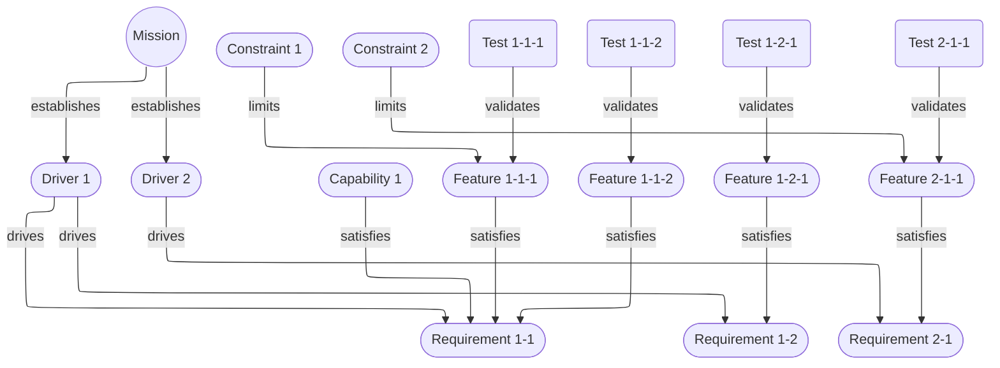
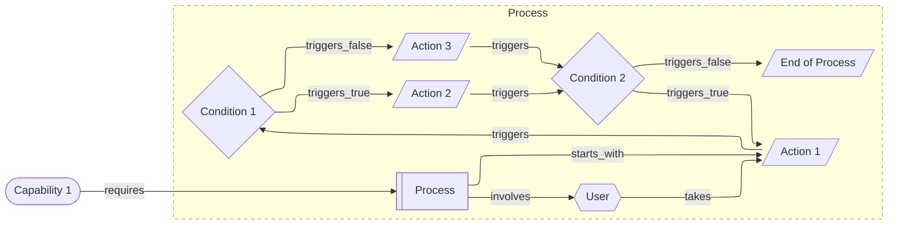
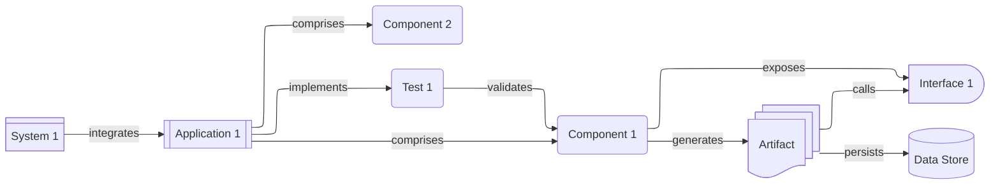
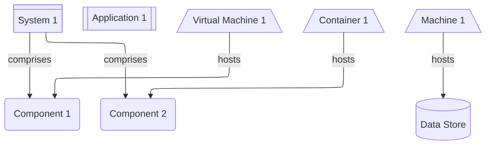
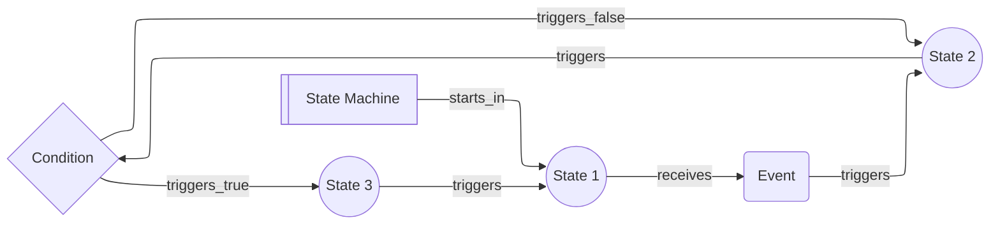
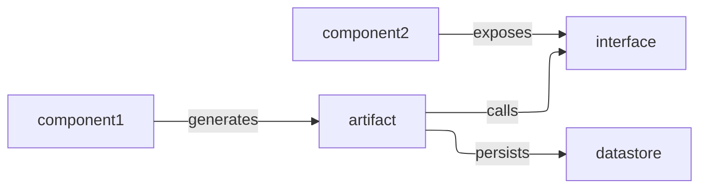

# Agent-Unified Representation of Requirements and Architecture (AURORA)

 AURORA defines a rigorous, MBSE-class architectural modeling framework designed for equal readability by human engineers, machine learning ("AI") agents, and computer programs. It provides a lightweight but complete representational schema that captures requirements, behavior, structure, interfaces, constraints, and traceability in a single, coherent model. The objective is a common architectural language that supports automated reasoning, validation, and lifecycle tooling while remaining directly interpretable by expert practitioners.

Because it is designed to be readable by machine agents as well as humans, AURORA artifacts can be generated by machine learning models, consumed by coding agents, and used to automatically generate views of the architecture.

**One Goal**: The Architect models the architecture instead of creating static drawings.

## Status

v1.0.0 released
v2.0.0 in development

## Goals

- **Unified Semantics:** One representation equally usable by humans and machines.
- **Complete Architectural Coverage:** One model that includes operational, logical, physical, and behavioral modeling with complete traceability.
- **Tool-Agnostic Implementation:** Built on open source standards, AURORA is simple to adopt, serialize, and integrate into existing systems.
- **Automated Reasoning Compatibility:** Schema designed for constraint solvers, LLMs, static analyzers, and agents. The model graph is directed and completely traversable.
- **Human Readability:** Clear structure and terminology without sacrificing formal rigor.
- **Universal Formats:** All cards use JSON and accompanying JSON Schemas are provided.
- **Complete Provenance and Traceability:** Every action on a card is logged on the card, providing a complete audit trail.
- **Secure Design Options:** Support for cryptographic signatures and checksums enables secure documents. Because all documents are JSON, they can be encrypted and decrypted by tooling.

## Core Concepts

AURORA models are intentionally simple and explicit. The entirety can be summed up by two rules: 1. Everything is an element represented by a card, and 2. All cards have a path of links to them from the unique `mission` card and leading out to other cards. It deliberately does not include symbols, views, and other drawing-oriented elements; all views can be rendered simply by parsing the model.

### Everything is an Element

- Everything in the architecture — `driver`, `requirement`, `node`, `boundary` — is represented by a card that captures every detail of the element. Cards are stored as JSON files that conform to the AURORA schema (details below). While we include a default set of card types and subtypes, the specification _does not_ prescribe any specific list. It is designed to be extremely flexible and expandable.
- Every model starts from a single `mission` card. This is the only card required by the specification. It provides a consistent entry point for machine processing.

### Elements have Relationships

- Every element in the model is connected to _at least_ one other, allowing fully automated view generation.
- Links are directional, first-class relationships that point away from the `mission` card, forming a directed graph rooted at `mission`. Local loops are permitted, for example when representing a `state_machine`, but no path can lead back to the `mission` card.
- Links include a human-friendly `relationship` label, but links themselves have no intrinsic semantic type; their meaning is derived from the current view.

## Card Schema

The canonical AURORA card schema is stored in `schemas/`. They can be included using either the "Download" link below or by placing a copy of the schema in the `AURORA` folder alongside the `mission` card and referencing it with a relative path.

- Download: [schemas/AURORA.schema.json](https://raw.githubusercontent.com/JEleniel/aurora/v2.0.0/schemas/AURORA.schema.json)
- View on GitHub: [schemas/AURORA.schema.json](https://github.com/JEleniel/aurora/blob/v2.0.0/schemas/AURORA.schema.json)

The canonical AURORA card schema is independently versioned; see `schemas/AURORA.schema.json` for the authoritative schema and version.

## Views

AURORA deliberately does not specify _any_ views, as _any_ view can be generated from the model. Our tooling does include a default set of views for convenience. Custom views can be created simply by choosing what card type (and subtypes) to include.

### Default Views

> **Note**: `boundary` cards are included in all views due to their special nature.

---

#### Requirements View

A view that captures system goals, `driver` cards, `capability` cards, `feature` cards, and concrete, testable `requirement` cards and the traceability between them. Use this view to validate coverage, prioritize `driver` cards, and link `requirement` cards to design elements and `test` cards.

- Cards: `mission`, `driver`, `requirement`, `capability`, `feature`, `constraint`, `test`

**Example**:

---

#### Process View

A view modeling user goals and interactions to validate workflows and traceability from `mission` to implementation.

- Cards: `capability`, `process`, `actor`, `action`, `condition`
- This view omits `state` cards; `state` cards are generally used to model a `state_machine`, which has its own view.

**Example**:

> **NOTE**: In this diagram a `boundary` is used to create a contained block. In the model, capability1 -- contains --> boundary1 --> contains --> process_1, and boundary1 has the attribute `"inherited": true` which makes it contain all the children (link targets, recursive) of process_1 in the diagram.

---

#### Component View

A view that models components, their responsibilities, interfaces, data artifacts, and trust/deployment boundaries to validate decomposition and mapping to implementation.

- Cards: `system`, `application`, `component`, `interface`, `datastore`, `artifact`, `test`

**Example**:

---

#### Deployment View

A view that represents the runtime topology, hosting, and trust boundaries used to validate deployment, scaling, and security posture.
   	* Cards: `system`, `application`, `node`, `component`, `interface`, `artifact`, `datastore`

---

#### State Machine View

A behavioral “lens” over the AURORA graph that shows how some element evolves over time as discrete state nodes connected by directed transitions.

- Cards: `state_machine`, `state`, `event`, `condition`

---

#### Communication Diagram

A view illustrating the communication between elements of the model.

- Cards: `component`, `artifact`, `interface`, `datastore`

---

## Tooling

AURORA includes a set of reference tooling including an editor, a standalone viewer, and a command line tool. All tooling features listed below are planned and currently pending implementation; progress is tracked in `PROGRESS.md`.

### Editor

We provide a cross-platform, full-featured editor for AURORA models. Everything you need to create, edit, and distribute your architecture is built-in.

#### Features

- **Interactive Exploration:** Navigate and understand complex architectures through centered element views with related links and dependencies displayed at a glance.
- **Built-in Views:** Includes a set of UML/SysML inspired views.
- **Create Custom Views:** Select the card types to include and automatically generate any drawing desired. In addition, since Mermaid is used for rendering, shapes and icons can be mapped to specific cards or card types.
- **Compressed Storage:** Can store the model in a structured `AURORA` folder or in a single ZIP-compressed file. The compressed file can be decompressed directly into the `AURORA` folder. No proprietary format required.
- **Schema-Aware Editing:** Editors validate card structure against JSON Schemas while editing, with inline errors and quick-fix suggestions.
- **Live Validation & Linting:** Real-time model validation for orphan cards, inverted links, invalid loops, and style/lint rules.
- **Versioning & Audit Trail:** Built-in change history, per-card audit entries, undo/redo, and change comparison tools.
- **Collaborative Editing:** Real-time collaboration (multi-user) with conflict resolution and presence indicators.
- **Model Merge & Conflict Resolution:** Tools to merge divergent model branches with semantic conflict helpers.
- **Extensible Plugin API:** Allow third-party extensions for importers, exporters, visualizations, and automation.
- **Agent Integration & Automation:** Expose APIs for machine agents to read/write cards, run validations, and generate views.
- **Export/Import Formats:** Export to ZIP/JSON, Mermaid, SVG, PNG, PDF; import from common interchange formats.
- **Access Control & RBAC:** Role-based permissions, read/write controls, and audit logging.
- **Keyboard Shortcuts & Accessibility:** Accessible UI, keyboard-first navigation, and screen-reader friendly components.

### Viewer

We include two different types of viewer for AURORA models:

1. A completely stand-alone, cross-platform viewer that allows you to browse models from a variety of built-in views, as well as custom views. It also allows creating custom views just like the editor.
2. An HTML page (`viewer.html`) along with supporting scripts and styles that provides the same ability to browse the model as the standalone viewer. While it can render custom views, it cannot create or edit them.

#### Standalone Viewer Features

- **Interactive Exploration:** Navigate and understand complex architectures through centered element views with related links and dependencies displayed at a glance.
- **Multi-View Support:** Provide all default and custom views with fast switching between perspectives.
- **Custom View Rendering:** Load and render user-defined views (Mermaid or JSON-based view specs).
- **Search, Filter & Highlight:** Full-text search, attribute filters, and path highlighting to trace relationships.
- **Export Current View:** Export visible views to SVG, PNG, PDF, and copyable Markdown.
- **Offline & Portable:** Fully functional offline mode with local model caching and file-based loading.
- **High-Performance Rendering:** Handles large models with virtualization and level-of-detail strategies.
- **Shareable Snapshots:** Create shareable, linkable snapshots or static exports of specific views.
- **Accessibility & Keyboard Navigation:** ARIA-compliant components and comprehensive keyboard support.
- **Plugin Support:** Allow viewer extensions for custom rendering, analytics, or integrations.

#### HTML Page Viewer Features

- **Interactive Exploration:** Navigate and understand complex architectures through centered element views with related links and dependencies displayed at a glance.
- **Ready to Host, works Without:** The page and supporting files are ready to deploy on a web host, and automatically dynamically loads the model in an `AURORA` folder with it; also supports loading as a file in the browser and loading of a local model. It can operate as a hosted or standalone lightweight viewer.
- **Client-Side Search & Filtering:** Fast client-side search and attribute-based filtering without server dependencies.
- **Responsive & Mobile-Friendly:** Layouts and controls adapt for tablets and phones.
- **Static Hosting Compatible:** Works with static hosting providers and supports loading models from relative paths or drag-and-drop.
- **Export View to SVG/PDF:** Allow users to export the current view as vector or raster formats directly from the browser.
- **Accessibility & Keyboard Support:** ARIA attributes and keyboard navigation for improved accessibility.
- **Theme Support:** Light and dark themes with simple CSS variables for customization.
- **Lazy Loading of Large Models:** Incremental loading to keep initial load times fast.
- **Drag-and-Drop Model Loading:** Support dropping a ZIP or folder to load a model locally.

### CLI Tool

Finally, we provide a scriptable command line tool supporting common operations.

#### Features

- **Generate Views as Files:** Generate any predefined or included custom view in multiple formats, including PDF, Markdown, and SVG. They will be generated in a specified folder and will include one file per drawing and one file per card. Where possible, all links will be navigable.
- **Validate a Model:** Verify that a set of model files conforms with the specification. Checks for orphan cards, inverted links, invalid loops, and more.
- **Init New Model:** Scaffold a new `AURORA` folder with example `mission` and schema files.
- **Format & Pretty-Print:** Reformat JSON files to a canonical, stable layout for diffing and review.
- **Lint & Best Practices:** Provide warnings for common modeling issues and style suggestions.
- **Diff & Report Semantic Changes:** Show human-friendly diffs between two model snapshots.
- **Merge Models:** Assist with merging models and resolving conflicts with semantic awareness.
- **Sign & Encrypt Archives:** Support cryptographic signing and optional encryption of model archives.
- **Batch Operations:** Run validate/export/sign operations across many models in a folder.
- **Serve Local Viewer:** Launch a lightweight local server to preview models in `viewer.html`.
- **Plugin/Transform Hooks:** Allow custom transforms, exporters, or validators to be added as plugins.
- **Generate Tests/Harnesses:** Produce basic validation test harnesses for CI integration.

## Machine-Agent Integration

- Deterministic serialization (JSON) and an agreed minimal ontology make models unambiguous for agents and tools.
- Models map naturally into graph structures (nodes + edges) for reasoning engines, search, and graph queries.

## License

See [LICENSE.md](LICENSE.md).

## Contributing

See [CONTRIBUTING.md](CONTRIBUTING.md).

## Security

See [SECURITY.md](SECURITY.md).

## Support

See [SUPPORT.md](SUPPORT.md).

## Changelog

See [CHANGELOG.md](CHANGELOG.md).
