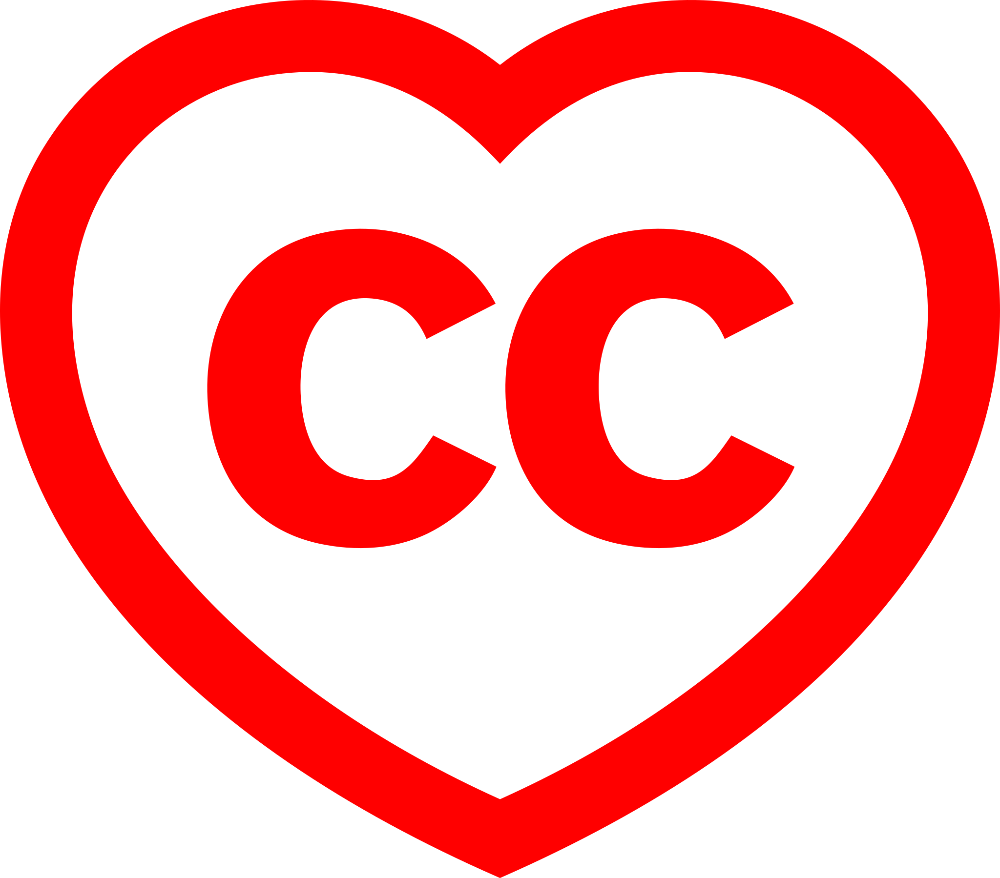

# Agent-Unified Representation of Requirements and Architecture (AURORA)

AURORA is an architectural practice designed to be equally followable by both machine and human agents. It is based on MBSE and uses SysML for diagramming.

AURORA defines a rigorous, MBSE-class architectural modeling framework designed for symmetric readability by human engineers and autonomous agents. It provides a lightweight but complete representational schema that captures requirements, behavior, structure, interfaces, constraints, and traceability in a single coherent model. The objective is a common architectural language that supports automated reasoning, validation, and lifecycle tooling while remaining directly interpretable by expert practitioners.

## Goals

- **Unified Semantics:** One representation equally usable by humans and machine agents.
- **Complete Architectural Coverage:** Operational, logical, physical, and behavioral modeling with explicit traceability.
- **Tool-Agnostic Implementation:** Simple to adopt, serialize, and integrate into existing systems.
- **Automated Reasoning Compatibility:** Schema designed for constraint solvers, LLMs, static analyzers, and agents.
- **Human-Centric Readability:** Clear structure and terminology without sacrificing formal rigor.
- **Universal Formats:** All documents use universal, unencumbered formats.

## Core Concepts

AURORA models are intentionally simple, explicit, and link-centric so that both human practitioners and automated agents can read, reason about, and act on the same architectural artifacts.

### Everything Is Linked

- Every element in the model is connected: drivers → requirements → architecture → tests → implementation.
- Links are typed and first-class (e.g., "satisfies", "refines", "depends-on", "verified-by") to make automated traceability and impact analysis straightforward.

### Drivers Layer

- Drivers capture the authoritative sources that motivate requirements: laws, regulations, standards, business goals, stakeholder intents, and mission statements.
- Drivers are recorded with provenance metadata (source, citation, version, owner) so downstream reasoning preserves legal and compliance context.

### Requirements Layer

- Requirements are structured artifacts, not freeform text: each requirement includes classification, priority, acceptance criteria, rationale, and links to drivers and tests.
- Requirements support multiple views (functional, non-functional, safety, security) and carry machine-readable constraints where possible (e.g., logical predicates or formal assertions).

### Architectural Views

- **Operational View:** Who uses the system, mission scenarios, external interfaces and constraints on operations.
- **Logical View:** Functions, services, data flows, domain models and their relationships.
- **Interface & Contract View:** Explicit API/contract descriptions, message schemas, and compatibility constraints.
- **Physical View:** Deployment topology, nodes, networks, capacities, and placement constraints.
- **Behavioral View:** Event flows, state machines, use-case scenarios, and failure/mode transitions.

Each view is a projection of the same underlying model — not a separate source of truth — enabling consistent traceability and automated cross-checks.

### Consistent Schema Design

- Every element follows a small, uniform schema: `id`, `type`, `name`, `description`, `attributes`, `relations`, `constraints`, `provenance`, and `metadata`.
- `attributes` are typed (string, number, enum, timestamp, etc.) and machine-validated. `relations` are typed edges with direction and optional cardinality.
- `constraints` express invariants or requirements in a form that can be consumed by validators or solvers (e.g., simple expressions, OCL-like assertions, or embedded JSON Schema fragments).

### Machine-Agent Integration

- Deterministic serialization (JSON) and an agreed minimal ontology make models unambiguous for agents and tools.
- Models map naturally into graph structures (nodes + typed edges) for reasoning engines, search, and graph queries.
- Validation tooling verifies syntactic schema conformance, constraint satisfaction, and trace completeness; reasoning tools can run invariants, safety checks, and automated impact analysis.

### Human–Machine Collaboration

- Authoring workflows support both hand-edited text and generated artifacts (templates, inferred links, and suggested refinements from analysis agents).
- Change records and provenance are preserved to support review, approval, and audit trails; agents can propose changes while humans accept, reject, or refine them.

### Principles

- **Explicitness:** Avoid implicit assumptions; record intent, rationale, and constraints.
- **Simplicity:** Keep the core schema small and composable.
- **Traceability:** Make it easy to follow why each element exists and what it affects.
- **Tool-Agnosticism:** Interchange formats and the ontology are lightweight so any toolchain can adopt them.

---

## Minimal Deliverables

This project adopts a strict "one element = one card" approach: every atomic architectural entity is represented as a single card. Cards are lightweight, self-contained artifacts that map directly to machine-friendly data structures and human views.

Minimum conceptual types of deliverables:

- **Card:** The primary artifact. Each card represents exactly one element (a driver, a requirement, a component, an interface, a test, etc.). Cards contain `id`, `type`, `name`, `description`, `attributes`, `relations`, and `provenance`.
- **View:** A curated projection (collection) of cards organized for a particular stakeholder or task (e.g., Operational View, Logical View). Views are not separate documents; they are named collections of card references and display rules.
- **Link:** Typed relationships between cards. Links are first-class, minimal records that reference source and target card `id`s and include a `type` (e.g., `satisfies`, `refines`, `depends-on`, `verified-by`) and optional metadata such as rationale or strength.

Key constraints and principles for minimal deliverables:

- Every architecture starts with a Root Driver: a single card representing the project's mission or authoritative source. Every other card MUST be linked (directly or indirectly) to the Root Driver, forming a derivation chain that preserves provenance and intent.
- No multi-page monoliths: large documents are replaced by collections of small cards and views.
- One card = one canonical element: avoid combining multiple responsibilities in a single card.
- Views are projections, not alternate sources of truth; the canonical information always lives on the card.
- Links enable traceability and queryability; prefer explicit links over implicit textual references.

- A JSON serialization exists for every element. Cards are stored as JSON and displayed in a human-readable, editable form.

Note: This project prefers JSON serialization and does not use YAML or other indentation/whitespace-delimited formats.

Pre-release note: This repository is currently in pre-release. Formal changelogs and elaborate release procedures are optional at this stage; keep `version` on cards (semver) and use `status` to indicate lifecycle state. When you move to a formal release cadence, we can add release notes and changelog requirements.

Suggested minimal deliverable set for a simple project:

- Root Driver (1 card)
- Drivers (1..N cards)
- Requirements (N cards — one requirement per card)
- Interfaces / Contracts (cards)
- Logical Components (cards)
- Deployable Nodes (cards)
- Tests / Acceptance Criteria (cards)
- Views (named collections referencing cards)
- Link set (the set of typed links connecting cards)

## Legal

Agent-Unified Representation Of Requirements and Architecture - AURORA © 2025 by JEleniel is licensed under Creative Commons Attribution-ShareAlike 4.0 International 

Share your work under the [Creative Commons](https://creativecommons.org/)
