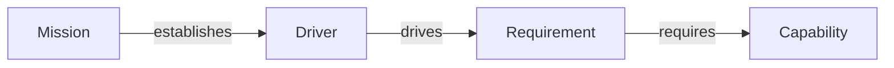

# Core Concepts

Aurora is a deterministic, typed, directed graph rooted at a single **Mission** card.

- **Cards** are graph nodes.
- **Links** are directed edges.
- **Registries** (reference configuration) define the canonical vocabulary and rendering defaults.
- **Views** are read-only projections of a model.

## Cards

A card is a single JSON document describing one architectural element.

### Required fields

Per the card schema (`schemas/Aurora.card.schema.json`), every card file must include:

- `$schema`: relative path to the card schema within the model home
- `id`: a stable identifier (format: `ABC-<number>`, e.g., `REQ-900`)
- `card_type`: the semantic type (e.g., `Requirement`, `Component`)
- `name`: a short title
- `description`: a concise description
- `links`: a list of outgoing links (may be empty)

### Optional fields (commonly used)

- `card_subtype`: a subtype label (e.g., `Service`, `API`, `User`)
- `attributes`: arbitrary structured metadata not covered by core fields
- `boundary`: a grouping label used by rendering and reasoning
- `status`: a status string (project-specific)
- `notes`: longer-form notes (rendered in Markdown outputs)
- `icon`: an **override** icon id for rendering (must be declared in the model configuration)

### Minimal example

```json
{
	"$schema": "./schemas/Aurora.card.schema.json",
	"id": "MIS-100",
	"card_type": "Mission",
	"name": "Example Mission",
	"description": "Demonstrate an Aurora model.",
	"links": []
}
```

## Links

A link is an outgoing edge from a source card to a target card.

```json
{
	"relationship": "drives",
	"target": "REQ-001"
}
```

Relationship labels are plain strings. Validity comes from:

- **Graph invariants** (always enforced as validation errors), and
- The **registry** (enforced as warnings when you deviate from the canonical set)

## Invariant rules

Aurora’s invariant rules ensure the model is a rooted directed graph with only local recurrence.

1. **The `Mission` card is the root.** It must have outgoing links only.
2. **Traversal follows directed edges from `Mission` outward.** Traversal halts at a leaf node (out-degree 0) or a previously visited node.
3. **No orphans.** Every non-`Mission` card has one or more incoming links and is reachable from the `Mission` card.

A small example:



## Model configuration (the registry)

Every model home includes `reference/Aurora.modelconfiguration.json` (validated by `schemas/Aurora.modelconfiguration.schema.json`). It defines:

- Which **icons** are available (`available_icons`)
- The canonical **card types** (`cards`) including default shape and colors
- Allowed canonical **relationships** (per card definition)
- The set of default **views** (`views`) and what they include

The registry is used for:

- Registry checks (warnings for unknown card types/relationships)
- View definitions (what gets rendered)
- Rendering defaults (shape, colors, and icons)

See **[Configuration Guide](./Configuration%20Guide.md)**.

## Audit log (NDJSON)

Each model has an append-only audit log at:

- `aurora/<MISSION_ID>/AuditLog.ndjson`

Each line is a standalone JSON object conforming to `schemas/Aurora.audit.schema.json`.

Example entry:

```json
{
	"timestamp": "2026-02-19T19:00:00Z",
	"editor": "Architect",
	"changes": [
		{
			"card_id": "REQ-001",
			"change_type": "change",
			"link_changes": [
				{
					"change_type": "create",
					"relationship": "requires",
					"target": "CAP-001"
				}
			]
		}
	]
}
```

## Compact exports

A compact export is a generated snapshot at:

- `aurora/<MISSION_ID>/Compact.json`

Compact exports are designed for machine consumption and differ from full cards:

- Omit `description` and `version`
- Must include `attributes` (to preserve metadata)
- May include `boundary`
- Must not include rendering-only fields like `icon` or `notes`

Tooling can generate them via `aurora_cli compact`.

## Views

A view is a diagram generated from a model using a view definition from the registry.

Each view definition specifies:

- `root_card_types`: which card acronyms can act as roots
- `included_card_types`: which card acronyms are included in the rendered graph

Rendering uses the model’s links to traverse and include cards that match the included set. See **[Canonical Set](./Canonical%20Set.md)** for the default views.
