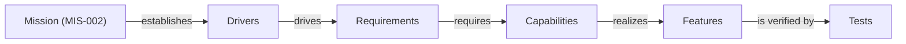
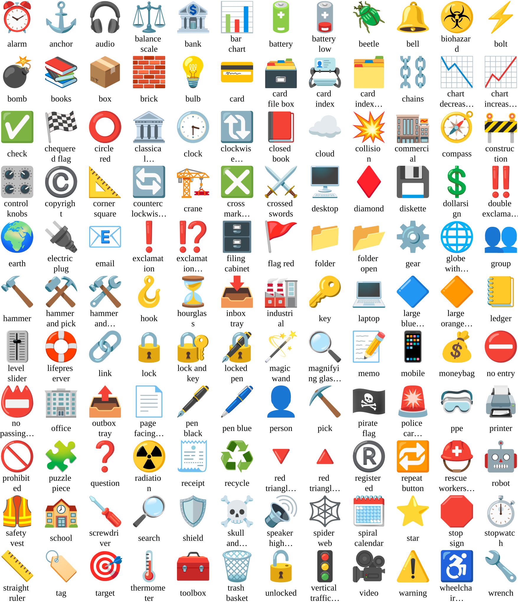
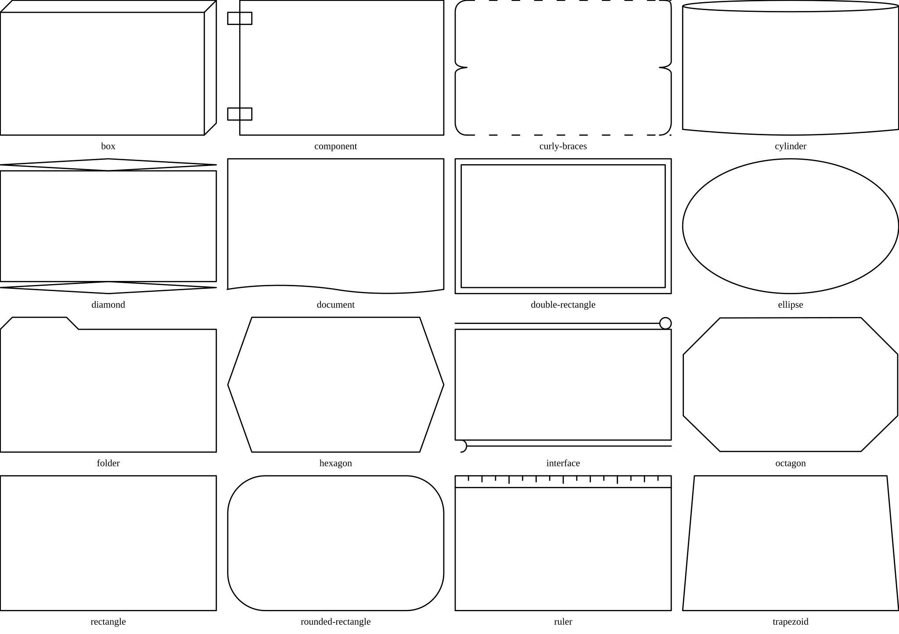

# MIS-002 Walkthrough

This walkthrough uses the example model **MIS-002** shipped with this repository.

MIS-002 is designed to exercise the **canonical set**: it contains cards and links across the full vocabulary and renders every default view.

## 1) Locate the model home

The example model home is:

- `docs/design/aurora/`

It contains:

- `schemas/` (JSON Schemas)
- `reference/` (canonical configuration + template)
- `MIS-002-Example_Canonical_Coverage_Model.json` (the mission card)
- `MIS-002/` (all other cards + audit log + compact exports)

See **[Model Home Layout](./Model%20Home%20Layout.md)** for the required structure.

## 2) Validate MIS-002

Validate the models in that model home:

```text
aurora_cli validate -i docs/design/aurora
```

If you want to focus on MIS-002 specifically, note that `aurora_cli` currently expects the input path to be a directory (not a mission-card file). See **[Aurora CLI](./Aurora%20CLI.md)**.

## 3) Open the mission card

The mission card is at:

- `docs/design/aurora/MIS-002-Example_Canonical_Coverage_Model.json`

It is the single root of the graph.

A mission card’s links establish the “spine” of the model, for example:



## 4) Pick a card and follow links

A convenient starting point is the “exercise” requirement:

- `docs/design/aurora/MIS-002/Requirement/REQ-900-Exercise_All_Card_Types_and_Relationships.json`

This card is designed to point at many card types so that:

- Registry relationship checks are exercised.
- Multiple views have valid roots.

Tip:

- If you ever see validation warnings about unknown relationships or targets, cross-check the allowed relationships in `docs/design/aurora/reference/Aurora.modelconfiguration.json`.

## 5) Render views

Render all views for both models into a temporary directory:

```text
aurora_cli render-views -i docs/design/aurora -o tmp/aurora_cli_out
```

The MIS-002 outputs are written to:

- `tmp/aurora_cli_out/MIS-002/Views/*.svg`

For example:

- `tmp/aurora_cli_out/MIS-002/Views/Entire_Model.svg`
- `tmp/aurora_cli_out/MIS-002/Views/Security.svg`
- `tmp/aurora_cli_out/MIS-002/Views/State_Machine.svg`

How views are selected:

- Each view definition declares `root_card_types`.
- If MIS-002 contains at least one card of a required root type, that view is rendered.

See **[Canonical Set](./Canonical%20Set.md)** for the default view list.

## 6) Render Markdown

Render Markdown for reading and review:

```text
aurora_cli render-aurora -i docs/design/aurora -o tmp/aurora_cli_out
```

The per-model index for MIS-002 is:

- `tmp/aurora_cli_out/README-MIS-002-Example_Canonical_Coverage_Model.md`

## 7) Explore icons and shapes

The reference icon and shape proof sheets are useful when customizing appearance:

- `assets/proofs/Icons.svg`
- `assets/proofs/Shapes.svg`

You can view them directly:

- 
- 

Notes:

- These proof sheets are generated by `svg_prep`.
- The `assets/proofs/SVGTemplate.svg` proof may render as blank because it is mostly `<defs>`.

## Next steps

- Add your own card types and relationships: **[Configuration Guide](./Configuration%20Guide.md)**.
- Maintain and extend icons/shapes: **[SVG Prep](./SVG%20Prep.md)**.
- Understand validation vs registry warnings: **[Core Concepts](./Core%20Concepts.md)**.
