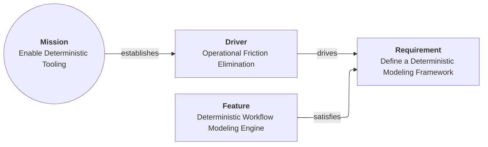

# Concepts: cards, links, and a directed graph

Aurora models requirements and architecture as a directed graph.

## Navigation

- [Aurora overview](README.md)
- [Model and folder layout](model-layout.md)
- [Views and rendering](views.md)
- [Design docs index](../design/README.md)

## Cards

A **card** is a JSON file describing a single architectural element (a noun):

- Mission, Driver, Requirement, Capability, Feature
- System, Application, Component, Interface
- Process, Activity, Event
- State Machine, State, Condition
- Constraint, Control, Risk, Threat
- …and more

Cards are intentionally “small”: they capture one thing, clearly.

## Links

A card may have **links** to other cards.

A link is directional and contains:

- `target`: the id of the destination card
- `relationship`: a human-friendly verb (for example `drives`, `satisfies`, `implements`)

Important: the relationship label is descriptive for humans; it does not have intrinsic semantic meaning by itself. Meaning emerges when you interpret the graph (for example by rendering a view).

## The Mission root

Every model starts from one Mission card. The Mission card is special:

- It summarizes the “why”.
- It is the root of the directed graph.
- It only has outgoing links.

## A tiny example

This diagram shows a minimal path from Mission to a Feature that satisfies a Requirement.

## Determinism

Aurora aims for deterministic interpretation:

- Stable file layout for cards.
- Validation rules that catch ambiguity (for example, broken links).
- Views generated from the model rather than maintained by hand.
