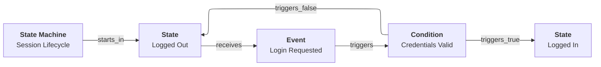

# Invariant rules

Aurora models follow a small set of invariant rules that make automated validation and deterministic rendering possible.

## Navigation

- [Aurora overview](README.md)
- [Concepts: cards, links, graph](concepts.md)
- [Views and rendering](views.md)
- [Design docs index](../design/README.md)

## Invariants (high level)

1. Every model starts with exactly one Mission card.
2. Links lead away from the Mission.
3. Every card must be reachable from Mission.
4. Local cycles are allowed (for example, state-machine loops), but no path can lead back to Mission.
5. All `links[].target` values must reference existing cards.

## Why these rules exist

These rules guarantee:

- There is a single, unambiguous entry point for tools.
- The model can be traversed deterministically.
- Renderers can generate consistent views without guessing.
- Validation can catch missing/typo’d links early.

## Example: a local cycle (allowed)

State machines often require loops.



The loop is contained within the state-machine subgraph; it does not point back to the Mission.

## Validating invariants

Use `aurora_cli validate` to validate schema and invariants.

```text
aurora_cli --input <MODEL_HOME> validate
```

Sample output:

```text
All models are valid.
```
