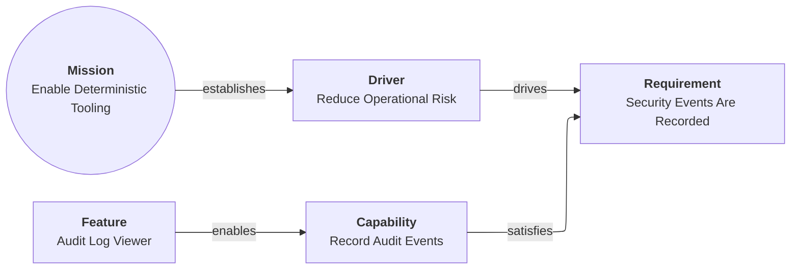

# Links and relationships

Links connect cards into a directed graph.

## Navigation

- [Aurora overview](README.md)
- [Concepts: cards, links, graph](concepts.md)
- [Invariant rules](invariants.md)
- [Design docs index](../design/README.md)

## Link structure

A link is an object inside a card's `links` array.

Common fields:

| Field | Meaning |
| --- | --- |
| `target` | The id of another card in the same model. |
| `relationship` | A verb phrase describing the connection for humans. |

## Relationship verbs

The relationship label is descriptive. Aurora encourages consistent verbs for readability and to reduce ambiguity.

Common conventions include:

- `establishes` (Mission → Driver)
- `drives` (Driver → Requirement)
- `satisfies` (Capability/Feature → Requirement)
- `enables` (Feature → Capability)
- `necessitates` (Mission → System)
- `integrates` (System → Application)
- `comprises` (Application → Component)
- `exposes` (Component → Interface)
- `persists_to` (Artifact → Data Store)

## A relationship chain example

## Boundary and Note cards

Some cards affect how views are rendered:

- `Boundary` cards can group other cards when rendering views.
- `Note` cards are annotations (often rendered with dotted links).

The underlying model is still just cards and links.
