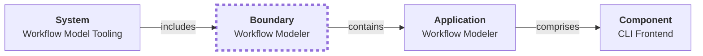

# Views and rendering

A view is a “lens” over the Aurora graph: you choose a subset of card types (and sometimes subtypes), then render them and the links between them.

## Navigation

- [Aurora overview](README.md)
- [Mermaid rendering rules](mermaid-rules.md)
- [aurora_cli docs](../aurora_cli/README.md)
- [Design docs index](../design/README.md)

## One model, many views

Views do not change the model. They change what part of the model is displayed.

Examples of views:

- Requirements view (mission → drivers → requirements → capabilities/features)
- Component view (systems/apps/components/interfaces/data)
- Process view (actors, activities, conditions)
- State machine view

## Default views

The repository includes a default set of views used by `aurora_cli`.

To see which views are rendered and what files are created, run:

```text
aurora_cli --input <MODEL_HOME> render-views --output <OUTPUT_ROOT>
```

Sample output:

```text
Rendered views for model MIS-001.
```

## What a view renderer does

A typical view renderer:

- Collects cards by type.
- Adds special cards needed for context (for example Boundary cards).
- Writes node definitions, edges, and styling (`classDef` + `class`).

## Boundary cards

Boundary cards can group related cards into a subgraph when rendering.



Note: The diagram above is illustrative; actual styling rules for rendered views are documented in [Mermaid rendering rules](mermaid-rules.md).
