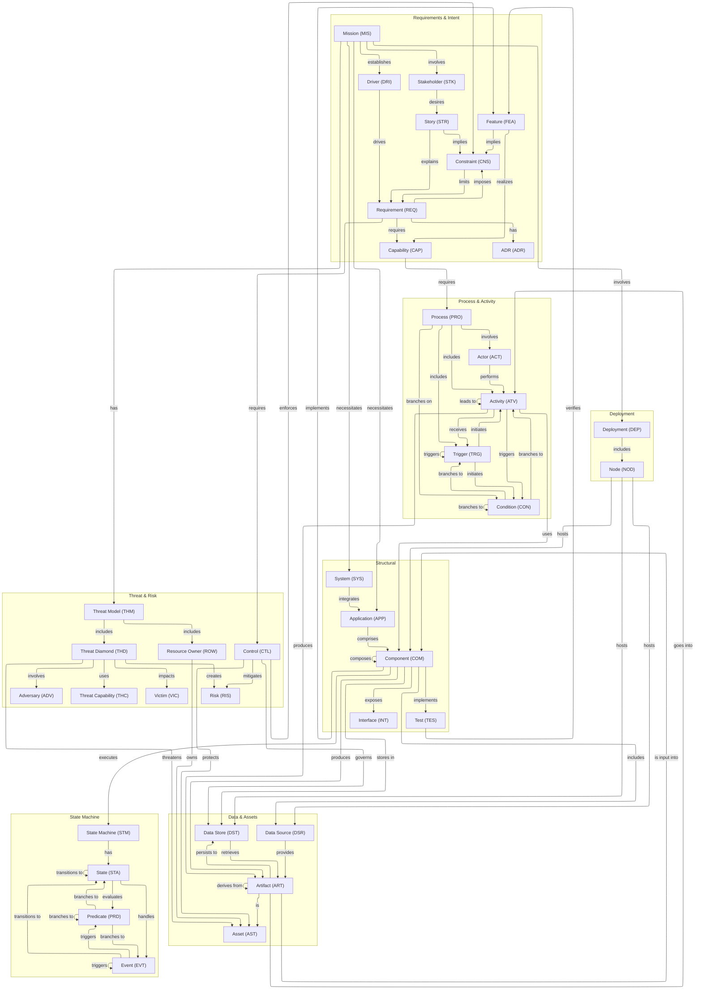

# Aurora Canonical Definitions

This document renders the full set of canonical card types and their allowed outgoing relationships as defined in [Aurora.canonical.definitions.json](../../.github/agents/aurora/Aurora.canonical.definitions.json).

## Graph

