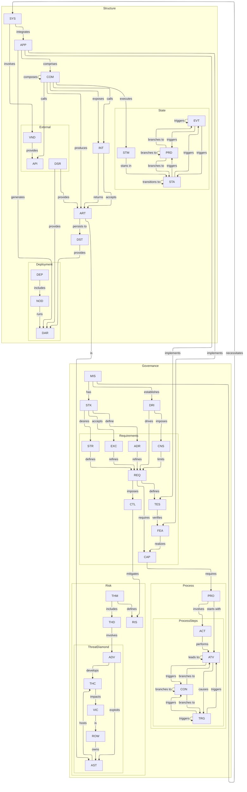

# Card Map

This reference visualizes the canonical card types and configured relationships from [`Aurora.modelconfiguration.json`](../../.github/aurora/reference/Aurora.modelconfiguration.json).

## Mermaid Graph

## Notes

- Nodes are shown by acronym, matching the canonical configuration.
- Edge labels are the configured relationship verbs.
- Card types without their own outgoing relationship list are still included as nodes so incoming links remain visible.
