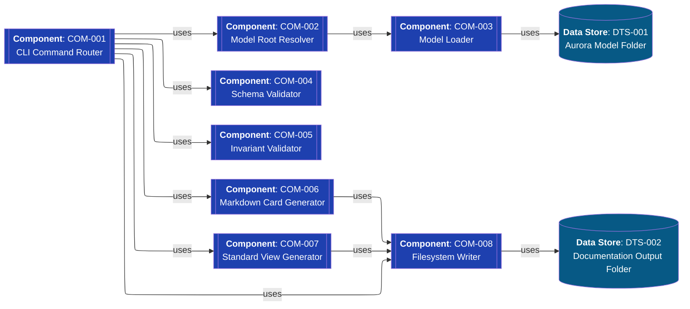

# MIS-001: Enable Deterministic Aurora CLI Tooling - Deployment

```mermaid
%%{init: {'flowchart': {'defaultRenderer': 'elk'}, 'themeVariables': { 'clusterBkg': 'transparent' }}}%%
graph LR


 COM-001[["`**Component**: COM-001<br />CLI Command Router`"]]
 COM-002[["`**Component**: COM-002<br />Model Root Resolver`"]]
 COM-003[["`**Component**: COM-003<br />Model Loader`"]]
 COM-004[["`**Component**: COM-004<br />Schema Validator`"]]
 COM-005[["`**Component**: COM-005<br />Invariant Validator`"]]
 COM-006[["`**Component**: COM-006<br />Markdown Card Generator`"]]
 COM-007[["`**Component**: COM-007<br />Standard View Generator`"]]
 COM-008[["`**Component**: COM-008<br />Filesystem Writer`"]]
 DTS-001[("`**Data Store**: DTS-001<br />Aurora Model Folder`")]
 DTS-002[("`**Data Store**: DTS-002<br />Documentation Output Folder`")]


 COM-001 -- uses --> COM-002;
 COM-001 -- uses --> COM-004;
 COM-001 -- uses --> COM-005;
 COM-001 -- uses --> COM-006;
 COM-001 -- uses --> COM-007;
 COM-001 -- uses --> COM-008;
 COM-002 -- uses --> COM-003;
 COM-003 -- uses --> DTS-001;
 COM-006 -- uses --> COM-008;
 COM-007 -- uses --> COM-008;
 COM-008 -- uses --> DTS-002;


classDef cls_boundary stroke-dasharray:5 5,stroke-width:4;
classDef cls_mission fill:#022c22,color:#FFFFFF
classDef cls_driver fill:#064e3b,color:#FFFFFF
classDef cls_requirement fill:#065f46,color:#FFFFFF
classDef cls_capability fill:#052e16,color:#FFFFFF
classDef cls_feature fill:#14532d,color:#FFFFFF
classDef cls_actor fill:#1a2e05,color:#FFFFFF
classDef cls_story fill:#365314,color:#FFFFFF;
classDef cls_condition fill:#422006,color:#FFFFFF
classDef cls_control fill:#713f12,color:#FFFFFF
classDef cls_constraint fill:#854d0e,color:#FFFFFF;
classDef cls_system fill:#172554,color:#FFFFFF
classDef cls_application fill:#1e3a8a,color:#FFFFFF
classDef cls_component fill:#1e40af,color:#FFFFFF
classDef cls_interface fill:#082f49,color:#FFFFFF
classDef cls_artifact fill:#1e293b,color:#FFFFFF
classDef cls_asset fill:#334155,color:#FFFFFF;
classDef cls_data_store fill:#075985,color:#FFFFFF
classDef cls_test fill:#022c22,color:#FFFFFF;
classDef cls_deployment fill:#1e1b4b,color:#FFFFFF;
classDef cls_node fill:#312e81,color:#FFFFFF;
classDef cls_node_instance fill:#3730a3,color:#FFFFFF;
classDef cls_process fill:#2e1065,color:#FFFFFF
classDef cls_activity fill:#4c1d95,color:#FFFFFF
classDef cls_event fill:#5b21b6,color:#FFFFFF
classDef cls_state_machine fill:#4a044e,color:#FFFFFF
classDef cls_state fill:#701a75,color:#FFFFFF
classDef cls_risk fill:#881337,color:#FFFFFF;
classDef cls_threat fill:#4c0519,color:#FFFFFF;
classDef cls_note fill:#1f2937,color:#FFFFFF;

 class COM-001,COM-002,COM-003,COM-004,COM-005,COM-006,COM-007,COM-008 cls_component;
 class DTS-001,DTS-002 cls_data_store;

```
