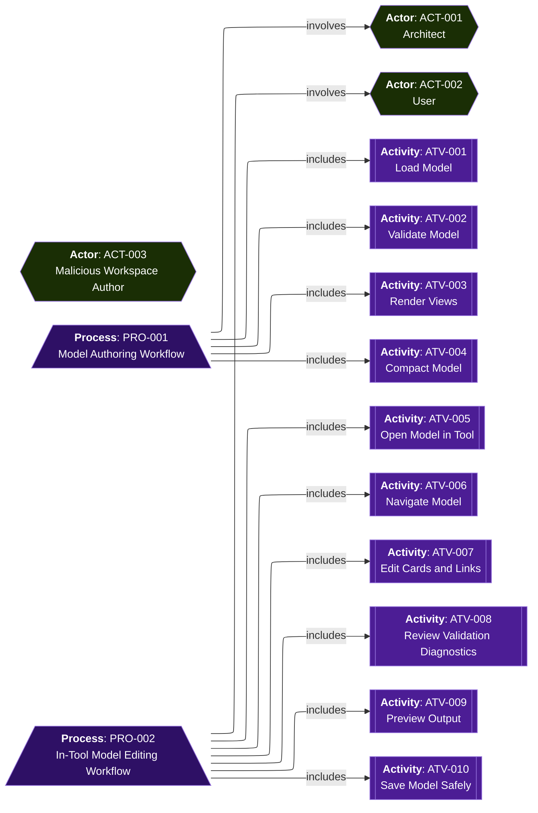

# MIS-001: Provide Default Tooling for AURORA - Process

```mermaid
%%{init: {'flowchart': {'defaultRenderer': 'elk'}, 'themeVariables': { 'clusterBkg': 'transparent' }}}%%
graph LR


	ACT-001{{"`**Actor**: ACT-001<br />Architect`"}}
	ACT-002{{"`**Actor**: ACT-002<br />User`"}}
	ACT-003{{"`**Actor**: ACT-003<br />Malicious Workspace Author`"}}
	ATV-001[["`**Activity**: ATV-001<br />Load Model`"]]
	ATV-002[["`**Activity**: ATV-002<br />Validate Model`"]]
	ATV-003[["`**Activity**: ATV-003<br />Render Views`"]]
	ATV-004[["`**Activity**: ATV-004<br />Compact Model`"]]
	ATV-005[["`**Activity**: ATV-005<br />Open Model in Tool`"]]
	ATV-006[["`**Activity**: ATV-006<br />Navigate Model`"]]
	ATV-007[["`**Activity**: ATV-007<br />Edit Cards and Links`"]]
	ATV-008[["`**Activity**: ATV-008<br />Review Validation Diagnostics`"]]
	ATV-009[["`**Activity**: ATV-009<br />Preview Output`"]]
	ATV-010[["`**Activity**: ATV-010<br />Save Model Safely`"]]
	PRO-001[/"`**Process**: PRO-001<br />Model Authoring Workflow`"\]
	PRO-002[/"`**Process**: PRO-002<br />In-Tool Model Editing Workflow`"\]


	PRO-001 -- involves --> ACT-001;
	PRO-001 -- includes --> ATV-001;
	PRO-001 -- includes --> ATV-002;
	PRO-001 -- includes --> ATV-003;
	PRO-001 -- includes --> ATV-004;
	PRO-002 -- involves --> ACT-002;
	PRO-002 -- includes --> ATV-005;
	PRO-002 -- includes --> ATV-006;
	PRO-002 -- includes --> ATV-007;
	PRO-002 -- includes --> ATV-008;
	PRO-002 -- includes --> ATV-009;
	PRO-002 -- includes --> ATV-010;


classDef cls_boundary stroke-dasharray:5 5,stroke-width:4;
classDef cls_mission fill:#022c22,color:#FFFFFF
classDef cls_driver fill:#064e3b,color:#FFFFFF
classDef cls_requirement fill:#065f46,color:#FFFFFF
classDef cls_capability fill:#052e16,color:#FFFFFF
classDef cls_feature fill:#14532d,color:#FFFFFF
classDef cls_actor fill:#1a2e05,color:#FFFFFF
classDef cls_story fill:#365314,color:#FFFFFF;
classDef cls_condition fill:#422006,color:#FFFFFF
classDef cls_control fill:#713f12,color:#FFFFFF
classDef cls_constraint fill:#854d0e,color:#FFFFFF;
classDef cls_system fill:#172554,color:#FFFFFF
classDef cls_application fill:#1e3a8a,color:#FFFFFF
classDef cls_component fill:#1e40af,color:#FFFFFF
classDef cls_interface fill:#082f49,color:#FFFFFF
classDef cls_artifact fill:#1e293b,color:#FFFFFF
classDef cls_asset fill:#334155,color:#FFFFFF;
classDef cls_data_store fill:#075985,color:#FFFFFF
classDef cls_test fill:#022c22,color:#FFFFFF;
classDef cls_deployment fill:#1e1b4b,color:#FFFFFF;
classDef cls_node fill:#312e81,color:#FFFFFF;
classDef cls_node_instance fill:#3730a3,color:#FFFFFF;
classDef cls_process fill:#2e1065,color:#FFFFFF
classDef cls_activity fill:#4c1d95,color:#FFFFFF
classDef cls_event fill:#5b21b6,color:#FFFFFF
classDef cls_state_machine fill:#4a044e,color:#FFFFFF
classDef cls_state fill:#701a75,color:#FFFFFF
classDef cls_risk fill:#881337,color:#FFFFFF;
classDef cls_threat fill:#4c0519,color:#FFFFFF;
classDef cls_note fill:#1f2937,color:#FFFFFF;

	class ATV-001,ATV-002,ATV-003,ATV-004,ATV-005,ATV-006,ATV-007,ATV-008,ATV-009,ATV-010 cls_activity;
	class ACT-001,ACT-002,ACT-003 cls_actor;
	class PRO-001,PRO-002 cls_process;

```
