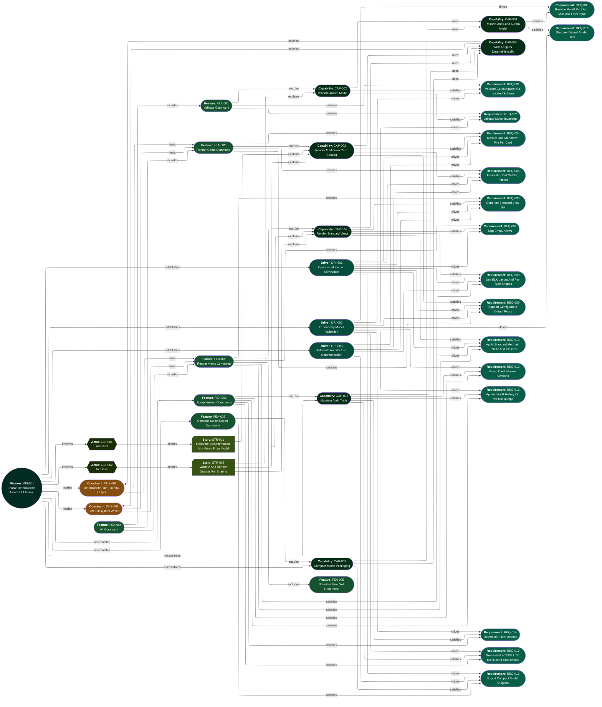

# MIS-001: Enable Deterministic Aurora CLI Tooling - Requirements

```mermaid
%%{init: {'flowchart': {'defaultRenderer': 'elk'}, 'themeVariables': { 'clusterBkg': 'transparent' }}}%%
graph LR


 ACT-001{{"`**Actor**: ACT-001<br />Architect`"}}
 ACT-002{{"`**Actor**: ACT-002<br />Tool User`"}}
 CAP-001(["`**Capability**: CAP-001<br />Resolve And Load Aurora Model`"])
 CAP-002(["`**Capability**: CAP-002<br />Validate Aurora Model`"])
 CAP-003(["`**Capability**: CAP-003<br />Render Markdown Card Catalog`"])
 CAP-004(["`**Capability**: CAP-004<br />Render Standard Views`"])
 CAP-005(["`**Capability**: CAP-005<br />Write Outputs Deterministically`"])
 CAP-006(["`**Capability**: CAP-006<br />Maintain Audit Trails`"])
 CAP-007(["`**Capability**: CAP-007<br />Compact Model Packaging`"])
 CNS-001(["`**Constraint**: CNS-001<br />Deterministic, Diff-Friendly Output`"])
 CNS-002(["`**Constraint**: CNS-002<br />Safe Filesystem Writes`"])
 DRI-001(["`**Driver**: DRI-001<br />Operational Friction Elimination`"])
 DRI-002(["`**Driver**: DRI-002<br />Trustworthy Model Validation`"])
 DRI-003(["`**Driver**: DRI-003<br />Automate Architecture Communication`"])
 FEA-001(["`**Feature**: FEA-001<br />Validate Command`"])
 FEA-002(["`**Feature**: FEA-002<br />Render Cards Command`"])
 FEA-003(["`**Feature**: FEA-003<br />Render Views Command`"])
 FEA-004(["`**Feature**: FEA-004<br />All Command`"])
 FEA-005(["`**Feature**: FEA-005<br />Standard View Set Generation`"])
 FEA-006(["`**Feature**: FEA-006<br />Bump Version Commands`"])
 FEA-007(["`**Feature**: FEA-007<br />Compact Model Export Command`"])
 MIS-001(("`**Mission**: MIS-001<br />Enable Deterministic Aurora CLI Tooling`"))
 REQ-001(["`**Requirement**: REQ-001<br />Validate Cards Against Co-Located Schema`"])
 REQ-002(["`**Requirement**: REQ-002<br />Validate Model Invariants`"])
 REQ-003(["`**Requirement**: REQ-003<br />Resolve Model Root And Missions From Input`"])
 REQ-004(["`**Requirement**: REQ-004<br />Render One Markdown File Per Card`"])
 REQ-005(["`**Requirement**: REQ-005<br />Generate Card Catalog Indexes`"])
 REQ-006(["`**Requirement**: REQ-006<br />Generate Standard View Set`"])
 REQ-007(["`**Requirement**: REQ-007<br />Skip Empty Views`"])
 REQ-008(["`**Requirement**: REQ-008<br />Use ELK Layout And Per-Type Shapes`"])
 REQ-009(["`**Requirement**: REQ-009<br />Support Configurable Output Roots`"])
 REQ-010(["`**Requirement**: REQ-010<br />Apply Standard Mermaid Palette And Classes`"])
 REQ-011(["`**Requirement**: REQ-011<br />Discover Default Model Root`"])
 REQ-012(["`**Requirement**: REQ-012<br />Bump Card Semver Versions`"])
 REQ-013(["`**Requirement**: REQ-013<br />Append Audit History On Version Bumps`"])
 REQ-014(["`**Requirement**: REQ-014<br />Determine Editor Identity`"])
 REQ-015(["`**Requirement**: REQ-015<br />Generate RFC3339 UTC Millisecond Timestamps`"])
 REQ-016(["`**Requirement**: REQ-016<br />Export Compact Model Snapshot`"])
 STR-001["`**Story**: STR-001<br />Generate Documentation And Views From Model`"]@{shape: card}
 STR-002["`**Story**: STR-002<br />Validate And Render Outputs For Sharing`"]@{shape: card}


 ACT-001 -- desires --> STR-001;
 ACT-002 -- desires --> STR-002;
 CAP-001 -- satisfies --> REQ-003;
 CAP-001 -- satisfies --> REQ-011;
 CAP-002 -- satisfies --> REQ-001;
 CAP-002 -- satisfies --> REQ-002;
 CAP-002 -- uses --> CAP-001;
 CAP-003 -- satisfies --> REQ-004;
 CAP-003 -- satisfies --> REQ-005;
 CAP-003 -- satisfies --> REQ-009;
 CAP-003 -- uses --> CAP-005;
 CAP-004 -- satisfies --> REQ-006;
 CAP-004 -- satisfies --> REQ-007;
 CAP-004 -- satisfies --> REQ-008;
 CAP-004 -- satisfies --> REQ-010;
 CAP-004 -- uses --> CAP-005;
 CAP-005 -- satisfies --> CNS-001;
 CAP-005 -- satisfies --> CNS-002;
 CAP-006 -- satisfies --> REQ-012;
 CAP-006 -- satisfies --> REQ-013;
 CAP-006 -- satisfies --> REQ-014;
 CAP-006 -- satisfies --> REQ-015;
 CAP-006 -- uses --> CAP-005;
 CAP-007 -- satisfies --> REQ-016;
 CAP-007 -- uses --> CAP-001;
 CAP-007 -- uses --> CAP-005;
 CNS-001 -- limits --> FEA-002;
 CNS-001 -- limits --> FEA-003;
 CNS-002 -- limits --> FEA-002;
 CNS-002 -- limits --> FEA-003;
 DRI-001 -- drives --> REQ-004;
 DRI-001 -- drives --> REQ-005;
 DRI-001 -- drives --> REQ-006;
 DRI-001 -- drives --> REQ-007;
 DRI-001 -- drives --> REQ-008;
 DRI-001 -- drives --> REQ-009;
 DRI-001 -- drives --> REQ-010;
 DRI-001 -- drives --> REQ-016;
 DRI-002 -- drives --> REQ-001;
 DRI-002 -- drives --> REQ-002;
 DRI-002 -- drives --> REQ-003;
 DRI-002 -- drives --> REQ-009;
 DRI-002 -- drives --> REQ-011;
 DRI-002 -- drives --> REQ-012;
 DRI-002 -- drives --> REQ-013;
 DRI-002 -- drives --> REQ-014;
 DRI-002 -- drives --> REQ-015;
 DRI-003 -- drives --> REQ-004;
 DRI-003 -- drives --> REQ-005;
 DRI-003 -- drives --> REQ-006;
 DRI-003 -- drives --> REQ-008;
 DRI-003 -- drives --> REQ-010;
 DRI-003 -- drives --> REQ-016;
 FEA-001 -- enables --> CAP-002;
 FEA-001 -- satisfies --> REQ-001;
 FEA-001 -- satisfies --> REQ-002;
 FEA-002 -- enables --> CAP-003;
 FEA-002 -- satisfies --> REQ-004;
 FEA-002 -- satisfies --> REQ-005;
 FEA-002 -- satisfies --> REQ-009;
 FEA-003 -- enables --> CAP-004;
 FEA-003 -- includes --> FEA-005;
 FEA-003 -- satisfies --> REQ-006;
 FEA-003 -- satisfies --> REQ-007;
 FEA-003 -- satisfies --> REQ-008;
 FEA-003 -- satisfies --> REQ-010;
 FEA-004 -- includes --> FEA-001;
 FEA-004 -- includes --> FEA-002;
 FEA-004 -- includes --> FEA-003;
 FEA-006 -- enables --> CAP-006;
 FEA-006 -- satisfies --> REQ-012;
 FEA-006 -- satisfies --> REQ-013;
 FEA-006 -- satisfies --> REQ-014;
 FEA-006 -- satisfies --> REQ-015;
 FEA-007 -- enables --> CAP-007;
 FEA-007 -- satisfies --> REQ-016;
 MIS-001 -- establishes --> DRI-001;
 MIS-001 -- establishes --> DRI-002;
 MIS-001 -- establishes --> DRI-003;
 MIS-001 -- involves --> ACT-001;
 MIS-001 -- involves --> ACT-002;
 MIS-001 -- implies --> CNS-001;
 MIS-001 -- implies --> CNS-002;
 MIS-001 -- necessitates --> CAP-006;
 MIS-001 -- necessitates --> FEA-006;
 MIS-001 -- necessitates --> CAP-007;
 MIS-001 -- necessitates --> FEA-007;
 STR-001 -- explains --> CAP-003;
 STR-001 -- explains --> CAP-004;
 STR-002 -- explains --> CAP-002;
 STR-002 -- explains --> CAP-003;
 STR-002 -- explains --> CAP-004;


classDef cls_boundary stroke-dasharray:5 5,stroke-width:4;
classDef cls_mission fill:#022c22,color:#FFFFFF
classDef cls_driver fill:#064e3b,color:#FFFFFF
classDef cls_requirement fill:#065f46,color:#FFFFFF
classDef cls_capability fill:#052e16,color:#FFFFFF
classDef cls_feature fill:#14532d,color:#FFFFFF
classDef cls_actor fill:#1a2e05,color:#FFFFFF
classDef cls_story fill:#365314,color:#FFFFFF;
classDef cls_condition fill:#422006,color:#FFFFFF
classDef cls_control fill:#713f12,color:#FFFFFF
classDef cls_constraint fill:#854d0e,color:#FFFFFF;
classDef cls_system fill:#172554,color:#FFFFFF
classDef cls_application fill:#1e3a8a,color:#FFFFFF
classDef cls_component fill:#1e40af,color:#FFFFFF
classDef cls_interface fill:#082f49,color:#FFFFFF
classDef cls_artifact fill:#1e293b,color:#FFFFFF
classDef cls_asset fill:#334155,color:#FFFFFF;
classDef cls_data_store fill:#075985,color:#FFFFFF
classDef cls_test fill:#022c22,color:#FFFFFF;
classDef cls_deployment fill:#1e1b4b,color:#FFFFFF;
classDef cls_node fill:#312e81,color:#FFFFFF;
classDef cls_node_instance fill:#3730a3,color:#FFFFFF;
classDef cls_process fill:#2e1065,color:#FFFFFF
classDef cls_activity fill:#4c1d95,color:#FFFFFF
classDef cls_event fill:#5b21b6,color:#FFFFFF
classDef cls_state_machine fill:#4a044e,color:#FFFFFF
classDef cls_state fill:#701a75,color:#FFFFFF
classDef cls_risk fill:#881337,color:#FFFFFF;
classDef cls_threat fill:#4c0519,color:#FFFFFF;
classDef cls_note fill:#1f2937,color:#FFFFFF;

 class ACT-001,ACT-002 cls_actor;
 class CAP-001,CAP-002,CAP-003,CAP-004,CAP-005,CAP-006,CAP-007 cls_capability;
 class CNS-001,CNS-002 cls_constraint;
 class DRI-001,DRI-002,DRI-003 cls_driver;
 class FEA-001,FEA-002,FEA-003,FEA-004,FEA-005,FEA-006,FEA-007 cls_feature;
 class MIS-001 cls_mission;
 class REQ-001,REQ-002,REQ-003,REQ-004,REQ-005,REQ-006,REQ-007,REQ-008,REQ-009,REQ-010,REQ-011,REQ-012,REQ-013,REQ-014,REQ-015,REQ-016 cls_requirement;
 class STR-001,STR-002 cls_story;

```
