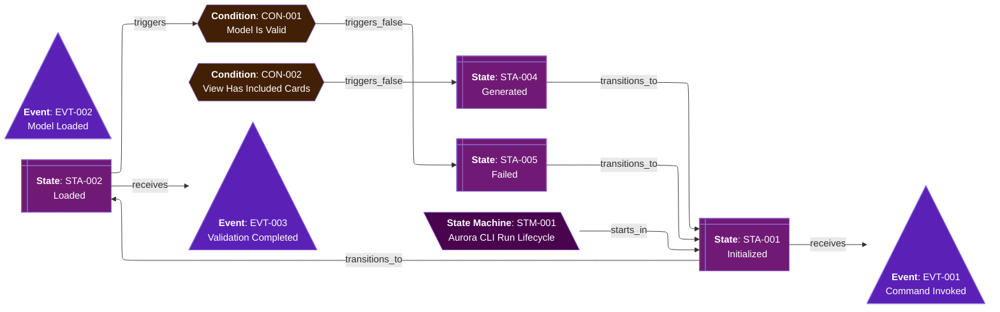

# MIS-001: Enable Deterministic Aurora CLI Tooling - State Machine

```mermaid
%%{init: {'flowchart': {'defaultRenderer': 'elk'}, 'themeVariables': { 'clusterBkg': 'transparent' }}}%%
graph LR


	CON-001{{"`**Condition**: CON-001<br />Model Is Valid`"}}
	CON-002{{"`**Condition**: CON-002<br />View Has Included Cards`"}}
	EVT-001["`**Event**: EVT-001<br />Command Invoked`"]@{shape: tri}
	EVT-002["`**Event**: EVT-002<br />Model Loaded`"]@{shape: tri}
	EVT-003["`**Event**: EVT-003<br />Validation Completed`"]@{shape: tri}
	STA-001["`**State**: STA-001<br />Initialized`"]@{shape: win-pane}
	STA-002["`**State**: STA-002<br />Loaded`"]@{shape: win-pane}
	STA-004["`**State**: STA-004<br />Generated`"]@{shape: win-pane}
	STA-005["`**State**: STA-005<br />Failed`"]@{shape: win-pane}
	STM-001[\"`**State Machine**: STM-001<br />Aurora CLI Run Lifecycle`"\]


	CON-001 -- triggers_false --> STA-005;
	CON-002 -- triggers_false --> STA-004;
	STA-001 -- receives --> EVT-001;
	STA-001 -- transitions_to --> STA-002;
	STA-002 -- receives --> EVT-003;
	STA-002 -- triggers --> CON-001;
	STA-004 -- transitions_to --> STA-001;
	STA-005 -- transitions_to --> STA-001;
	STM-001 -- starts_in --> STA-001;


classDef cls_boundary stroke-dasharray:5 5,stroke-width:4;
classDef cls_mission fill:#022c22,color:#FFFFFF
classDef cls_driver fill:#064e3b,color:#FFFFFF
classDef cls_requirement fill:#065f46,color:#FFFFFF
classDef cls_capability fill:#052e16,color:#FFFFFF
classDef cls_feature fill:#14532d,color:#FFFFFF
classDef cls_actor fill:#1a2e05,color:#FFFFFF
classDef cls_story fill:#365314,color:#FFFFFF;
classDef cls_condition fill:#422006,color:#FFFFFF
classDef cls_control fill:#713f12,color:#FFFFFF
classDef cls_constraint fill:#854d0e,color:#FFFFFF;
classDef cls_system fill:#172554,color:#FFFFFF
classDef cls_application fill:#1e3a8a,color:#FFFFFF
classDef cls_component fill:#1e40af,color:#FFFFFF
classDef cls_interface fill:#082f49,color:#FFFFFF
classDef cls_artifact fill:#1e293b,color:#FFFFFF
classDef cls_asset fill:#334155,color:#FFFFFF;
classDef cls_data_store fill:#075985,color:#FFFFFF
classDef cls_test fill:#022c22,color:#FFFFFF;
classDef cls_deployment fill:#1e1b4b,color:#FFFFFF;
classDef cls_node fill:#312e81,color:#FFFFFF;
classDef cls_node_instance fill:#3730a3,color:#FFFFFF;
classDef cls_process fill:#2e1065,color:#FFFFFF
classDef cls_activity fill:#4c1d95,color:#FFFFFF
classDef cls_event fill:#5b21b6,color:#FFFFFF
classDef cls_state_machine fill:#4a044e,color:#FFFFFF
classDef cls_state fill:#701a75,color:#FFFFFF
classDef cls_risk fill:#881337,color:#FFFFFF;
classDef cls_threat fill:#4c0519,color:#FFFFFF;
classDef cls_note fill:#1f2937,color:#FFFFFF;

	class CON-001,CON-002 cls_condition;
	class EVT-001,EVT-002,EVT-003 cls_event;
	class STA-001,STA-002,STA-004,STA-005 cls_state;
	class STM-001 cls_state_machine;

```
