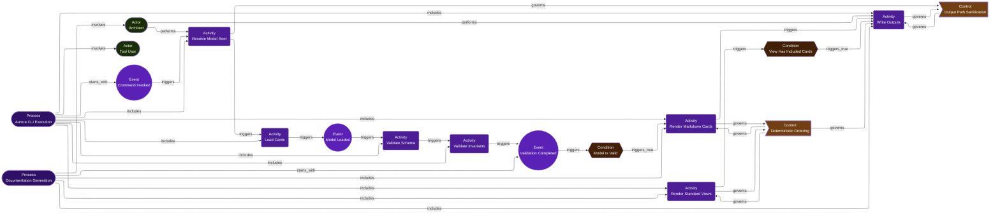

# Process Flow

**Cards included:**

- Process
- Actor
- Event
- Activity
- Condition
- Control

```mermaid
%%{init: {'flowchart': {'defaultRenderer': 'elk'}}}%%
graph LR
  PRO-001(["`Process<br />Aurora CLI Execution`"])
  PRO-002(["`Process<br />Documentation Generation`"])
  ACT-001(["`Actor<br />Architect`"])
  ACT-002(["`Actor<br />Tool User`"])
  EVT-001(("`Event<br />Command Invoked`"))
  EVT-002(("`Event<br />Model Loaded`"))
  EVT-003(("`Event<br />Validation Completed`"))
  ATV-001("`Activity<br />Resolve Model Root`")
  ATV-002("`Activity<br />Load Cards`")
  ATV-003("`Activity<br />Validate Schema`")
  ATV-004("`Activity<br />Validate Invariants`")
  ATV-005("`Activity<br />Render Markdown Cards`")
  ATV-006("`Activity<br />Render Standard Views`")
  ATV-007("`Activity<br />Write Outputs`")
  CON-001{{"`Condition<br />Model Is Valid`"}}
  CON-002{{"`Condition<br />View Has Included Cards`"}}
  CTL-001>"`Control<br />Deterministic Ordering`"]
  CTL-002>"`Control<br />Output Path Sanitization`"]

  ATV-001 -- triggers --> ATV-002
  ATV-001 -- governs --> CTL-002
  ATV-002 -- triggers --> EVT-002
  ATV-003 -- triggers --> ATV-004
  ATV-004 -- triggers --> EVT-003
  ATV-005 -- governs --> CTL-001
  ATV-005 -- triggers --> ATV-007
  ATV-006 -- triggers --> CON-002
  ATV-006 -- governs --> CTL-001
  ATV-007 -- governs --> CTL-002
  ACT-001 -- performs --> ATV-001
  ACT-001 -- performs --> ATV-007
  CON-001 -- triggers_true --> ATV-005
  CON-002 -- triggers_true --> ATV-007
  CTL-001 -- governs --> ATV-005
  CTL-001 -- governs --> ATV-006
  CTL-001 -- governs --> ATV-007
  CTL-002 -- governs --> ATV-007
  EVT-001 -- triggers --> ATV-001
  EVT-002 -- triggers --> ATV-003
  EVT-003 -- triggers --> CON-001
  PRO-001 -- starts_with --> EVT-001
  PRO-001 -- involves --> ACT-002
  PRO-001 -- includes --> ATV-001
  PRO-001 -- includes --> ATV-002
  PRO-001 -- includes --> ATV-003
  PRO-001 -- includes --> ATV-004
  PRO-001 -- includes --> ATV-005
  PRO-001 -- includes --> ATV-006
  PRO-001 -- includes --> ATV-007
  PRO-002 -- involves --> ACT-001
  PRO-002 -- starts_with --> EVT-003
  PRO-002 -- includes --> ATV-005
  PRO-002 -- includes --> ATV-006
  PRO-002 -- includes --> ATV-007

  classDef cls_activity fill:#4c1d95,color:#FFFFFF
  classDef cls_actor fill:#1a2e05,color:#FFFFFF
  classDef cls_condition fill:#422006,color:#FFFFFF
  classDef cls_control fill:#713f12,color:#FFFFFF
  classDef cls_event fill:#5b21b6,color:#FFFFFF
  classDef cls_process fill:#2e1065,color:#FFFFFF

  class ATV-001,ATV-002,ATV-003,ATV-004,ATV-005,ATV-006,ATV-007 cls_activity
  class ACT-001,ACT-002 cls_actor
  class CON-001,CON-002 cls_condition
  class CTL-001,CTL-002 cls_control
  class EVT-001,EVT-002,EVT-003 cls_event
  class PRO-001,PRO-002 cls_process

```
