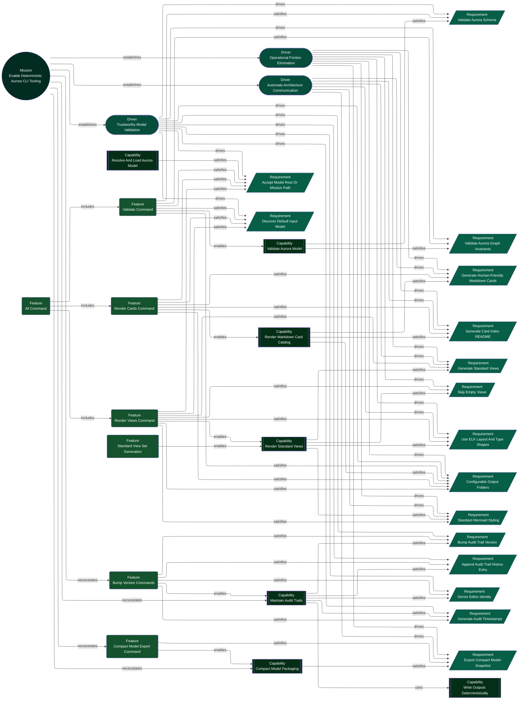

# Requirements View

**Cards included:**

- Mission
- Driver
- Requirement
- Capability
- Feature

```mermaid
%%{init: {'flowchart': {'defaultRenderer': 'elk'}}}%%
graph LR
  MIS-001(("`Mission<br />Enable Deterministic Aurora CLI Tooling`"))
  DRI-001(["`Driver<br />Operational Friction Elimination`"])
  DRI-002(["`Driver<br />Trustworthy Model Validation`"])
  DRI-003(["`Driver<br />Automate Architecture Communication`"])
  REQ-001[/"`Requirement<br />Validate Aurora Schema`"/]
  REQ-002[/"`Requirement<br />Validate Aurora Graph Invariants`"/]
  REQ-003[/"`Requirement<br />Accept Model Root Or Mission Path`"/]
  REQ-004[/"`Requirement<br />Generate Human-Friendly Markdown Cards`"/]
  REQ-005[/"`Requirement<br />Generate Card Index README`"/]
  REQ-006[/"`Requirement<br />Generate Standard Views`"/]
  REQ-007[/"`Requirement<br />Skip Empty Views`"/]
  REQ-008[/"`Requirement<br />Use ELK Layout And Type Shapes`"/]
  REQ-009[/"`Requirement<br />Configurable Output Folders`"/]
  REQ-010[/"`Requirement<br />Standard Mermaid Styling`"/]
  REQ-011[/"`Requirement<br />Discover Default Input Model`"/]
  REQ-012[/"`Requirement<br />Bump Audit Trail Version`"/]
  REQ-013[/"`Requirement<br />Append Audit Trail History Entry`"/]
  REQ-014[/"`Requirement<br />Derive Editor Identity`"/]
  REQ-015[/"`Requirement<br />Generate Audit Timestamps`"/]
  REQ-016[/"`Requirement<br />Export Compact Model Snapshot`"/]
  CAP-001[["`Capability<br />Resolve And Load Aurora Model`"]]
  CAP-002[["`Capability<br />Validate Aurora Model`"]]
  CAP-003[["`Capability<br />Render Markdown Card Catalog`"]]
  CAP-004[["`Capability<br />Render Standard Views`"]]
  CAP-005[["`Capability<br />Write Outputs Deterministically`"]]
  CAP-006[["`Capability<br />Maintain Audit Trails`"]]
  CAP-007[["`Capability<br />Compact Model Packaging`"]]
  FEA-001("`Feature<br />Validate Command`")
  FEA-002("`Feature<br />Render Cards Command`")
  FEA-003("`Feature<br />Render Views Command`")
  FEA-004("`Feature<br />All Command`")
  FEA-005("`Feature<br />Standard View Set Generation`")
  FEA-006("`Feature<br />Bump Version Commands`")
  FEA-007("`Feature<br />Compact Model Export Command`")

  CAP-001 -- satisfies --> REQ-003
  CAP-002 -- satisfies --> REQ-001
  CAP-002 -- satisfies --> REQ-002
  CAP-003 -- satisfies --> REQ-004
  CAP-003 -- satisfies --> REQ-005
  CAP-003 -- satisfies --> REQ-009
  CAP-004 -- satisfies --> REQ-006
  CAP-004 -- satisfies --> REQ-007
  CAP-004 -- satisfies --> REQ-008
  CAP-004 -- satisfies --> REQ-010
  CAP-006 -- satisfies --> REQ-012
  CAP-006 -- satisfies --> REQ-013
  CAP-006 -- satisfies --> REQ-014
  CAP-006 -- satisfies --> REQ-015
  CAP-006 -- uses --> CAP-005
  CAP-007 -- satisfies --> REQ-016
  DRI-001 -- drives --> REQ-004
  DRI-001 -- drives --> REQ-005
  DRI-001 -- drives --> REQ-006
  DRI-001 -- drives --> REQ-007
  DRI-001 -- drives --> REQ-008
  DRI-001 -- drives --> REQ-009
  DRI-001 -- drives --> REQ-010
  DRI-001 -- drives --> REQ-016
  DRI-002 -- drives --> REQ-001
  DRI-002 -- drives --> REQ-002
  DRI-002 -- drives --> REQ-003
  DRI-002 -- drives --> REQ-011
  DRI-002 -- drives --> REQ-009
  DRI-002 -- drives --> REQ-012
  DRI-002 -- drives --> REQ-013
  DRI-002 -- drives --> REQ-014
  DRI-002 -- drives --> REQ-015
  DRI-003 -- drives --> REQ-004
  DRI-003 -- drives --> REQ-005
  DRI-003 -- drives --> REQ-006
  DRI-003 -- drives --> REQ-008
  DRI-003 -- drives --> REQ-010
  DRI-003 -- drives --> REQ-016
  FEA-001 -- enables --> CAP-002
  FEA-001 -- satisfies --> REQ-001
  FEA-001 -- satisfies --> REQ-002
  FEA-001 -- satisfies --> REQ-003
  FEA-001 -- satisfies --> REQ-011
  FEA-001 -- satisfies --> REQ-009
  FEA-002 -- enables --> CAP-003
  FEA-002 -- satisfies --> REQ-004
  FEA-002 -- satisfies --> REQ-005
  FEA-002 -- satisfies --> REQ-003
  FEA-002 -- satisfies --> REQ-011
  FEA-002 -- satisfies --> REQ-009
  FEA-003 -- enables --> CAP-004
  FEA-003 -- satisfies --> REQ-006
  FEA-003 -- satisfies --> REQ-007
  FEA-003 -- satisfies --> REQ-008
  FEA-003 -- satisfies --> REQ-010
  FEA-003 -- satisfies --> REQ-003
  FEA-003 -- satisfies --> REQ-011
  FEA-003 -- satisfies --> REQ-009
  FEA-004 -- includes --> FEA-001
  FEA-004 -- includes --> FEA-002
  FEA-004 -- includes --> FEA-003
  FEA-005 -- enables --> CAP-004
  FEA-006 -- enables --> CAP-006
  FEA-006 -- satisfies --> REQ-012
  FEA-006 -- satisfies --> REQ-013
  FEA-006 -- satisfies --> REQ-014
  FEA-006 -- satisfies --> REQ-015
  FEA-007 -- enables --> CAP-007
  FEA-007 -- satisfies --> REQ-016
  MIS-001 -- establishes --> DRI-001
  MIS-001 -- establishes --> DRI-002
  MIS-001 -- establishes --> DRI-003
  MIS-001 -- necessitates --> CAP-006
  MIS-001 -- necessitates --> FEA-006
  MIS-001 -- necessitates --> CAP-007
  MIS-001 -- necessitates --> FEA-007

  classDef cls_capability fill:#052e16,color:#FFFFFF
  classDef cls_driver fill:#064e3b,color:#FFFFFF
  classDef cls_feature fill:#14532d,color:#FFFFFF
  classDef cls_mission fill:#022c22,color:#FFFFFF
  classDef cls_requirement fill:#065f46,color:#FFFFFF

  class CAP-001,CAP-002,CAP-003,CAP-004,CAP-005,CAP-006,CAP-007 cls_capability
  class DRI-001,DRI-002,DRI-003 cls_driver
  class FEA-001,FEA-002,FEA-003,FEA-004,FEA-005,FEA-006,FEA-007 cls_feature
  class MIS-001 cls_mission
  class REQ-001,REQ-002,REQ-003,REQ-004,REQ-005,REQ-006,REQ-007,REQ-008,REQ-009,REQ-010,REQ-011,REQ-012,REQ-013,REQ-014,REQ-015,REQ-016 cls_requirement

```
