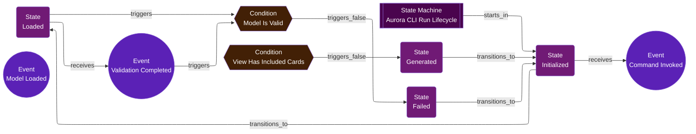

# State Machine

**Cards included:**

- State Machine
- State
- Event
- Condition

```mermaid
%%{init: {'flowchart': {'defaultRenderer': 'elk'}}}%%
graph LR
  STM-001[["`State Machine<br />Aurora CLI Run Lifecycle`"]]
  STA-001("`State<br />Initialized`")
  STA-002("`State<br />Loaded`")
  STA-004("`State<br />Generated`")
  STA-005("`State<br />Failed`")
  EVT-001(("`Event<br />Command Invoked`"))
  EVT-002(("`Event<br />Model Loaded`"))
  EVT-003(("`Event<br />Validation Completed`"))
  CON-001{{"`Condition<br />Model Is Valid`"}}
  CON-002{{"`Condition<br />View Has Included Cards`"}}

  CON-001 -- triggers_false --> STA-005
  CON-002 -- triggers_false --> STA-004
  EVT-003 -- triggers --> CON-001
  STM-001 -- starts_in --> STA-001
  STA-001 -- receives --> EVT-001
  STA-001 -- transitions_to --> STA-002
  STA-002 -- receives --> EVT-003
  STA-002 -- triggers --> CON-001
  STA-004 -- transitions_to --> STA-001
  STA-005 -- transitions_to --> STA-001

  classDef cls_condition fill:#422006,color:#FFFFFF
  classDef cls_event fill:#5b21b6,color:#FFFFFF
  classDef cls_state fill:#701a75,color:#FFFFFF
  classDef cls_state_machine fill:#4a044e,color:#FFFFFF

  class CON-001,CON-002 cls_condition
  class EVT-001,EVT-002,EVT-003 cls_event
  class STA-001,STA-002,STA-004,STA-005 cls_state
  class STM-001 cls_state_machine

```
