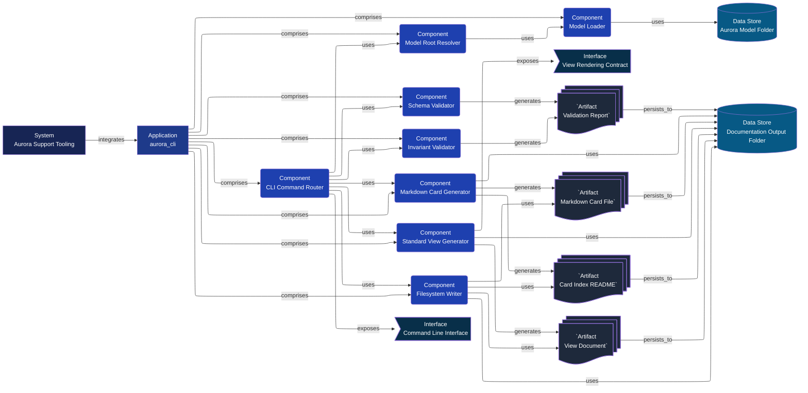

# System Composition

**Cards included:**

- System
- Application
- Component
- Interface
- Data Store
- Artifact

```mermaid
%%{init: {'flowchart': {'defaultRenderer': 'elk'}}}%%
graph LR
  SYS-001["`System<br />Aurora Support Tooling`"]
  APP-001["`Application<br />aurora_cli`"]
  COM-001("`Component<br />CLI Command Router`")
  COM-002("`Component<br />Model Root Resolver`")
  COM-003("`Component<br />Model Loader`")
  COM-004("`Component<br />Schema Validator`")
  COM-005("`Component<br />Invariant Validator`")
  COM-006("`Component<br />Markdown Card Generator`")
  COM-007("`Component<br />Standard View Generator`")
  COM-008("`Component<br />Filesystem Writer`")
  INT-001>"`Interface<br />Command Line Interface`"]
  INT-002>"`Interface<br />View Rendering Contract`"]
  DTS-001[("`Data Store<br />Aurora Model Folder`")]
  DTS-002[("`Data Store<br />Documentation Output Folder`")]
  ART-001@{shape: documents, label: "`Artifact<br />Validation Report`"}
  ART-002@{shape: documents, label: "`Artifact<br />Markdown Card File`"}
  ART-003@{shape: documents, label: "`Artifact<br />Card Index README`"}
  ART-004@{shape: documents, label: "`Artifact<br />View Document`"}

  APP-001 -- comprises --> COM-001
  APP-001 -- comprises --> COM-002
  APP-001 -- comprises --> COM-003
  APP-001 -- comprises --> COM-004
  APP-001 -- comprises --> COM-005
  APP-001 -- comprises --> COM-006
  APP-001 -- comprises --> COM-007
  APP-001 -- comprises --> COM-008
  ART-001 -- persists_to --> DTS-002
  ART-002 -- persists_to --> DTS-002
  ART-003 -- persists_to --> DTS-002
  ART-004 -- persists_to --> DTS-002
  COM-001 -- exposes --> INT-001
  COM-001 -- uses --> COM-002
  COM-001 -- uses --> COM-004
  COM-001 -- uses --> COM-005
  COM-001 -- uses --> COM-006
  COM-001 -- uses --> COM-007
  COM-001 -- uses --> COM-008
  COM-002 -- uses --> COM-003
  COM-003 -- uses --> DTS-001
  COM-004 -- generates --> ART-001
  COM-005 -- generates --> ART-001
  COM-006 -- generates --> ART-002
  COM-006 -- generates --> ART-003
  COM-006 -- uses --> DTS-002
  COM-007 -- exposes --> INT-002
  COM-007 -- generates --> ART-004
  COM-007 -- uses --> DTS-002
  COM-008 -- uses --> DTS-002
  COM-008 -- uses --> ART-002
  COM-008 -- uses --> ART-003
  COM-008 -- uses --> ART-004
  SYS-001 -- integrates --> APP-001

  classDef cls_application fill:#1e3a8a,color:#FFFFFF
  classDef cls_artifact fill:#1e293b,color:#FFFFFF
  classDef cls_component fill:#1e40af,color:#FFFFFF
  classDef cls_data_store fill:#075985,color:#FFFFFF
  classDef cls_interface fill:#082f49,color:#FFFFFF
  classDef cls_system fill:#172554,color:#FFFFFF

  class APP-001 cls_application
  class ART-001,ART-002,ART-003,ART-004 cls_artifact
  class COM-001,COM-002,COM-003,COM-004,COM-005,COM-006,COM-007,COM-008 cls_component
  class DTS-001,DTS-002 cls_data_store
  class INT-001,INT-002 cls_interface
  class SYS-001 cls_system

```
