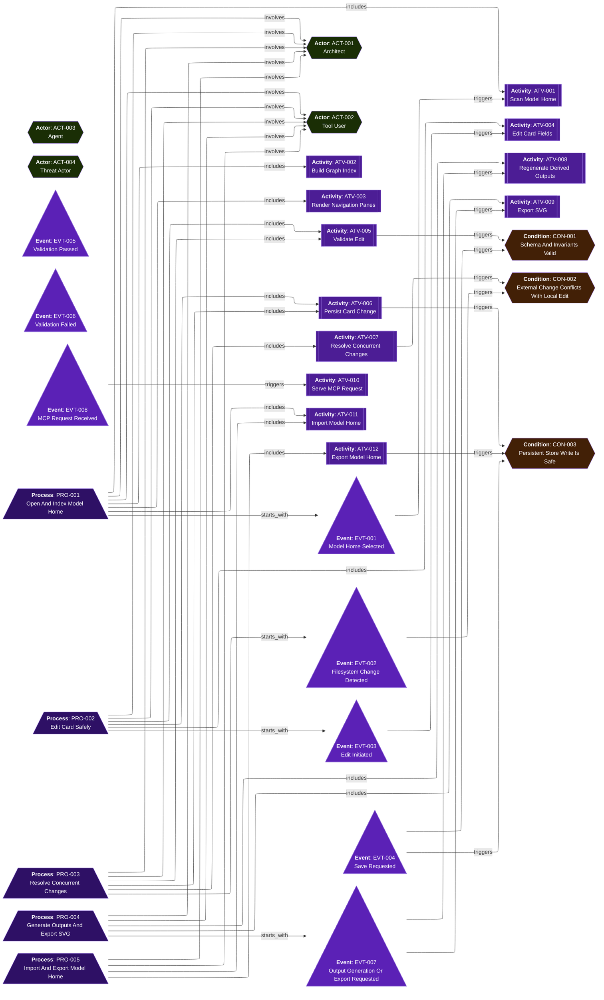

# MIS-002: Enable Aurora Viewer And Editor - Process

```mermaid
%%{init: {'flowchart': {'defaultRenderer': 'elk'}, 'themeVariables': { 'clusterBkg': 'transparent' }}}%%
graph LR


	ACT-001{{"`**Actor**: ACT-001<br />Architect`"}}
	ACT-002{{"`**Actor**: ACT-002<br />Tool User`"}}
	ACT-003{{"`**Actor**: ACT-003<br />Agent`"}}
	ACT-004{{"`**Actor**: ACT-004<br />Threat Actor`"}}
	ATV-001[["`**Activity**: ATV-001<br />Scan Model Home`"]]
	ATV-002[["`**Activity**: ATV-002<br />Build Graph Index`"]]
	ATV-003[["`**Activity**: ATV-003<br />Render Navigation Panes`"]]
	ATV-004[["`**Activity**: ATV-004<br />Edit Card Fields`"]]
	ATV-005[["`**Activity**: ATV-005<br />Validate Edit`"]]
	ATV-006[["`**Activity**: ATV-006<br />Persist Card Change`"]]
	ATV-007[["`**Activity**: ATV-007<br />Resolve Concurrent Changes`"]]
	ATV-008[["`**Activity**: ATV-008<br />Regenerate Derived Outputs`"]]
	ATV-009[["`**Activity**: ATV-009<br />Export SVG`"]]
	ATV-010[["`**Activity**: ATV-010<br />Serve MCP Request`"]]
	ATV-011[["`**Activity**: ATV-011<br />Import Model Home`"]]
	ATV-012[["`**Activity**: ATV-012<br />Export Model Home`"]]
	CON-001{{"`**Condition**: CON-001<br />Schema And Invariants Valid`"}}
	CON-002{{"`**Condition**: CON-002<br />External Change Conflicts With Local Edit`"}}
	CON-003{{"`**Condition**: CON-003<br />Persistent Store Write Is Safe`"}}
	EVT-001["`**Event**: EVT-001<br />Model Home Selected`"]@{shape: tri}
	EVT-002["`**Event**: EVT-002<br />Filesystem Change Detected`"]@{shape: tri}
	EVT-003["`**Event**: EVT-003<br />Edit Initiated`"]@{shape: tri}
	EVT-004["`**Event**: EVT-004<br />Save Requested`"]@{shape: tri}
	EVT-005["`**Event**: EVT-005<br />Validation Passed`"]@{shape: tri}
	EVT-006["`**Event**: EVT-006<br />Validation Failed`"]@{shape: tri}
	EVT-007["`**Event**: EVT-007<br />Output Generation Or Export Requested`"]@{shape: tri}
	EVT-008["`**Event**: EVT-008<br />MCP Request Received`"]@{shape: tri}
	PRO-001[/"`**Process**: PRO-001<br />Open And Index Model Home`"\]
	PRO-002[/"`**Process**: PRO-002<br />Edit Card Safely`"\]
	PRO-003[/"`**Process**: PRO-003<br />Resolve Concurrent Changes`"\]
	PRO-004[/"`**Process**: PRO-004<br />Generate Outputs And Export SVG`"\]
	PRO-005[/"`**Process**: PRO-005<br />Import And Export Model Home`"\]


	ATV-005 -- triggers --> CON-001;
	ATV-006 -- triggers --> CON-003;
	ATV-007 -- triggers --> CON-002;
	ATV-012 -- triggers --> CON-003;
	EVT-001 -- triggers --> ATV-001;
	EVT-002 -- triggers --> CON-002;
	EVT-003 -- triggers --> ATV-004;
	EVT-004 -- triggers --> CON-001;
	EVT-004 -- triggers --> CON-003;
	EVT-007 -- triggers --> ATV-008;
	EVT-007 -- triggers --> ATV-009;
	EVT-008 -- triggers --> ATV-010;
	PRO-001 -- involves --> ACT-001;
	PRO-001 -- involves --> ACT-002;
	PRO-001 -- starts_with --> EVT-001;
	PRO-001 -- includes --> ATV-001;
	PRO-001 -- includes --> ATV-002;
	PRO-001 -- includes --> ATV-003;
	PRO-001 -- includes --> ATV-011;
	PRO-002 -- involves --> ACT-001;
	PRO-002 -- involves --> ACT-002;
	PRO-002 -- starts_with --> EVT-003;
	PRO-002 -- includes --> ATV-004;
	PRO-002 -- includes --> ATV-005;
	PRO-002 -- includes --> ATV-006;
	PRO-003 -- involves --> ACT-001;
	PRO-003 -- involves --> ACT-002;
	PRO-003 -- starts_with --> EVT-002;
	PRO-003 -- includes --> ATV-007;
	PRO-003 -- includes --> ATV-005;
	PRO-003 -- includes --> ATV-006;
	PRO-004 -- involves --> ACT-001;
	PRO-004 -- involves --> ACT-002;
	PRO-004 -- starts_with --> EVT-007;
	PRO-004 -- includes --> ATV-008;
	PRO-004 -- includes --> ATV-009;
	PRO-005 -- involves --> ACT-001;
	PRO-005 -- involves --> ACT-002;
	PRO-005 -- includes --> ATV-011;
	PRO-005 -- includes --> ATV-012;


classDef cls_boundary stroke-dasharray:5 5,stroke-width:4;
classDef cls_mission fill:#022c22,color:#FFFFFF
classDef cls_driver fill:#064e3b,color:#FFFFFF
classDef cls_requirement fill:#065f46,color:#FFFFFF
classDef cls_capability fill:#052e16,color:#FFFFFF
classDef cls_feature fill:#14532d,color:#FFFFFF
classDef cls_actor fill:#1a2e05,color:#FFFFFF
classDef cls_story fill:#365314,color:#FFFFFF;
classDef cls_condition fill:#422006,color:#FFFFFF
classDef cls_control fill:#713f12,color:#FFFFFF
classDef cls_constraint fill:#854d0e,color:#FFFFFF;
classDef cls_system fill:#172554,color:#FFFFFF
classDef cls_application fill:#1e3a8a,color:#FFFFFF
classDef cls_component fill:#1e40af,color:#FFFFFF
classDef cls_interface fill:#082f49,color:#FFFFFF
classDef cls_artifact fill:#1e293b,color:#FFFFFF
classDef cls_asset fill:#334155,color:#FFFFFF;
classDef cls_data_store fill:#075985,color:#FFFFFF
classDef cls_test fill:#022c22,color:#FFFFFF;
classDef cls_deployment fill:#1e1b4b,color:#FFFFFF;
classDef cls_node fill:#312e81,color:#FFFFFF;
classDef cls_node_instance fill:#3730a3,color:#FFFFFF;
classDef cls_process fill:#2e1065,color:#FFFFFF
classDef cls_activity fill:#4c1d95,color:#FFFFFF
classDef cls_event fill:#5b21b6,color:#FFFFFF
classDef cls_state_machine fill:#4a044e,color:#FFFFFF
classDef cls_state fill:#701a75,color:#FFFFFF
classDef cls_risk fill:#881337,color:#FFFFFF;
classDef cls_threat fill:#4c0519,color:#FFFFFF;
classDef cls_note fill:#1f2937,color:#FFFFFF;

	class ATV-001,ATV-002,ATV-003,ATV-004,ATV-005,ATV-006,ATV-007,ATV-008,ATV-009,ATV-010,ATV-011,ATV-012 cls_activity;
	class ACT-001,ACT-002,ACT-003,ACT-004 cls_actor;
	class CON-001,CON-002,CON-003 cls_condition;
	class EVT-001,EVT-002,EVT-003,EVT-004,EVT-005,EVT-006,EVT-007,EVT-008 cls_event;
	class PRO-001,PRO-002,PRO-003,PRO-004,PRO-005 cls_process;

```
