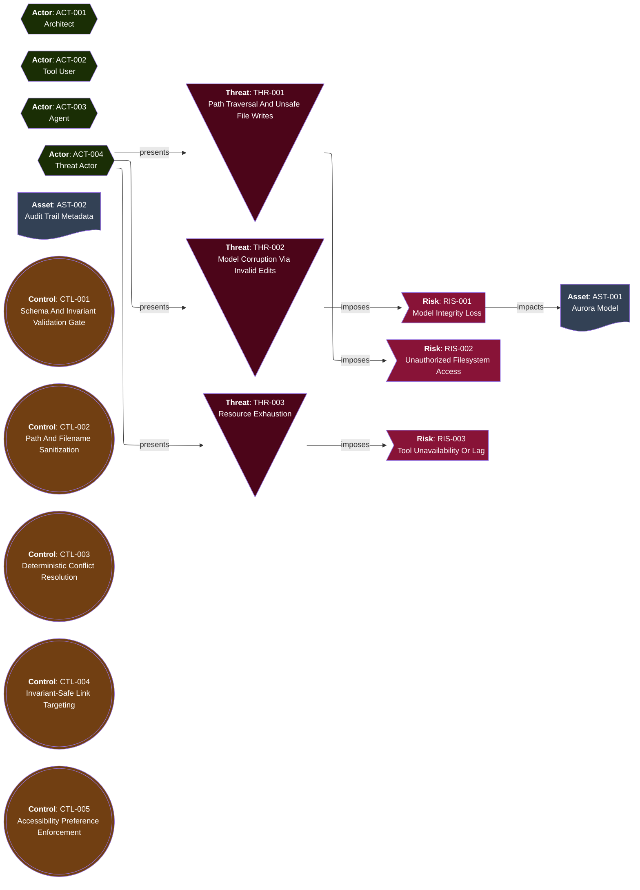

# MIS-002: Enable Aurora Viewer And Editor - Threat Model

```mermaid
%%{init: {'flowchart': {'defaultRenderer': 'elk'}, 'themeVariables': { 'clusterBkg': 'transparent' }}}%%
graph LR


	ACT-001{{"`**Actor**: ACT-001<br />Architect`"}}
	ACT-002{{"`**Actor**: ACT-002<br />Tool User`"}}
	ACT-003{{"`**Actor**: ACT-003<br />Agent`"}}
	ACT-004{{"`**Actor**: ACT-004<br />Threat Actor`"}}
	AST-001["`**Asset**: AST-001<br />Aurora Model`"]@{shape: document}
	AST-002["`**Asset**: AST-002<br />Audit Trail Metadata`"]@{shape: document}
	CTL-001((("`**Control**: CTL-001<br />Schema And Invariant Validation Gate`")))
	CTL-002((("`**Control**: CTL-002<br />Path And Filename Sanitization`")))
	CTL-003((("`**Control**: CTL-003<br />Deterministic Conflict Resolution`")))
	CTL-004((("`**Control**: CTL-004<br />Invariant-Safe Link Targeting`")))
	CTL-005((("`**Control**: CTL-005<br />Accessibility Preference Enforcement`")))
	RIS-001>"`**Risk**: RIS-001<br />Model Integrity Loss`"]
	RIS-002>"`**Risk**: RIS-002<br />Unauthorized Filesystem Access`"]
	RIS-003>"`**Risk**: RIS-003<br />Tool Unavailability Or Lag`"]
	THR-001["`**Threat**: THR-001<br />Path Traversal And Unsafe File Writes`"]@{shape: manual-file}
	THR-002["`**Threat**: THR-002<br />Model Corruption Via Invalid Edits`"]@{shape: manual-file}
	THR-003["`**Threat**: THR-003<br />Resource Exhaustion`"]@{shape: manual-file}


	ACT-004 -- presents --> THR-001;
	ACT-004 -- presents --> THR-002;
	ACT-004 -- presents --> THR-003;
	RIS-001 -- impacts --> AST-001;
	THR-001 -- imposes --> RIS-002;
	THR-002 -- imposes --> RIS-001;
	THR-003 -- imposes --> RIS-003;


classDef cls_boundary stroke-dasharray:5 5,stroke-width:4;
classDef cls_mission fill:#022c22,color:#FFFFFF
classDef cls_driver fill:#064e3b,color:#FFFFFF
classDef cls_requirement fill:#065f46,color:#FFFFFF
classDef cls_capability fill:#052e16,color:#FFFFFF
classDef cls_feature fill:#14532d,color:#FFFFFF
classDef cls_actor fill:#1a2e05,color:#FFFFFF
classDef cls_story fill:#365314,color:#FFFFFF;
classDef cls_condition fill:#422006,color:#FFFFFF
classDef cls_control fill:#713f12,color:#FFFFFF
classDef cls_constraint fill:#854d0e,color:#FFFFFF;
classDef cls_system fill:#172554,color:#FFFFFF
classDef cls_application fill:#1e3a8a,color:#FFFFFF
classDef cls_component fill:#1e40af,color:#FFFFFF
classDef cls_interface fill:#082f49,color:#FFFFFF
classDef cls_artifact fill:#1e293b,color:#FFFFFF
classDef cls_asset fill:#334155,color:#FFFFFF;
classDef cls_data_store fill:#075985,color:#FFFFFF
classDef cls_test fill:#022c22,color:#FFFFFF;
classDef cls_deployment fill:#1e1b4b,color:#FFFFFF;
classDef cls_node fill:#312e81,color:#FFFFFF;
classDef cls_node_instance fill:#3730a3,color:#FFFFFF;
classDef cls_process fill:#2e1065,color:#FFFFFF
classDef cls_activity fill:#4c1d95,color:#FFFFFF
classDef cls_event fill:#5b21b6,color:#FFFFFF
classDef cls_state_machine fill:#4a044e,color:#FFFFFF
classDef cls_state fill:#701a75,color:#FFFFFF
classDef cls_risk fill:#881337,color:#FFFFFF;
classDef cls_threat fill:#4c0519,color:#FFFFFF;
classDef cls_note fill:#1f2937,color:#FFFFFF;

	class ACT-001,ACT-002,ACT-003,ACT-004 cls_actor;
	class AST-001,AST-002 cls_asset;
	class CTL-001,CTL-002,CTL-003,CTL-004,CTL-005 cls_control;
	class RIS-001,RIS-002,RIS-003 cls_risk;
	class THR-001,THR-002,THR-003 cls_threat;

```
