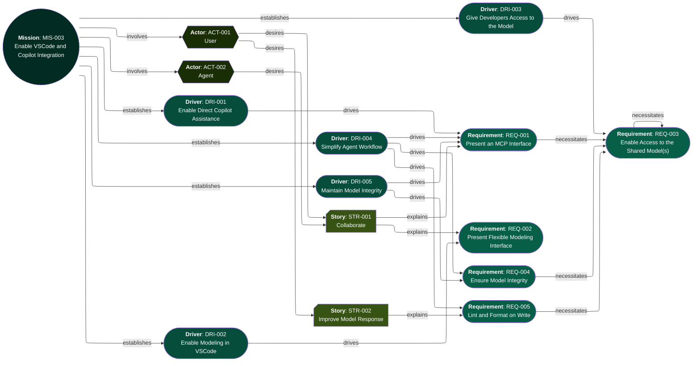

# MIS-003: Enable VSCode and Copilot Integration - Requirements

```mermaid
%%{init: {'flowchart': {'defaultRenderer': 'elk'}, 'themeVariables': { 'clusterBkg': 'transparent' }}}%%
graph LR


	ACT-001{{"`**Actor**: ACT-001<br />User`"}}
	ACT-002{{"`**Actor**: ACT-002<br />Agent`"}}
	DRI-001(["`**Driver**: DRI-001<br />Enable Direct Copilot Assistance`"])
	DRI-002(["`**Driver**: DRI-002<br />Enable Modeling in VSCode`"])
	DRI-003(["`**Driver**: DRI-003<br />Give Developers Access to the Model`"])
	DRI-004(["`**Driver**: DRI-004<br />Simplify Agent Workflow`"])
	DRI-005(["`**Driver**: DRI-005<br />Maintain Model Integrity`"])
	MIS-003(("`**Mission**: MIS-003<br />Enable VSCode and Copilot Integration`"))
	REQ-001(["`**Requirement**: REQ-001<br />Present an MCP Interface`"])
	REQ-002(["`**Requirement**: REQ-002<br />Present Flexible Modeling Interface`"])
	REQ-003(["`**Requirement**: REQ-003<br />Enable Access to the Shared Model(s)`"])
	REQ-004(["`**Requirement**: REQ-004<br />Ensure Model Integrity`"])
	REQ-005(["`**Requirement**: REQ-005<br />Lint and Format on Write`"])
	STR-001["`**Story**: STR-001<br />Collaborate`"]@{shape: card}
	STR-002["`**Story**: STR-002<br />Improve Model Response`"]@{shape: card}


	ACT-001 -- desires --> STR-001;
	ACT-001 -- desires --> STR-002;
	ACT-002 -- desires --> STR-001;
	DRI-001 -- drives --> REQ-001;
	DRI-002 -- drives --> REQ-002;
	DRI-003 -- drives --> REQ-003;
	DRI-004 -- drives --> REQ-001;
	DRI-004 -- drives --> REQ-004;
	DRI-004 -- drives --> REQ-005;
	DRI-005 -- drives --> REQ-001;
	DRI-005 -- drives --> REQ-004;
	MIS-003 -- establishes --> DRI-001;
	MIS-003 -- establishes --> DRI-002;
	MIS-003 -- establishes --> DRI-003;
	MIS-003 -- establishes --> DRI-004;
	MIS-003 -- establishes --> DRI-005;
	MIS-003 -- involves --> ACT-001;
	MIS-003 -- involves --> ACT-002;
	REQ-001 -- necessitates --> REQ-003;
	REQ-003 -- necessitates --> REQ-003;
	REQ-004 -- necessitates --> REQ-003;
	REQ-005 -- necessitates --> REQ-003;
	STR-001 -- explains --> REQ-001;
	STR-001 -- explains --> REQ-002;
	STR-002 -- explains --> REQ-005;


classDef cls_boundary stroke-dasharray:5 5,stroke-width:4;
classDef cls_mission fill:#022c22,color:#FFFFFF
classDef cls_driver fill:#064e3b,color:#FFFFFF
classDef cls_requirement fill:#065f46,color:#FFFFFF
classDef cls_capability fill:#052e16,color:#FFFFFF
classDef cls_feature fill:#14532d,color:#FFFFFF
classDef cls_actor fill:#1a2e05,color:#FFFFFF
classDef cls_story fill:#365314,color:#FFFFFF;
classDef cls_condition fill:#422006,color:#FFFFFF
classDef cls_control fill:#713f12,color:#FFFFFF
classDef cls_constraint fill:#854d0e,color:#FFFFFF;
classDef cls_system fill:#172554,color:#FFFFFF
classDef cls_application fill:#1e3a8a,color:#FFFFFF
classDef cls_component fill:#1e40af,color:#FFFFFF
classDef cls_interface fill:#082f49,color:#FFFFFF
classDef cls_artifact fill:#1e293b,color:#FFFFFF
classDef cls_asset fill:#334155,color:#FFFFFF;
classDef cls_data_store fill:#075985,color:#FFFFFF
classDef cls_test fill:#022c22,color:#FFFFFF;
classDef cls_deployment fill:#1e1b4b,color:#FFFFFF;
classDef cls_node fill:#312e81,color:#FFFFFF;
classDef cls_node_instance fill:#3730a3,color:#FFFFFF;
classDef cls_process fill:#2e1065,color:#FFFFFF
classDef cls_activity fill:#4c1d95,color:#FFFFFF
classDef cls_event fill:#5b21b6,color:#FFFFFF
classDef cls_state_machine fill:#4a044e,color:#FFFFFF
classDef cls_state fill:#701a75,color:#FFFFFF
classDef cls_risk fill:#881337,color:#FFFFFF;
classDef cls_threat fill:#4c0519,color:#FFFFFF;
classDef cls_note fill:#1f2937,color:#FFFFFF;

	class ACT-001,ACT-002 cls_actor;
	class DRI-001,DRI-002,DRI-003,DRI-004,DRI-005 cls_driver;
	class MIS-003 cls_mission;
	class REQ-001,REQ-002,REQ-003,REQ-004,REQ-005 cls_requirement;
	class STR-001,STR-002 cls_story;

```
