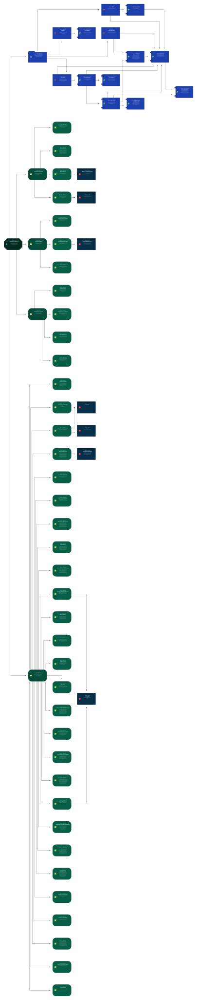
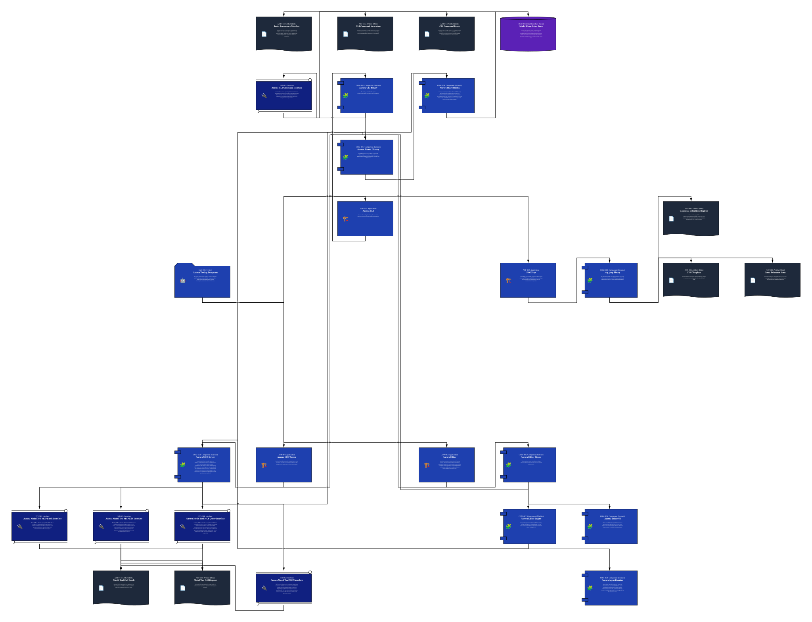
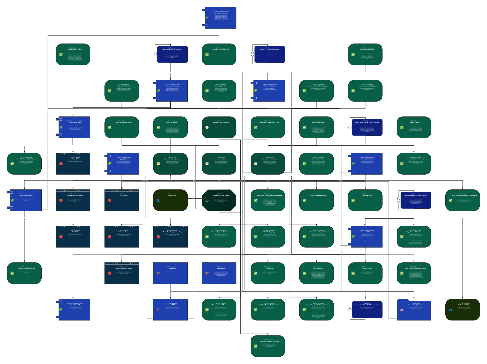
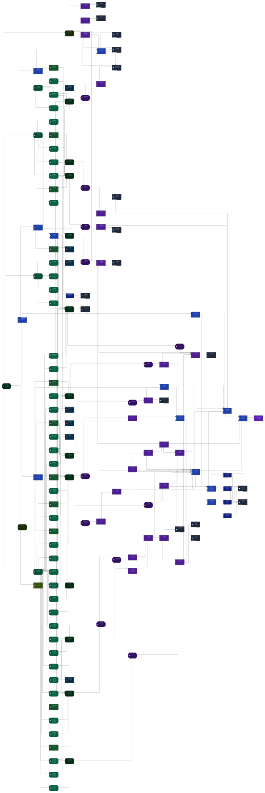
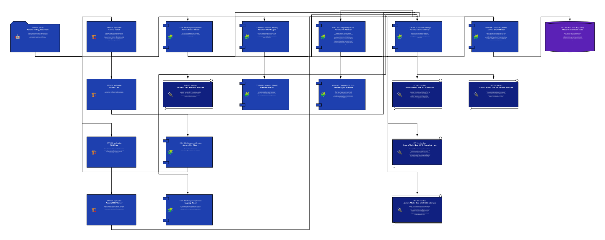
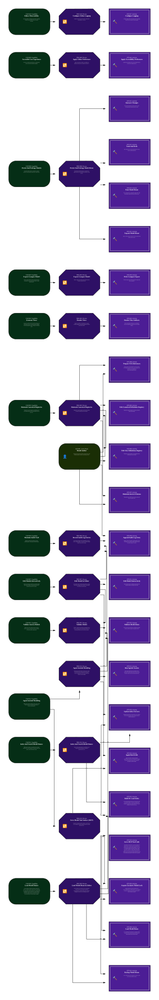
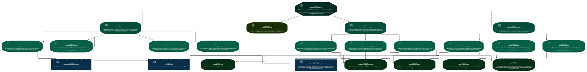
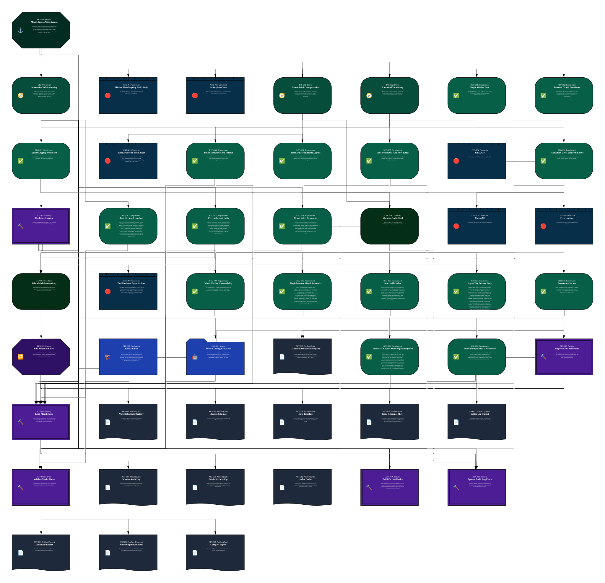
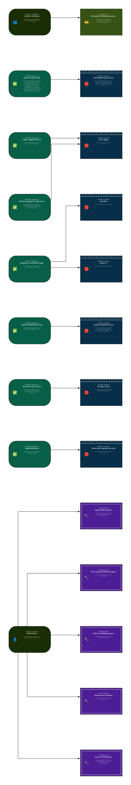

# MIS-001: Model Aurora With Aurora

**[Mission Card](MIS-001-Model_Aurora_With_Aurora.md)**

Define Aurora (Agent-Unified Representation of Requirements and Architecture) using Aurora itself: a deterministic, machine-consumable architecture model rooted at a single Mission card, backed by schemas and canonical registries, and usable by tools and agents.

## Views

## Card Index

### Activity

- **[ATV-013 - Undo And Redo](MIS-001/Activity/ATV-013-Undo_And_Redo.md)**: Allow undo/redo of recent edits (target depth: 50) across interactive editing operations.

- **[ATV-012 - Autosave Changes](MIS-001/Activity/ATV-012-Autosave_Changes.md)**: Persist edits immediately by default (autosave), while still supporting an optional manual save mode.

- **[ATV-006 - Edit View Definitions Registry](MIS-001/Activity/ATV-006-Edit_View_Definitions_Registry.md)**: Maintain the canonical registry of view definitions (roots, included types, and view intent).

- **[ATV-017 - Configure Logging](MIS-001/Activity/ATV-017-Configure_Logging.md)**: Configure logging sinks and formatting via fern, supporting stdout, stderr, and optional file-based logging.

- **[ATV-001 - Validate Model Home](MIS-001/Activity/ATV-001-Validate_Model_Home.md)**: Load cards from the model home and validate them against schemas, canonical registries, and graph invariants.

- **[ATV-005 - Edit Canonical Definitions Registry](MIS-001/Activity/ATV-005-Edit_Canonical_Definitions_Registry.md)**: Maintain the canonical registry of card types and allowed outgoing relationships.

- **[ATV-019 - Build Or Load Index](MIS-001/Activity/ATV-019-Build_Or_Load_Index.md)**: Load a persisted index from the user cache directory when valid; otherwise build a new index incrementally while keeping UI responsiveness. Indexing MUST NOT require loading the full model into memory.

- **[ATV-015 - Unpack Model Home](MIS-001/Activity/ATV-015-Unpack_Model_Home.md)**: Unpack a ZIP-compressed model home into the standard folder structure used by Aurora.

- **[ATV-009 - Load Model Home](MIS-001/Activity/ATV-009-Load_Model_Home.md)**: Load a model home for interactive use, using the schemas and reference files included with that model home and respecting single-writer locking semantics.

- **[ATV-022 - Apply Batch Edit](MIS-001/Activity/ATV-022-Apply_Batch_Edit.md)**: Apply a batch edit as a single transactional, validation-gated operation (all-or-nothing) while holding the exclusive model lock, and record one audit entry describing all card/link changes.

- **[ATV-016 - Apply Accessibility Preferences](MIS-001/Activity/ATV-016-Apply_Accessibility_Preferences.md)**: Apply dark mode defaults, WCAG AA accessibility behavior, and base font scaling preferences.

- **[ATV-003 - Write Compact Export](MIS-001/Activity/ATV-003-Write_Compact_Export.md)**: Write the compact export JSON document for transport and agent consumption.

- **[ATV-021 - Run Agentic Session](MIS-001/Activity/ATV-021-Run_Agentic_Session.md)**: Run an agent-assisted session with explicit context controls and a visible activity feed of tool actions; allow the agent to perform only tool-mediated reads/writes.

- **[ATV-010 - Backup Model Home](MIS-001/Activity/ATV-010-Backup_Model_Home.md)**: Create a ZIP backup of the model home at load time, stored per conventions defined in Aurora.

- **[ATV-020 - Update Index On Save](MIS-001/Activity/ATV-020-Update_Index_On_Save.md)**: Update the persisted index asynchronously when a change is saved so search/navigation reflect the latest model state without blocking the UI.

- **[ATV-018 - Acquire Exclusive Model Lock](MIS-001/Activity/ATV-018-Acquire_Exclusive_Model_Lock.md)**: Acquire and hold an exclusive OS-level lock on `aurora/<MISSION_ID>/AuditLog.ndjson` for the duration of an interactive editing session; refuse to open the model if the lock cannot be acquired.

- **[ATV-008 - Prepare SVG References](MIS-001/Activity/ATV-008-Prepare_SVG_References.md)**: Run svg_prep to generate/update Icons.svg and refresh SVGTemplate.svg defs from source icons and shapes, then synchronize icon availability into Aurora.modelconfiguration.json.

- **[ATV-023 - Serve MCP Tool Calls](MIS-001/Activity/ATV-023-Serve_MCP_Tool_Calls.md)**: Accept MCP tool calls (stdio or in-process transport) and dispatch them to the Aurora model tool implementation. Read-only calls consult the index/working set; write calls are confirmation-gated by the hosting UI policy, acquire the exclusive model lock, validate, apply transactionally, append one audit entry, and schedule asynchronous index updates. Every tool call returns machine-readable JSON with success/failure plus progress/cancellation where applicable.

- **[ATV-002 - Render View Artifacts](MIS-001/Activity/ATV-002-Render_View_Artifacts.md)**: Select roots/included card types per view definitions, traverse the subgraph, and render the view into diagram artifacts.

- **[ATV-014 - Pack Model Home](MIS-001/Activity/ATV-014-Pack_Model_Home.md)**: Pack a model home into a single ZIP-compressed file while preserving the standard model home folder structure.

- **[ATV-004 - Append Audit Log Entry](MIS-001/Activity/ATV-004-Append_Audit_Log_Entry.md)**: Append one line to the mission `AuditLog.ndjson` file for each change event, allowing multiple changed cards and related link changes in one entry.

- **[ATV-007 - Maintain Aurora Schemas](MIS-001/Activity/ATV-007-Maintain_Aurora_Schemas.md)**: Maintain the Aurora JSON schemas used for cards, audit logs, and compact export.

- **[ATV-011 - Edit Model Interactively](MIS-001/Activity/ATV-011-Edit_Model_Interactively.md)**: Edit cards, links, and view definitions interactively with immediate feedback, keeping the model valid.

### Actor

- **[ACT-001 - Model Author](MIS-001/Actor/ACT-001-Model_Author.md)**: A human author (often the architect) who edits Aurora cards and keeps registries, references, and audit logs current.

### Application

- **[APP-002 - SVG Prep](MIS-001/Application/APP-002-SVG_Prep.md)**: Command-line tool that builds Aurora SVG reference assets (Icons.svg, SVGTemplate.svg defs) from source icons/shapes and synchronizes the icon availability list in the canonical model configuration.

- **[APP-003 - Aurora Editor](MIS-001/Application/APP-003-Aurora_Editor.md)**: Standalone cross-platform desktop editor for loading, exploring, indexing/searching, editing, and packaging Aurora model homes while preserving deterministic validity, auditability, and view generation. Agent-assisted modeling is a first-class workflow and is mediated exclusively through validation-gated model tools.

- **[APP-004 - Aurora MCP Server](MIS-001/Application/APP-004-Aurora_MCP_Server.md)**: Model tool server that exposes the constrained Aurora model tool surface over MCP for UI and agent workflows, while keeping memory bounded and all writes validation-gated.

- **[APP-001 - Aurora CLI](MIS-001/Application/APP-001-Aurora_CLI.md)**: Command-line tooling for validating Aurora models, generating views, and exporting compact representations.

### Artifact

- **[ART-010 - Model Archive Zip](MIS-001/Artifact/ART-010-Model_Archive_Zip.md)**: A ZIP-compressed archive of a model home used for backups and for pack/unpack workflows, preserving the model home folder structure.

- **[ART-004 - Mission Audit Log](MIS-001/Artifact/ART-004-Mission_Audit_Log.md)**: The per-mission append-only `AuditLog.ndjson` file that records grouped card/link change events.

- **[ART-016 - CLI Command Invocation](MIS-001/Artifact/ART-016-CLI_Command_Invocation.md)**: Structured representation of a single Aurora CLI invocation (command name, arguments, environment, and working directory assumptions) as consumed by the CLI interface.

- **[ART-012 - Index Cache](MIS-001/Artifact/ART-012-Index_Cache.md)**: Persisted on-disk index artifacts stored in the user cache directory to accelerate navigation and search without fully materializing a model in memory. Index artifacts MUST be partitioned/namespaced by model home identity and validated/invalidated against the originating model home content.

- **[ART-006 - View Definitions Registry](MIS-001/Artifact/ART-006-View_Definitions_Registry.md)**: The canonical registry JSON that defines views (roots, included card types, and view descriptions).

- **[ART-005 - Canonical Definitions Registry](MIS-001/Artifact/ART-005-Canonical_Definitions_Registry.md)**: The canonical registry JSON (Aurora.modelconfiguration.json) that defines card types, acronyms, allowed outgoing relationships, view definitions, and the available icon list used by tooling.

- **[ART-015 - Index Provenance Manifest](MIS-001/Artifact/ART-015-Index_Provenance_Manifest.md)**: Metadata describing the provenance, partitioning, and validation state of persisted index and derived-record stores (for example: model home identity, mission scope, schema/config versions, fingerprints, and last-built timestamps).

- **[ART-017 - CLI Command Result](MIS-001/Artifact/ART-017-CLI_Command_Result.md)**: Structured result of a single Aurora CLI command execution, including exit status, machine-readable diagnostics, and references to produced artifacts (for example validation reports, rendered views, or compact exports).

- **[ART-011 - Editor Log Output](MIS-001/Artifact/ART-011-Editor_Log_Output.md)**: Editor log output emitted to stdout, stderr, and/or an optional log file, used for troubleshooting and diagnostics.

- **[ART-002 - View Diagram Artifacts](MIS-001/Artifact/ART-002-View_Diagram_Artifacts.md)**: Rendered view artifacts (for example SVG diagrams and DOT sources) generated from a model and view definitions.

- **[ART-007 - Aurora Schemas](MIS-001/Artifact/ART-007-Aurora_Schemas.md)**: The Aurora JSON schemas used to validate cards, audit logs, and compact exports.

- **[ART-008 - SVG Template](MIS-001/Artifact/ART-008-SVG_Template.md)**: The SVGTemplate.svg reference template used by the renderer to wrap generated drawings and provide shared defs and styling.

- **[ART-013 - Model Tool Call Request](MIS-001/Artifact/ART-013-Model_Tool_Call_Request.md)**: Structured JSON request payload for a single model tool call (tool name + arguments + optional correlation/progress metadata).

- **[ART-001 - Validation Report](MIS-001/Artifact/ART-001-Validation_Report.md)**: Diagnostics output describing schema, registry, and invariant validation results for a model home.

- **[ART-014 - Model Tool Call Result](MIS-001/Artifact/ART-014-Model_Tool_Call_Result.md)**: Structured JSON result payload for a single model tool call, including success/failure, error details, and (when applicable) progress and cancellation signals.

- **[ART-003 - Compact Export](MIS-001/Artifact/ART-003-Compact_Export.md)**: The compact JSON export of the model cards and links for transport and agent consumption.

- **[ART-009 - Icons Reference Sheet](MIS-001/Artifact/ART-009-Icons_Reference_Sheet.md)**: The Icons.svg reference output produced from source icons, containing normalized icon defs and a proof-sheet layout used for verification and template integration.

### Capability

- **[CAP-003 - Export Compact Model](MIS-001/Capability/CAP-003-Export_Compact_Model.md)**: Export an agent-friendly compact model representation containing the cards and their directed links in a single JSON document.

- **[CAP-004 - Maintain Audit Trail](MIS-001/Capability/CAP-004-Maintain_Audit_Trail.md)**: Maintain an append-only audit log per mission (`AuditLog.ndjson`) with grouped card/link changes.

- **[CAP-007 - Edit Models Interactively](MIS-001/Capability/CAP-007-Edit_Models_Interactively.md)**: Interactively navigate and edit Aurora models (including agent-assisted workflows) with guardrails that prevent invalid edits and preserve invariants.

- **[CAP-002 - Generate Views](MIS-001/Capability/CAP-002-Generate_Views.md)**: Generate view artifacts from the model by selecting roots and included card types, traversing reachable subgraphs, and rendering diagrams without changing the underlying model.

- **[CAP-010 - Editor Observability](MIS-001/Capability/CAP-010-Editor_Observability.md)**: Emit logs suitable for debugging and operations, supporting multiple sinks (stdout/stderr/file) and consistent formatting.

- **[CAP-001 - Validate Aurora Models](MIS-001/Capability/CAP-001-Validate_Aurora_Models.md)**: Validate that an Aurora model conforms to schemas, canonical registries, and graph invariants (reachability, root direction, and no-orphan rules).

- **[CAP-009 - Accessible User Experience](MIS-001/Capability/CAP-009-Accessible_User_Experience.md)**: Provide an accessible and usable editor UI, including dark mode by default and adjustable typography.

- **[CAP-005 - Maintain Canonical Registries](MIS-001/Capability/CAP-005-Maintain_Canonical_Registries.md)**: Maintain the canonical registries (card definitions and view definitions) that govern model validation and view generation.

- **[CAP-011 - Index And Search Model Homes](MIS-001/Capability/CAP-011-Index_And_Search_Model_Homes.md)**: Build, persist, and query a searchable index over Aurora model homes so users and agents can navigate and find cards quickly with bounded memory usage.

- **[CAP-012 - Agent Assisted Modeling](MIS-001/Capability/CAP-012-Agent_Assisted_Modeling.md)**: Support agent-assisted modeling workflows (chat, scoped context, proposals, and validation-gated edits) as a first-class authoring mode.

- **[CAP-008 - Persist And Package Models](MIS-001/Capability/CAP-008-Persist_And_Package_Models.md)**: Persist edits safely (autosave or manual save), support undo/redo, and pack/unpack model homes as ZIP archives.

- **[CAP-006 - Load Model Homes](MIS-001/Capability/CAP-006-Load_Model_Homes.md)**: Load and validate model homes using the schemas and references bundled with that model home, while supporting very large models without blocking the UI. Loading includes acquiring the exclusive model lock, streaming validation, and (when available) loading a persisted index from the user cache directory to become interactive quickly.

### Component

- **[COM-003 - svg_prep Binary](MIS-001/Component/COM-003-svgprep_Binary.md)**: The svg_prep executable used to generate/update Aurora SVG reference assets (Icons.svg and SVGTemplate.svg defs) and synchronize the icon list in Aurora.modelconfiguration.json.

- **[COM-005 - Aurora Editor Binary](MIS-001/Component/COM-005-Aurora_Editor_Binary.md)**: The aurora_editor desktop executable providing an interactive UI and background engine for safe, validated model authoring.

- **[COM-002 - Aurora CLI Binary](MIS-001/Component/COM-002-Aurora_CLI_Binary.md)**: The aurora_cli executable that exposes validate/render/compact commands to users and pipelines.

- **[COM-007 - Aurora Editor Engine](MIS-001/Component/COM-007-Aurora_Editor_Engine.md)**: Background engine responsible for model-home locking, loading, indexing/search, validating/linting, rendering views, packaging/unpackaging, and persistence behaviors without blocking the UI.

- **[COM-010 - Aurora MCP Server](MIS-001/Component/COM-010-Aurora_MCP_Server.md)**: Constrained model tool server that exposes the validation-gated model tool surface over MCP (structured JSON tool calls/results) without full model materialization. The server can run as a standalone stdio MCP process or be hosted in-process via a spawn-friendly entry point (thread friendly). It enforces schema/invariant validation, transactional writes, audit logging, backups, and exclusive-lock requirements by delegating core model operations to aurora_shared.

- **[COM-001 - Aurora Shared Library](MIS-001/Component/COM-001-Aurora_Shared_Library.md)**: Shared Rust library providing registry-aware parsing, validation helpers, transactional write primitives, and rendering primitives used by Aurora tools (CLI, Editor, and MCP server).

- **[COM-009 - Aurora Agent Runtime](MIS-001/Component/COM-009-Aurora_Agent_Runtime.md)**: Agent runtime responsible for provider connectivity (Ollama, OpenAI, optional GitHub Models), request orchestration, offline-mode enforcement, and secret scrubbing before network calls. For model reads/writes, it invokes the validation-gated model tool surface provided by the Aurora MCP server.

- **[COM-008 - Aurora Shared Index](MIS-001/Component/COM-008-Aurora_Shared_Index.md)**: Indexing subsystem (shared by the editor and MCP server) that builds, persists, and queries the model index (for example using Tantivy) while keeping the host responsive and memory bounded. The index MUST be namespaced by model home identity and MUST track provenance so multiple model homes can coexist without collisions.

- **[COM-006 - Aurora Editor UI](MIS-001/Component/COM-006-Aurora_Editor_UI.md)**: Dioxus-based desktop UI responsible for interactive navigation (mind-map-like centered views), editing surfaces, agent-assisted modeling UX (chat, activity feed, diff preview), and accessibility/theming preferences.

### Constraint

- **[CNS-005 - Dioxus UI](MIS-001/Constraint/CNS-005-Dioxus_UI.md)**: The standalone editor UI MUST be implemented using Dioxus.

- **[CNS-007 - Tool Mediated Agent Actions](MIS-001/Constraint/CNS-007-Tool_Mediated_Agent_Actions.md)**: Agents MUST NOT execute shell commands or spawn arbitrary OS processes, and MUST NOT write directly to model files. All agent reads and writes MUST be mediated by the editor's model tool surface that enforces validation, invariants, and locking.

- **[CNS-004 - Rust 2024](MIS-001/Constraint/CNS-004-Rust_2024.md)**: The standalone editor MUST be implemented in Rust 2024.

- **[CNS-002 - No Orphan Cards](MIS-001/Constraint/CNS-002-No_Orphan_Cards.md)**: Every non-Mission card must have one or more incoming links and be reachable from the Mission card.

- **[CNS-003 - Standard Model File Layout](MIS-001/Constraint/CNS-003-Standard_Model_File_Layout.md)**: Models must use the standard Aurora folder layout: Mission card at model home, mission-scoped cards under `<MISSION_ID>/<Card Type>/`, and an append-only audit log at `<MISSION_ID>/AuditLog.ndjson`.

- **[CNS-001 - Mission Has Outgoing Links Only](MIS-001/Constraint/CNS-001-Mission_Has_Outgoing_Links_Only.md)**: The Mission card serves as the root of the model graph and must only have outgoing links.

- **[CNS-006 - Fern Logging](MIS-001/Constraint/CNS-006-Fern_Logging.md)**: The standalone editor MUST support logging with fern integration.

### Data Store

- **[DST-001 - Model Home Index Store](MIS-001/Data_Store/DST-001-Model_Home_Index_Store.md)**: On-disk store (under the OS user cache directory) for persisted indices and derived records used for navigation/search. The store is partitioned by model home identity (and mission scope when applicable) and retains provenance metadata required to validate/invalidate cached state.

### Driver

- **[DRI-003 - Automated View Generation](MIS-001/Driver/DRI-003-Automated_View_Generation.md)**: Enable tools to generate consistent diagrams and documentation from the model without manually drawing or maintaining multiple sources of truth.

- **[DRI-001 - Deterministic Interpretation](MIS-001/Driver/DRI-001-Deterministic_Interpretation.md)**: Eliminate ambiguous architectural meaning by enforcing invariant rules and schema-backed cards so that any interpretation (views, traceability, impact analysis) is reproducible.

- **[DRI-002 - Canonical Vocabulary](MIS-001/Driver/DRI-002-Canonical_Vocabulary.md)**: Provide a single, normative registry for card types and allowed relationship targets/verbs so models can be validated and interpreted consistently across tools.

- **[DRI-004 - Interactive Safe Authoring](MIS-001/Driver/DRI-004-Interactive_Safe_Authoring.md)**: Enable a fast, responsive, and safe desktop authoring experience so humans can edit models without breaking invariants, while tools and agents can still trust the model as deterministic and valid.

### Feature

- **[FEA-011 - Editor Logging](MIS-001/Feature/FEA-011-Editor_Logging.md)**: Emit structured logs for troubleshooting and diagnostics, with fern integration supporting stdout, stderr, and optional file output.

- **[FEA-006 - Prepare SVG References](MIS-001/Feature/FEA-006-Prepare_SVG_References.md)**: Generate and update Aurora SVG reference assets (Icons.svg and SVGTemplate.svg defs) and keep the canonical icon availability list synchronized.

- **[FEA-013 - Agent Assisted Modeling](MIS-001/Feature/FEA-013-Agent_Assisted_Modeling.md)**: Provide an agentic sidebar with scoped context controls, an activity feed of tool actions, and a validation-gated model tool surface for proposing and applying edits.

- **[FEA-002 - Render Views](MIS-001/Feature/FEA-002-Render_Views.md)**: Generate view diagrams and related artifacts from an Aurora model based on the view definitions registry.

- **[FEA-003 - Export Compact Model](MIS-001/Feature/FEA-003-Export_Compact_Model.md)**: Export an Aurora compact model representation suitable for agent consumption and transport.

- **[FEA-007 - Load And Validate Model Homes](MIS-001/Feature/FEA-007-Load_And_Validate_Model_Homes.md)**: Load a model home quickly (including large models), using the schemas and references packaged with that model home, and validate in a way that keeps the UI responsive.

- **[FEA-008 - Interactive Model Editing](MIS-001/Feature/FEA-008-Interactive_Model_Editing.md)**: Provide interactive model authoring with immediate feedback and enforcement so invalid edits are prevented before they can persist to disk.

- **[FEA-012 - Index And Search](MIS-001/Feature/FEA-012-Index_And_Search.md)**: Maintain a persisted index in the user cache directory and expose fast search and navigation over model homes without full in-memory materialization.

- **[FEA-009 - Model Persistence And Recovery](MIS-001/Feature/FEA-009-Model_Persistence_And_Recovery.md)**: Persist changes safely (autosave or manual save), provide undo/redo, and support packing/unpacking model homes as ZIP archives.

- **[FEA-010 - Accessible Themed UI](MIS-001/Feature/FEA-010-Accessible_Themed_UI.md)**: Provide WCAG AA accessible UI behavior, dark mode by default, and adjustable base font sizing with proportional scaling.

- **[FEA-001 - Validate Model](MIS-001/Feature/FEA-001-Validate_Model.md)**: Validate an Aurora model against schemas, registries, and graph invariants, producing actionable diagnostics.

### Interface

- **[INT-004 - Aurora Model Tool MCP Query Interface](MIS-001/Interface/INT-004-Aurora_Model_Tool_MCP_Query_Interface.md)**: Read-only MCP tool subset for querying Aurora model homes without direct file access. Covers the minimum non-mutating capabilities in REQ-028 (for example: find cards by id/name/type/subtype; fetch normalized card representation; fetch inbound/outbound adjacency and bounded neighborhoods; query modelconfiguration; compute viable roots per the root safety rule; list possible next target types based on model configuration).

- **[INT-002 - Aurora Model Tool MCP Interface](MIS-001/Interface/INT-002-Aurora_Model_Tool_MCP_Interface.md)**: MCP-exposed tool interface for reading and writing Aurora model homes. Tool calls and results are structured JSON and cover the minimum capabilities defined by REQ-028; long-running operations report progress and support cancellation. The MCP tool surface is further described as a set of sub-interfaces: INT-004 (query), INT-005 (edit), and INT-006 (batch).

- **[INT-005 - Aurora Model Tool MCP Edit Interface](MIS-001/Interface/INT-005-Aurora_Model_Tool_MCP_Edit_Interface.md)**: Mutating MCP tool subset for editing Aurora model homes via validation-gated, transactional operations (no direct file writes). Covers the minimum write capabilities in REQ-028 (create/update/delete cards; create/update/delete links) and enforces confirmation gating by hosting policy (REQ-029), exclusive lock semantics (REQ-025), and validation on write (REQ-017).

- **[INT-006 - Aurora Model Tool MCP Batch Interface](MIS-001/Interface/INT-006-Aurora_Model_Tool_MCP_Batch_Interface.md)**: Batch MCP tool subset for applying multi-card/link edits as a single all-or-nothing operation (REQ-028) under the exclusive model lock. A failed batch MUST return a clear machine-readable failure report describing which validations failed and what was not applied.

- **[INT-003 - Aurora CLI Command Interface](MIS-001/Interface/INT-003-Aurora_CLI_Command_Interface.md)**: Command-line contract exposed by the Aurora CLI for users and pipelines. The interface MUST be documented (commands, flags, exit codes, and stable output/diagnostic semantics) so automation can reliably validate models, render views, and export compact representations.

### Process

- **[PRO-006 - Load Model Home In Editor](MIS-001/Process/PRO-006-Load_Model_Home_In_Editor.md)**: Load a model home for interactive use by acquiring the exclusive model lock, locating the model home schemas/references, creating a backup archive, loading or building the search index, and validating the model.

- **[PRO-007 - Edit Model In Editor](MIS-001/Process/PRO-007-Edit_Model_In_Editor.md)**: Edit a model via the UI while enforcing validity, recording audit entries, keeping the editor responsive, and updating the search index asynchronously.

- **[PRO-005 - Maintain Canonical Registries](MIS-001/Process/PRO-005-Maintain_Canonical_Registries.md)**: Maintain the canonical registries and schemas that define the Aurora vocabulary and view semantics.

- **[PRO-001 - Validate Model](MIS-001/Process/PRO-001-Validate_Model.md)**: Validate a model home by loading cards, applying schema checks, validating canonical relationship constraints, and enforcing reachability and root-direction invariants.

- **[PRO-002 - Render Views](MIS-001/Process/PRO-002-Render_Views.md)**: Render view artifacts by selecting roots, traversing reachable subgraphs, and generating diagrams and related assets from the model.

- **[PRO-011 - Index And Search Model Homes](MIS-001/Process/PRO-011-Index_And_Search_Model_Homes.md)**: Create or load a persisted index for a model home, use it to support fast search/navigation, and update it asynchronously on save.

- **[PRO-003 - Export Compact Model](MIS-001/Process/PRO-003-Export_Compact_Model.md)**: Export a compact representation of the model cards and links into a single JSON file.

- **[PRO-008 - Persist And Package Model Home](MIS-001/Process/PRO-008-Persist_And_Package_Model_Home.md)**: Persist edits to disk safely (autosave or manual save), support undo/redo, and pack/unpack model homes as ZIP archives.

- **[PRO-012 - Agent Assisted Modeling](MIS-001/Process/PRO-012-Agent_Assisted_Modeling.md)**: Perform agent-assisted tasks by selecting scope, issuing tool-mediated reads, presenting proposed changes for review, and applying batch edits transactionally with validation and audit logging.

- **[PRO-010 - Configure Editor Logging](MIS-001/Process/PRO-010-Configure_Editor_Logging.md)**: Configure and emit logs from the editor to stdout/stderr and optionally to a file sink.

- **[PRO-004 - Record Audit Log Entries](MIS-001/Process/PRO-004-Record_Audit_Log_Entries.md)**: Record mission change events by appending one entry per event to `AuditLog.ndjson`; each entry may include multiple changed cards and link changes.

- **[PRO-013 - Serve Model Tool Surface (MCP)](MIS-001/Process/PRO-013-Serve_Model_Tool_Surface_MCP.md)**: Operate the constrained model tool surface as an MCP server so UI and agents can perform validated reads/writes without direct file access.

- **[PRO-009 - Apply Editor Preferences](MIS-001/Process/PRO-009-Apply_Editor_Preferences.md)**: Apply user preferences related to accessibility and appearance (dark mode, font sizing) for the editor UI.

### Requirement

- **[REQ-020 - Crash Safety Semantics](MIS-001/Requirement/REQ-020-Crash_Safety_Semantics.md)**: With autosave enabled, on crash the model may at worst contain an orphan card that needs to be linked; with autosave disabled, the saved model MUST always be valid and unsaved changes are lost on crash. Since the model is multi-file, atomic writes are not possible; transactional writes MUST be simulated so that if one write in a multi-file operation fails, the entire operation is rolled back.

- **[REQ-034 - Modelconfiguration Is Versioned](MIS-001/Requirement/REQ-034-Modelconfiguration_Is_Versioned.md)**: `reference/Aurora.modelconfiguration.json` MUST include a `version` property so tooling can identify the exact canonical registry version. The modelconfiguration schema MUST require this field, and tooling that loads the registry MUST parse and surface it for diagnostics and compatibility decisions.

- **[REQ-026 - Searchable Index](MIS-001/Requirement/REQ-026-Searchable_Index.md)**: The editor MUST build and maintain a searchable index so users and agents can navigate and search while keeping memory bounded. Full indexing SHOULD be available almost instantly for typical model homes. Minimum index coverage MUST include: card type, card subtype, card ID, card name, outbound link adjacency, and attribute property names. Indexing MUST update on save; index updates are asynchronous, expected to be inexpensive, and SHOULD not block the UI thread. Full-text search is optional.

- **[REQ-010 - Rendering Semantics](MIS-001/Requirement/REQ-010-Rendering_Semantics.md)**: Rendering MUST treat canonical registry style fields (shape/icon/fill/color) as non-normative hints; model validity MUST depend on normative fields (types, ids, relationships), not styling.

- **[REQ-018 - Autosave Default Manual Optional](MIS-001/Requirement/REQ-018-Autosave_Default_Manual_Optional.md)**: The editor MUST use immediate autosave by default and MUST provide an option for manual save mode.

- **[REQ-030 - Agent Provider Support And Configuration](MIS-001/Requirement/REQ-030-Agent_Provider_Support_And_Configuration.md)**: Agent integration MUST support configuring providers explicitly (endpoint URL, model selection, timeouts). The editor MUST support Ollama endpoints and OpenAI endpoints, and SHOULD support GitHub Models via REST API including optional organizational attribution.

- **[REQ-006 - Audit Log Semantics](MIS-001/Requirement/REQ-006-Audit_Log_Semantics.md)**: Each mission MUST have an append-only `AuditLog.ndjson` audit log where each line records one change event with timestamp, editor attribution, and a list of changed cards (including link changes when applicable). Multi-card operations (including batch edits) MUST be recorded as a single audit entry describing all affected cards and link changes. Audit entries MUST be appended by the editor/tooling layer that performs validation-gated writes, not by agents or UI code writing files directly.

- **[REQ-028 - Agent Tool Surface Only](MIS-001/Requirement/REQ-028-Agent_Tool_Surface_Only.md)**: Aurora tooling MUST expose a constrained model tool surface that is the only way an agent can read or modify the model. Tool calls and tool results MUST be structured, machine-readable JSON (for example via MCP). Minimum non-mutating tools MUST include: find cards by id/name/type/subtype; fetch a card's normalized representation (attributes + links); fetch inbound/outbound adjacency and bounded neighborhood expansions; query model configuration; compute viable roots per the root safety rule; retrieve validation errors/warnings for a candidate edit; and list possible next target card types based on model configuration. Minimum write tools MUST include: create/update/delete cards (updates supply a complete replacement payload); create/update/delete links; and apply a batch edit as a single all-or-nothing operation with a clear failure report. All writes MUST be transactional and validation-gated, MUST require holding the exclusive model lock, and MUST append exactly one audit entry per successful operation.

- **[REQ-002 - Directed Graph Invariants](MIS-001/Requirement/REQ-002-Directed_Graph_Invariants.md)**: Starting from the Mission, all links MUST traverse away from the Mission; every card must be reachable; and traversal must terminate in a leaf or a previously seen card (local loop).

- **[REQ-031 - Secrets Are Secure](MIS-001/Requirement/REQ-031-Secrets_Are_Secure.md)**: Secrets (for example API keys and tokens) MUST NOT be stored in plain text. Prefer OS keychain or equivalent secure storage. Agent calls MUST be scrubbed of secrets. Logs MUST NOT contain secrets.

- **[REQ-013 - Fast Streamed Loading](MIS-001/Requirement/REQ-013-Fast_Streamed_Loading.md)**: Models of any size SHOULD load almost instantly; the editor MUST become interactive with visible progress feedback within 2 seconds on the minimum target platform (8GiB RAM baseline) for a typical model home (~2000 cards, ~3500 links). If reading model files exceeds this budget, the editor MUST still open quickly and continue loading with progress feedback. Operations MAY take longer on large models, but the editor MUST remain responsive (no runaway memory growth) and MUST NOT load the entire model into memory at once.

- **[REQ-025 - Single Instance Model Semantics](MIS-001/Requirement/REQ-025-Single_Instance_Model_Semantics.md)**: Multiple instances editing the same model are not supported. Aurora tooling (editor and MCP server) MUST prevent accidental concurrent editing using OS-level locking by holding an exclusive lock (write handle) on the mission audit log at `aurora/<MISSION_ID>/AuditLog.ndjson` for the full duration of an editing session. If the exclusive lock cannot be acquired because it is already held, the tool MUST refuse to open the model and MUST present a clear locked-model error. This relies on the OS to release locks on crash, minimizing stale-lock cleanup. Shared/networked models remain not officially supported.

- **[REQ-033 - Editor UX Layout And Graph Navigation](MIS-001/Requirement/REQ-033-Editor_UX_Layout_And_Graph_Navigation.md)**: The primary working screen MUST be divided into four resizable regions: left sidebar (default 20% width), right sidebar (default 20% width), bottom panel (default 20% height), and a top-center panel filling remaining space. The left sidebar MUST provide VS Code-like navigation including search, pinned, and recent items, with a primary tree rooted at the Mission and showing cards as `ID: Name`. The top-center panel MUST provide a centered graph view where selecting a card centers it, parents appear above, descendants below, siblings left/right (siblings ordered lexicographically by Card ID), and keyboard navigation is supported.

- **[REQ-024 - Major Version Compatibility](MIS-001/Requirement/REQ-024-Major_Version_Compatibility.md)**: Each model home MUST include a complete set of schema and configuration files snapshotted at model creation time; incompatible models MUST be detected via schema validation.

- **[REQ-037 - Index And Record Provenance](MIS-001/Requirement/REQ-037-Index_And_Record_Provenance.md)**: When indexing and caching derived records for navigation/search, the editor and MCP server MUST track where each set of indices and derived records originates. Index and record stores MUST be namespaced by model home identity (and, where relevant, mission id) so multiple model homes can be opened and indexed concurrently without collisions. Provenance MUST include enough information to validate/invalidate cached data against the originating model home content (for example: model home path, schema/config versions, and content fingerprints).

- **[REQ-035 - Tool Call Progress And Cancellation](MIS-001/Requirement/REQ-035-Tool_Call_Progress_And_Cancellation.md)**: For long-running model tool operations (load/index/render/validate/batch edits), the editor and MCP server MUST remain responsive: every tool call MUST return a structured success or failure result, MUST report progress when work exceeds interactive latency budgets, and MUST support cancellation without leaving the model in an invalid state.

- **[REQ-005 - Standard Model Home Layout](MIS-001/Requirement/REQ-005-Standard_Model_Home_Layout.md)**: Model homes MUST contain the shared Aurora schemas, and missions MUST follow the standard folder layout for cards and audit logs.

- **[REQ-016 - Interactive View Rendering](MIS-001/Requirement/REQ-016-Interactive_View_Rendering.md)**: The editor MUST be able to render any view defined in the model configuration file and MUST support ad-hoc views.

- **[REQ-003 - Canonical Definitions Registry](MIS-001/Requirement/REQ-003-Canonical_Definitions_Registry.md)**: A canonical registry MUST define the available card types, their id acronyms, and the allowed outgoing relationship targets and verbs for each card type.

- **[REQ-001 - Single Mission Root](MIS-001/Requirement/REQ-001-Single_Mission_Root.md)**: A model MUST include exactly one Mission card as the root intent, with only outgoing links, summarizing the high-level why of the model.

- **[REQ-011 - Standalone Cross Platform Editor](MIS-001/Requirement/REQ-011-Standalone_Cross_Platform_Editor.md)**: The Aurora Editor MUST run on the major desktop platforms (Linux, Microsoft Windows, and Apple macOS).

- **[REQ-017 - Prevent Invalid Edits](MIS-001/Requirement/REQ-017-Prevent_Invalid_Edits.md)**: Aurora tooling (editor and MCP server) MUST prevent edits that would break a model (schema, registry constraints, invariants). Validation is performed at write points; if a candidate edit would fail validation, the write MUST be blocked and errors MUST be presented. Warning-only checks (for example naming/relationship verb linting) MUST remain warnings. These rules apply equally to human UI edits and agent-assisted edits.

- **[REQ-009 - Default Tooling Support](MIS-001/Requirement/REQ-009-Default_Tooling_Support.md)**: Default tooling SHOULD validate models, generate human-readable outputs, generate views, and export compact models from the source cards.

- **[REQ-014 - Backup Zip On Load](MIS-001/Requirement/REQ-014-Backup_Zip_On_Load.md)**: At load time, Aurora tooling (editor and MCP server) MUST begin creating a timestamped backup ZIP of the entire model home under `aurora/backups/` (for example `MIS-001-20260210T061800Z.zip`). Backup creation MUST be asynchronous and MUST NOT block UI interactivity or tool-call responsiveness. If backup creation fails, the tool MUST warn the user but continue loading. A configurable number of ZIPs will be retained (default 5), with older backups automatically deleted.

- **[REQ-029 - Agentic Sidebar UX](MIS-001/Requirement/REQ-029-Agentic_Sidebar_UX.md)**: The editor MUST provide an agentic sidebar supporting: free-form chat, a visible structured activity feed of tool actions, explicit context controls (selected card only, view context, or user-selected scope), and a diff-like proposed-changes preview before writes. By default, applying proposed changes MUST require explicit user confirmation; deletes MUST always require confirmation.

- **[REQ-022 - Editor Logging With Fern](MIS-001/Requirement/REQ-022-Editor_Logging_With_Fern.md)**: Logging MUST be supported with fern integration, including stdout, stderr, and optional file-based logging.

- **[REQ-038 - Document Aurora CLI Interface](MIS-001/Requirement/REQ-038-Document_Aurora_CLI_Interface.md)**: The Aurora CLI interface (commands, flags, exit codes, and output/diagnostic semantics) MUST be documented and kept in sync with the implementation so users and pipelines can rely on stable tooling behavior.

- **[REQ-019 - Undo Redo Depth](MIS-001/Requirement/REQ-019-Undo_Redo_Depth.md)**: The editor SHOULD support undo/redo spanning 50 edits deep.

- **[REQ-027 - Index Cache In User Cache Directory](MIS-001/Requirement/REQ-027-Index_Cache_In_User_Cache_Directory.md)**: Index persistence MUST use the user cache directory (OS cache folder) rather than the model home. Cached indices are disposable cache artifacts: they SHOULD be safe to delete, MUST be validated/invalidated against the current model home content, and MUST be rebuilt when stale or incompatible. Index persistence MUST be partitioned/namespaced by model home identity so multiple model homes can be indexed concurrently without collisions.

- **[REQ-008 - Compact Model Format](MIS-001/Requirement/REQ-008-Compact_Model_Format.md)**: A compact, single-file representation MUST be supported for transport and agent consumption, using the compact schema and retaining card ids, types, fields, and links.

- **[REQ-007 - View Definitions And Root Safety](MIS-001/Requirement/REQ-007-View_Definitions_And_Root_Safety.md)**: View definitions MUST specify root card types and included card types; view roots MUST exclude cards participating in cycles (root safety rule).

- **[REQ-023 - Accessibility And Dark Mode](MIS-001/Requirement/REQ-023-Accessibility_And_Dark_Mode.md)**: The editor MUST be WCAG AA compliant, MUST support dark mode (default), and MUST support adjustable base font size with proportional scaling.

- **[REQ-012 - Model Home Local Schemas And References](MIS-001/Requirement/REQ-012-Model_Home_Local_Schemas_And_References.md)**: Aurora tooling (editor and MCP server) MUST load and use the schemas and reference files included with the selected model home (not built-in or global defaults), allowing tooling to operate across multiple Aurora versions and customizations. At minimum this includes: using `schemas/*` for validation and using `reference/Aurora.modelconfiguration.json` (including its `version`) for canonical card registries, appearance/theming, and view definitions.

- **[REQ-036 - File Based Logging For Stdio Servers](MIS-001/Requirement/REQ-036-File_Based_Logging_For_Stdio_Servers.md)**: When running as an stdio MCP server, logging MUST be file-based (and MUST NOT corrupt the protocol stream). The server SHOULD still support optional console logging when not using stdio for protocol transport.

- **[REQ-004 - Schema-Backed Card Format](MIS-001/Requirement/REQ-004-SchemaBacked_Card_Format.md)**: Cards MUST conform to the Aurora card schema (required fields, identifier format, and link structure) and be stored as pretty-printed JSON.

- **[REQ-032 - Offline Mode](MIS-001/Requirement/REQ-032-Offline_Mode.md)**: The editor MUST provide an offline mode that prevents network calls. When offline mode is enabled, agent provider requests MUST fail closed and MUST not attempt any outbound connections.

- **[REQ-021 - Pack And Unpack Model Zips](MIS-001/Requirement/REQ-021-Pack_And_Unpack_Model_Zips.md)**: The editor MUST support packing and unpacking model homes as a single ZIP-compressed file.

- **[REQ-015 - UI Engine Thread Separation](MIS-001/Requirement/REQ-015-UI_Engine_Thread_Separation.md)**: The editor UI and engine MUST operate on separate threads to ensure UI responsiveness and effective use of modern hardware.

### Stakeholder

- **[STK-001 - Architects And Agents](MIS-001/Stakeholder/STK-001-Architects_And_Agents.md)**: Humans and automation (LLMs, agents, validation/render tooling) that need a shared, unambiguous representation of architecture and requirements.

### Story

- **[STR-001 - Deterministic Modeling Experience](MIS-001/Story/STR-001-Deterministic_Modeling_Experience.md)**: As an architect, I want to express architecture and requirements as a validated, deterministic model so that tools and agents can reason about it, generate consistent views, and avoid ambiguity.

### System

- **[SYS-001 - Aurora Tooling Ecosystem](MIS-001/System/SYS-001-Aurora_Tooling_Ecosystem.md)**: The overall Aurora system: schemas + canonical registries + model cards, supported by tools (CLI + svg_prep + editor + shared library) that validate models, generate views/exports, and maintain reference SVG assets.

