# MIS-002: Example Canonical Coverage Model

**[Mission Card](MIS-002-Example_Canonical_Coverage_Model.md)**

Example Aurora model that exercises every canonical card type, subtype, and relationship defined in the model configuration registry.

## Views

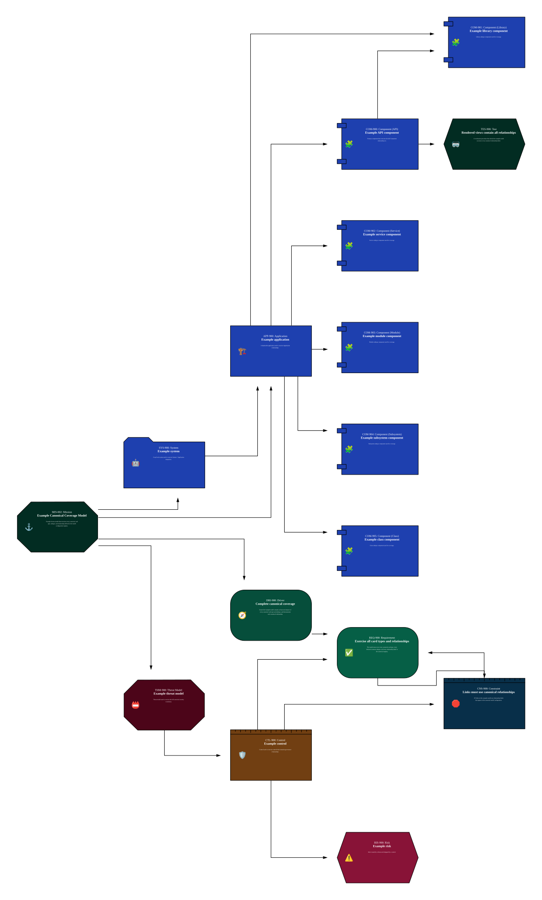

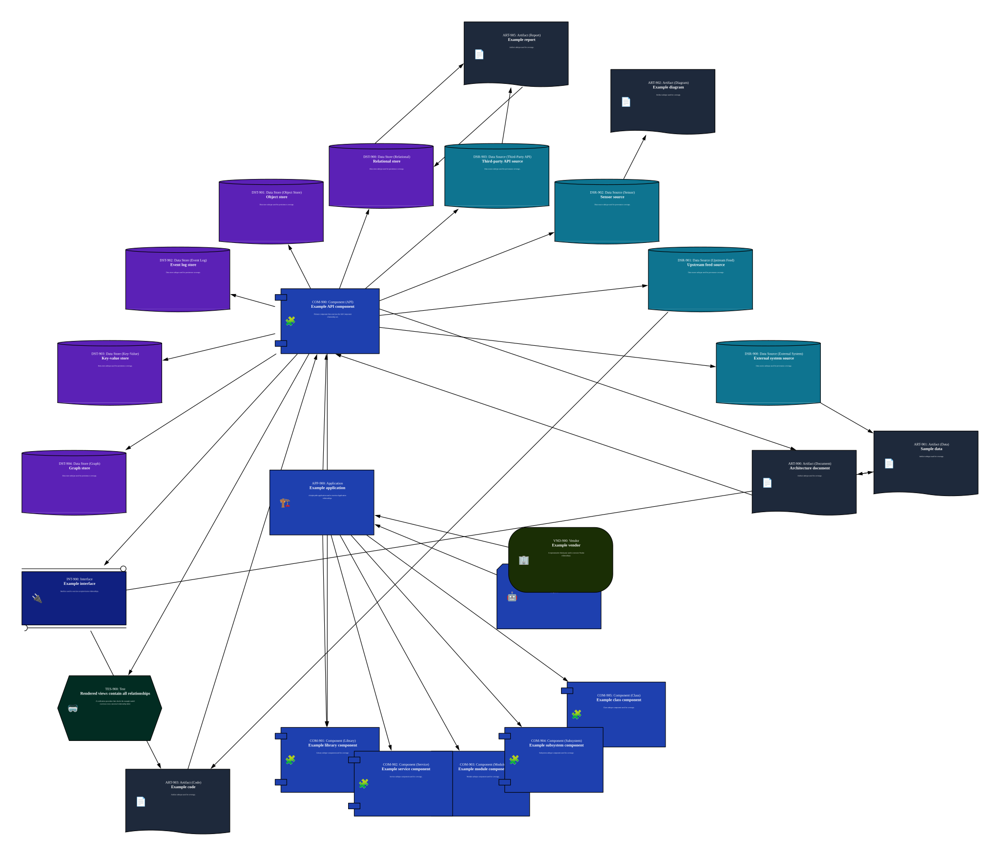

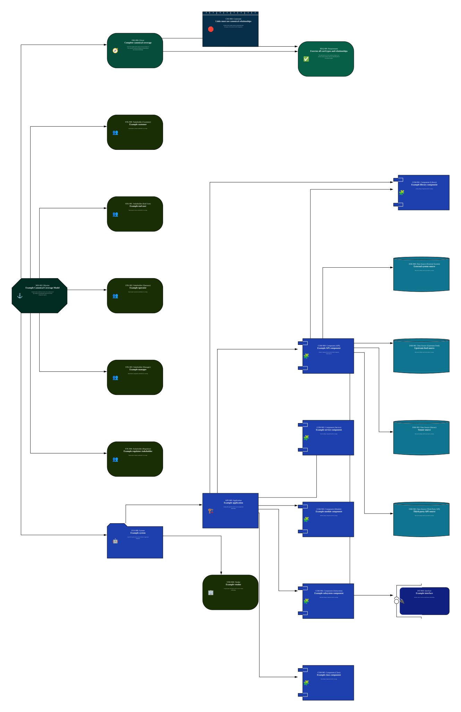

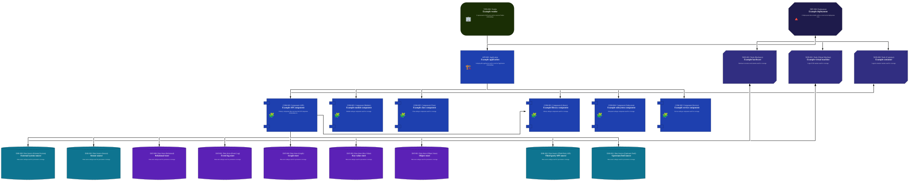

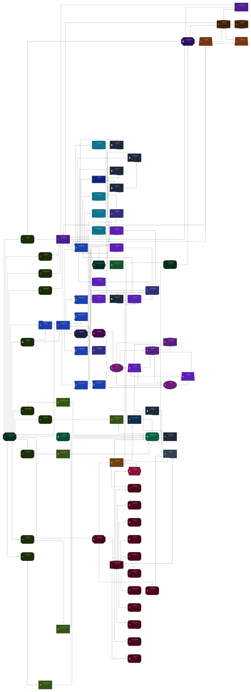

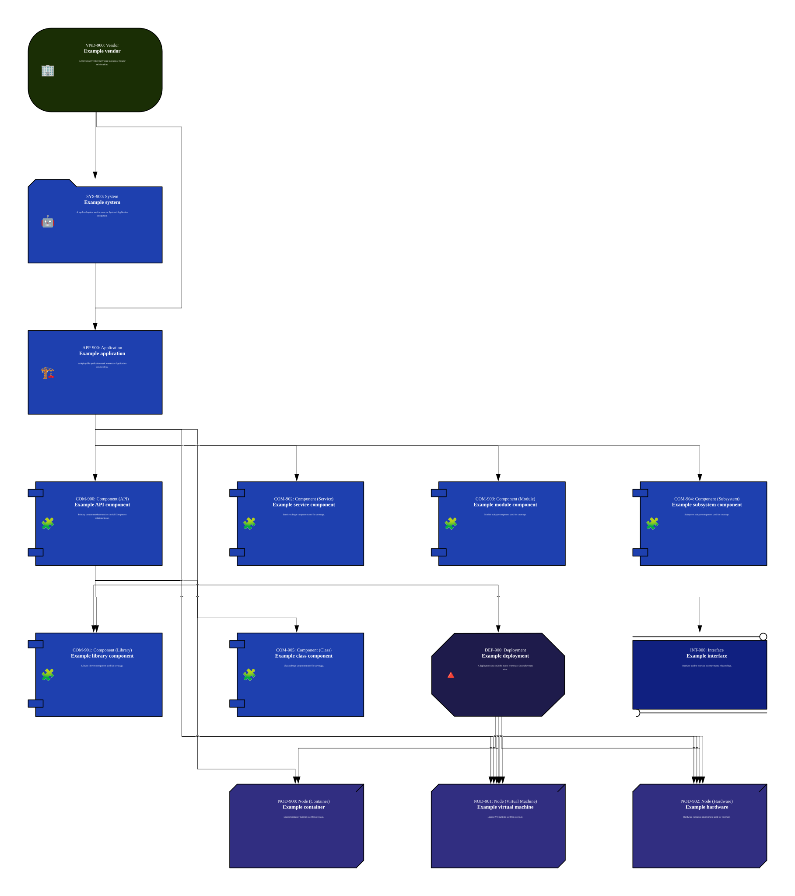

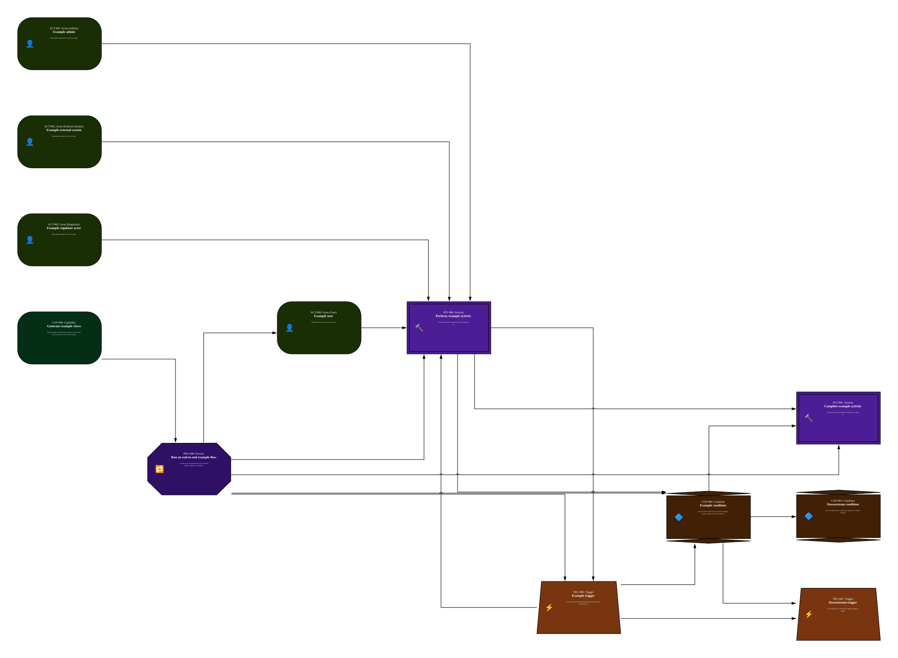

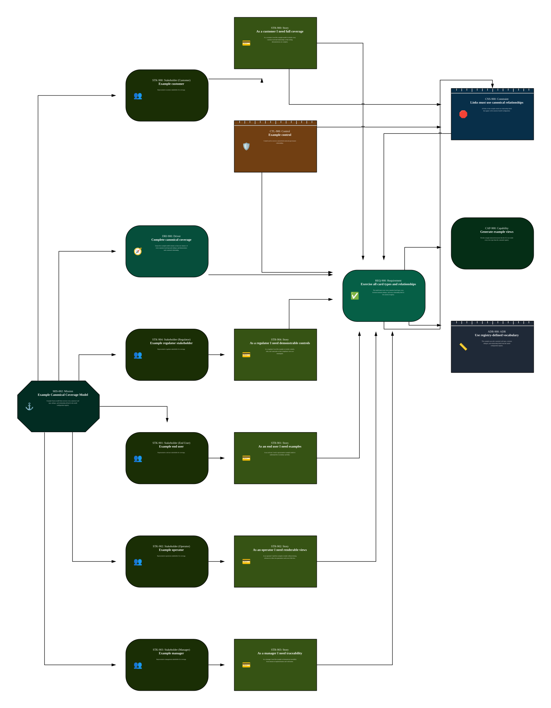

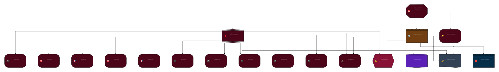

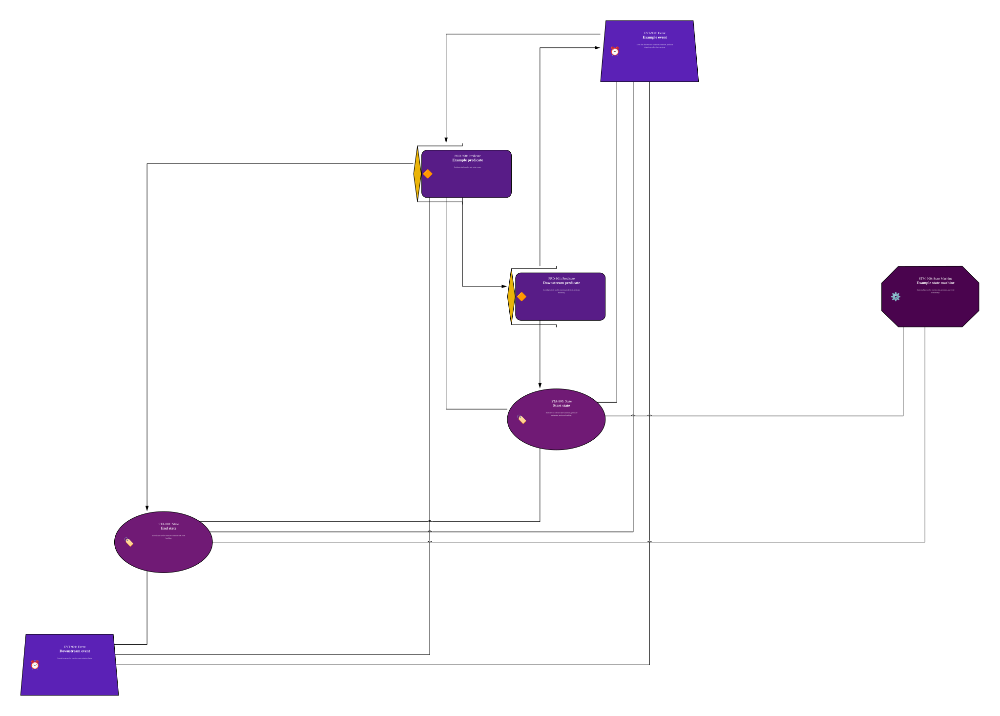

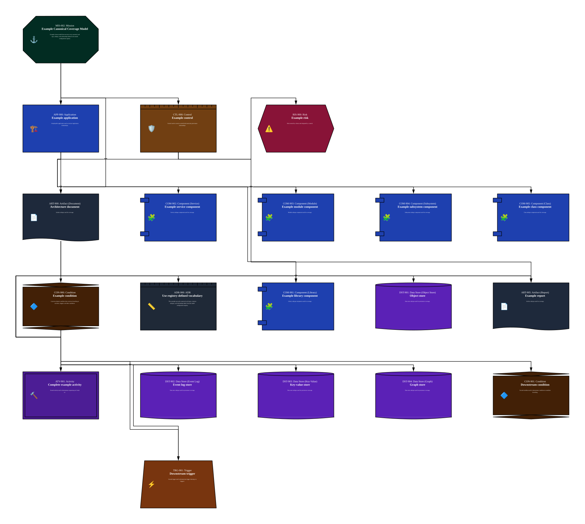

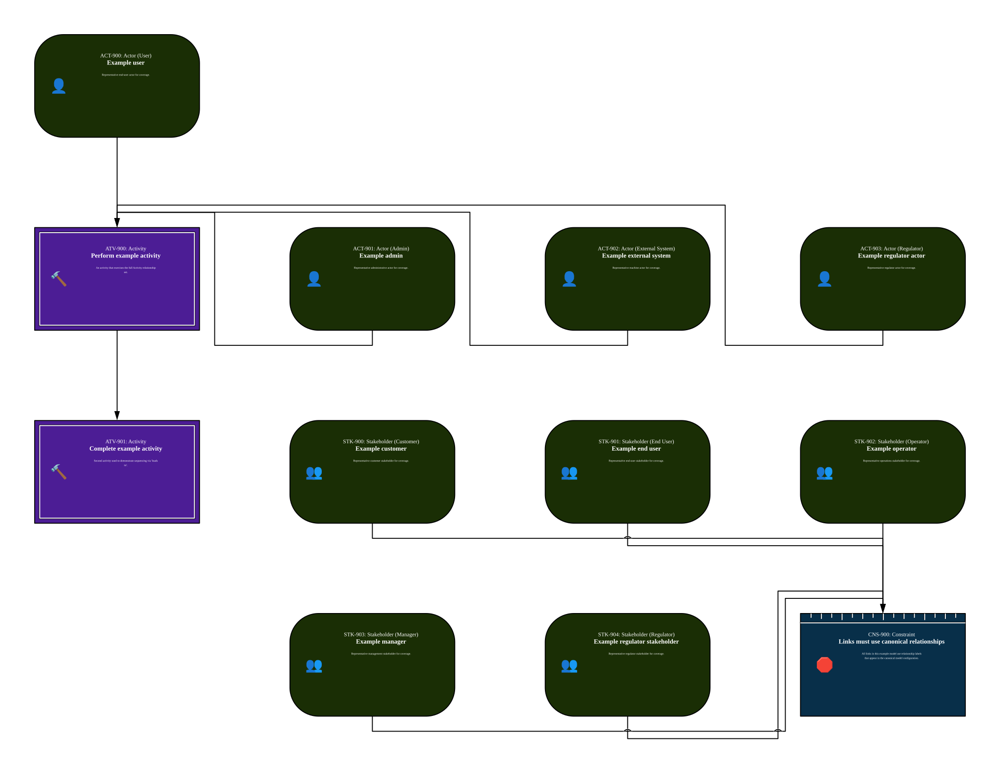

## Card Index

### ADR

- **[ADR-900 - Use registry-defined vocabulary](MIS-002/ADR/ADR-900-Use_registrydefined_vocabulary.md)**: This example uses only canonical card types, common subtypes, and relationship labels from the model configuration registry.

### Activity

- **[ATV-900 - Perform example activity](MIS-002/Activity/ATV-900-Perform_example_activity.md)**: An activity that exercises the full Activity relationship set.

- **[ATV-901 - Complete example activity](MIS-002/Activity/ATV-901-Complete_example_activity.md)**: Second activity used to demonstrate sequencing via 'leads to'.

### Actor

- **[ACT-903 - Example regulator actor](MIS-002/Actor/ACT-903-Example_regulator_actor.md)**: Representative regulator actor for coverage.

- **[ACT-902 - Example external system](MIS-002/Actor/ACT-902-Example_external_system.md)**: Representative machine actor for coverage.

- **[ACT-901 - Example admin](MIS-002/Actor/ACT-901-Example_admin.md)**: Representative administrative actor for coverage.

- **[ACT-900 - Example user](MIS-002/Actor/ACT-900-Example_user.md)**: Representative end-user actor for coverage.

### Adversary

- **[ADV-903 - Hacktivist adversary](MIS-002/Adversary/ADV-903-Hacktivist_adversary.md)**: Adversary subtype used for coverage.

- **[ADV-902 - Script kiddie adversary](MIS-002/Adversary/ADV-902-Script_kiddie_adversary.md)**: Adversary subtype used for coverage.

- **[ADV-904 - Organized crime adversary](MIS-002/Adversary/ADV-904-Organized_crime_adversary.md)**: Adversary subtype used for coverage.

- **[ADV-905 - Nation state adversary](MIS-002/Adversary/ADV-905-Nation_state_adversary.md)**: Adversary subtype used for coverage.

- **[ADV-901 - Outsider adversary](MIS-002/Adversary/ADV-901-Outsider_adversary.md)**: Adversary subtype used for coverage.

- **[ADV-900 - Insider adversary](MIS-002/Adversary/ADV-900-Insider_adversary.md)**: Adversary subtype used for coverage.

### Application

- **[APP-900 - Example application](MIS-002/Application/APP-900-Example_application.md)**: A deployable application used to exercise Application relationships.

### Artifact

- **[ART-903 - Example code](MIS-002/Artifact/ART-903-Example_code.md)**: Artifact subtype used for coverage.

- **[ART-901 - Sample data](MIS-002/Artifact/ART-901-Sample_data.md)**: Artifact subtype used for coverage.

- **[ART-902 - Example diagram](MIS-002/Artifact/ART-902-Example_diagram.md)**: Artifact subtype used for coverage.

- **[ART-900 - Architecture document](MIS-002/Artifact/ART-900-Architecture_document.md)**: Artifact subtype used for coverage.

- **[ART-904 - Example model](MIS-002/Artifact/ART-904-Example_model.md)**: Artifact subtype used for coverage.

- **[ART-905 - Example report](MIS-002/Artifact/ART-905-Example_report.md)**: Artifact subtype used for coverage.

### Asset

- **[AST-900 - Example asset](MIS-002/Asset/AST-900-Example_asset.md)**: A valuable asset used to exercise security relationships.

### Capability

- **[CAP-900 - Generate example views](MIS-002/Capability/CAP-900-Generate_example_views.md)**: Provide enough connected structure that the CLI can render every view type from the canonical registry.

### Component

- **[COM-902 - Example service component](MIS-002/Component/COM-902-Example_service_component.md)**: Service subtype component used for coverage.

- **[COM-904 - Example subsystem component](MIS-002/Component/COM-904-Example_subsystem_component.md)**: Subsystem subtype component used for coverage.

- **[COM-903 - Example module component](MIS-002/Component/COM-903-Example_module_component.md)**: Module subtype component used for coverage.

- **[COM-900 - Example API component](MIS-002/Component/COM-900-Example_API_component.md)**: Primary component that exercises the full Component relationship set.

- **[COM-901 - Example library component](MIS-002/Component/COM-901-Example_library_component.md)**: Library subtype component used for coverage.

- **[COM-905 - Example class component](MIS-002/Component/COM-905-Example_class_component.md)**: Class subtype component used for coverage.

### Condition

- **[CON-900 - Example condition](MIS-002/Condition/CON-900-Example_condition.md)**: A process-domain condition that exercises branching to activities, triggers, and other conditions.

- **[CON-901 - Downstream condition](MIS-002/Condition/CON-901-Downstream_condition.md)**: Second condition used to demonstrate condition-to-condition branching.

### Constraint

- **[CNS-900 - Links must use canonical relationships](MIS-002/Constraint/CNS-900-Links_must_use_canonical_relationships.md)**: All links in this example model use relationship labels that appear in the canonical model configuration.

### Control

- **[CTL-900 - Example control](MIS-002/Control/CTL-900-Example_control.md)**: Control used to exercise control/risk/constraint governance relationships.

### Data Source

- **[DSR-903 - Third-party API source](MIS-002/Data_Source/DSR-903-Thirdparty_API_source.md)**: Data source subtype used for provenance coverage.

- **[DSR-900 - External system source](MIS-002/Data_Source/DSR-900-External_system_source.md)**: Data source subtype used for provenance coverage.

- **[DSR-902 - Sensor source](MIS-002/Data_Source/DSR-902-Sensor_source.md)**: Data source subtype used for provenance coverage.

- **[DSR-901 - Upstream feed source](MIS-002/Data_Source/DSR-901-Upstream_feed_source.md)**: Data source subtype used for provenance coverage.

### Data Store

- **[DST-902 - Event log store](MIS-002/Data_Store/DST-902-Event_log_store.md)**: Data store subtype used for persistence coverage.

- **[DST-903 - Key-value store](MIS-002/Data_Store/DST-903-Keyvalue_store.md)**: Data store subtype used for persistence coverage.

- **[DST-900 - Relational store](MIS-002/Data_Store/DST-900-Relational_store.md)**: Data store subtype used for persistence coverage.

- **[DST-901 - Object store](MIS-002/Data_Store/DST-901-Object_store.md)**: Data store subtype used for persistence coverage.

- **[DST-904 - Graph store](MIS-002/Data_Store/DST-904-Graph_store.md)**: Data store subtype used for persistence coverage.

### Deployment

- **[DEP-900 - Example deployment](MIS-002/Deployment/DEP-900-Example_deployment.md)**: A deployment that includes nodes to exercise the deployment view.

### Driver

- **[DRI-900 - Complete canonical coverage](MIS-002/Driver/DRI-900-Complete_canonical_coverage.md)**: Ensure the example model contains at least one instance of every canonical card type and subtype, and demonstrates each canonical relationship.

### Event

- **[EVT-901 - Downstream event](MIS-002/Event/EVT-901-Downstream_event.md)**: Second event used to exercise event emission chains.

- **[EVT-900 - Example event](MIS-002/Event/EVT-900-Example_event.md)**: Event that demonstrates transitions, emission, predicate triggering, and artifact carrying.

### Feature

- **[FEA-900 - Canonical coverage is visible](MIS-002/Feature/FEA-900-Canonical_coverage_is_visible.md)**: The rendered views should show the full spread of canonical card types and relationship labels.

### Interface

- **[INT-900 - Example interface](MIS-002/Interface/INT-900-Example_interface.md)**: Interface used to exercise accepts/returns relationships.

### Node

- **[NOD-901 - Example virtual machine](MIS-002/Node/NOD-901-Example_virtual_machine.md)**: Logical VM runtime used for coverage.

- **[NOD-900 - Example container](MIS-002/Node/NOD-900-Example_container.md)**: Logical container runtime used for coverage.

- **[NOD-902 - Example hardware](MIS-002/Node/NOD-902-Example_hardware.md)**: Hardware execution environment used for coverage.

### Predicate

- **[PRD-901 - Downstream predicate](MIS-002/Predicate/PRD-901-Downstream_predicate.md)**: Second predicate used to exercise predicate-to-predicate branching.

- **[PRD-900 - Example predicate](MIS-002/Predicate/PRD-900-Example_predicate.md)**: Predicate that branches and emits events.

### Process

- **[PRO-900 - Run an end-to-end example flow](MIS-002/Process/PRO-900-Run_an_endtoend_example_flow.md)**: A simple process that demonstrates process-domain activities, triggers, and conditions.

### Requirement

- **[REQ-900 - Exercise all card types and relationships](MIS-002/Requirement/REQ-900-Exercise_all_card_types_and_relationships.md)**: The model must cover every canonical card type, every declared common subtype, and every relationship label in the canonical registry.

### Resource Owner

- **[ROW-900 - Example resource owner](MIS-002/Resource_Owner/ROW-900-Example_resource_owner.md)**: Resource owner used to exercise ownership relationships.

### Risk

- **[RIS-900 - Example risk](MIS-002/Risk/RIS-900-Example_risk.md)**: Risk created by a threat and mitigated by a control.

### Stakeholder

- **[STK-901 - Example end user](MIS-002/Stakeholder/STK-901-Example_end_user.md)**: Representative end-user stakeholder for coverage.

- **[STK-903 - Example manager](MIS-002/Stakeholder/STK-903-Example_manager.md)**: Representative management stakeholder for coverage.

- **[STK-900 - Example customer](MIS-002/Stakeholder/STK-900-Example_customer.md)**: Representative customer stakeholder for coverage.

- **[STK-904 - Example regulator stakeholder](MIS-002/Stakeholder/STK-904-Example_regulator_stakeholder.md)**: Representative regulator stakeholder for coverage.

- **[STK-902 - Example operator](MIS-002/Stakeholder/STK-902-Example_operator.md)**: Representative operations stakeholder for coverage.

### State

- **[STA-901 - End state](MIS-002/State/STA-901-End_state.md)**: Second state used to exercise transitions and event handling.

- **[STA-900 - Start state](MIS-002/State/STA-900-Start_state.md)**: State used to exercise state transitions, predicate evaluation, and event handling.

### State Machine

- **[STM-900 - Example state machine](MIS-002/State_Machine/STM-900-Example_state_machine.md)**: State machine used to exercise state, predicate, and event relationships.

### Story

- **[STR-902 - As an operator I need renderable views](MIS-002/Story/STR-902-As_an_operator_I_need_renderable_views.md)**: As an operator I need the example to render without missing references so that view generation works out-of-the-box.

- **[STR-900 - As a customer I need full coverage](MIS-002/Story/STR-900-As_a_customer_I_need_full_coverage.md)**: As a customer I need the example model to include every canonical card and relationship so that tooling demonstrations are complete.

- **[STR-904 - As a regulator I need demonstrable controls](MIS-002/Story/STR-904-As_a_regulator_I_need_demonstrable_controls.md)**: As a regulator I need the example to include controls, risks, and constraints so that compliance views are meaningful.

- **[STR-901 - As an end user I need examples](MIS-002/Story/STR-901-As_an_end_user_I_need_examples.md)**: As an end user I need a representative example model to understand the vocabulary and links.

- **[STR-903 - As a manager I need traceability](MIS-002/Story/STR-903-As_a_manager_I_need_traceability.md)**: As a manager I need the example to demonstrate traceability from mission to implementation and verification.

### System

- **[SYS-900 - Example system](MIS-002/System/SYS-900-Example_system.md)**: A top-level system used to exercise System->Application integration.

### Test

- **[TES-900 - Rendered views contain all relationships](MIS-002/Test/TES-900-Rendered_views_contain_all_relationships.md)**: A verification procedure that checks the example model exercises every canonical relationship label.

### Threat Capability

- **[THC-900 - Example threat capability](MIS-002/Threat_Capability/THC-900-Example_threat_capability.md)**: Threat capability used for coverage.

### Threat Diamond

- **[THD-900 - Example threat diamond](MIS-002/Threat_Diamond/THD-900-Example_threat_diamond.md)**: Threat used to exercise threat-centric relationships including adversaries, capabilities, victims, and risks.

### Threat Model

- **[THM-900 - Example threat model](MIS-002/Threat_Model/THM-900-Example_threat_model.md)**: Threat model used to exercise the full canonical security vocabulary.

### Trigger

- **[TRG-901 - Downstream trigger](MIS-002/Trigger/TRG-901-Downstream_trigger.md)**: Second trigger used to demonstrate trigger chaining via 'triggers'.

- **[TRG-900 - Example trigger](MIS-002/Trigger/TRG-900-Example_trigger.md)**: A process-domain trigger that demonstrates the full Trigger relationship set.

### Vendor

- **[VND-900 - Example vendor](MIS-002/Vendor/VND-900-Example_vendor.md)**: A representative third party used to exercise Vendor relationships.

### Victim

- **[VIC-900 - User victim](MIS-002/Victim/VIC-900-User_victim.md)**: Victim subtype used for coverage.

- **[VIC-903 - Data victim](MIS-002/Victim/VIC-903-Data_victim.md)**: Victim subtype used for coverage.

- **[VIC-901 - Organization victim](MIS-002/Victim/VIC-901-Organization_victim.md)**: Victim subtype used for coverage.

- **[VIC-902 - System victim](MIS-002/Victim/VIC-902-System_victim.md)**: Victim subtype used for coverage.

