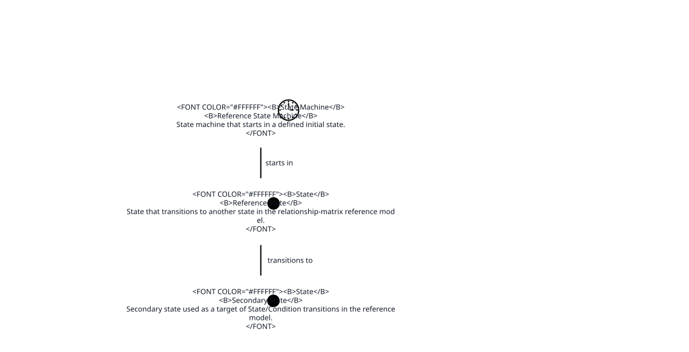
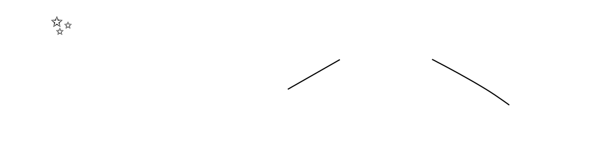

# MIS-002: Relationship Matrix Reference

**[Mission Card](MIS-002-Relationship Matrix Reference.md)**

Reference Aurora model encoding the canonical relationship registry as concrete card links for tooling and diagram validation.

## Views

## Card Index

### ADR

- **[ADR-001 - Reference ADR](MIS-002/ADR/ADR-001.md)**: Architectural Decision Record made by an actor and documenting a requirement.

### Activity

- **[ATV-001 - Reference Activity](MIS-002/Activity/ATV-001.md)**: Activity that leads to another activity, emits an event, and evaluates a condition.

- **[ATV-002 - Triggered Activity](MIS-002/Activity/ATV-002.md)**: Secondary activity used as the target of Activity/Event triggers in the reference model.

### Actor

- **[ACT-001 - Reference Actor](MIS-002/Actor/ACT-001.md)**: Actor exercising desire/own/perform/present relationships in the reference model.

- **[ACT-002 - Triggered Actor](MIS-002/Actor/ACT-002.md)**: Secondary actor involved in the relationship-matrix reference model.

### Application

- **[APP-001 - Reference Application](MIS-002/Application/APP-001.md)**: Application that composes a component in the relationship-matrix reference model.

### Artifact

- **[ART-001 - Reference Artifact](MIS-002/Artifact/ART-001.md)**: Artifact generated by a component, classified as an asset, and persisted to a data store.

### Asset

- **[AST-001 - Reference Asset](MIS-002/Asset/AST-001.md)**: Asset owned by an actor, protected by a control, and derived from an artifact in the reference model.

### Boundary

- **[BND-001 - Reference Boundary](MIS-002/Boundary/BND-001.md)**: Boundary used to exercise includes/contains relationships in the relationship-matrix reference model.

### Capability

- **[CAP-001 - Reference Capability](MIS-002/Capability/CAP-001.md)**: Capability used to satisfy a requirement and necessitate a process.

### Class

- **[CLS-001 - Reference Class](MIS-002/Class/CLS-001.md)**: Class target for implement relationships in the reference model.

### Component

- **[COM-001 - Reference Component](MIS-002/Component/COM-001.md)**: Component used to exercise interface invocation, artifact generation, feature implementation, test fulfillment, class realization, control enforcement, and state machine execution.

### Condition

- **[CON-001 - Reference Condition](MIS-002/Condition/CON-001.md)**: Condition evaluated by an activity in the relationship-matrix reference model.

- **[CON-002 - Secondary Condition](MIS-002/Condition/CON-002.md)**: Secondary condition used as a target of Condition transitions to Condition.

### Constraint

- **[CNS-001 - Reference Constraint](MIS-002/Constraint/CNS-001.md)**: Constraint implied by a story in the relationship-matrix reference model.

### Control

- **[CTL-001 - Reference Control](MIS-002/Control/CTL-001.md)**: Control that mitigates risk and safeguards an asset in the relationship-matrix reference model.

### Data Store

- **[DTS-001 - Reference Data Store](MIS-002/Data Store/DTS-001.md)**: Data store that exposes an interface and receives persisted artifacts.

### Deployment

- **[DEP-001 - Reference Deployment](MIS-002/Deployment/DEP-001.md)**: Deployment that provisions a node in the relationship-matrix reference model.

### Driver

- **[DRI-001 - Reference Driver](MIS-002/Driver/DRI-001.md)**: Motivation used to drive a downstream requirement in the relationship-matrix reference model.

### Event

- **[EVT-001 - Reference Event](MIS-002/Event/EVT-001.md)**: Event that transitions to a state in the relationship-matrix reference model.

- **[EVT-002 - Triggered Event](MIS-002/Event/EVT-002.md)**: Secondary event used as a target of transitions/triggers in the reference model.

### Feature

- **[FEA-001 - Reference Feature](MIS-002/Feature/FEA-001.md)**: Feature that enables a capability in the relationship-matrix reference model.

### Interface

- **[INT-001 - Reference Interface](MIS-002/Interface/INT-001.md)**: Interface that can be called by a component and exposed by a data store.

### Mission

### Node

- **[NOD-001 - Reference Node](MIS-002/Node/NOD-001.md)**: Node that hosts a component and data store and instantiates a node instance.

### Node Instance

- **[NIN-001 - Reference Node Instance](MIS-002/Node Instance/NIN-001.md)**: Concrete runtime realization of a node.

### Note

### Predicate

- **[PRD-001 - Reference Predicate](MIS-002/Predicate/PRD-001.md)**: Predicate used to exercise state machine transitions in the relationship-matrix reference model.

### Process

- **[PRO-001 - Reference Process](MIS-002/Process/PRO-001.md)**: Process necessitated by a capability in the relationship-matrix reference model.

### Requirement

- **[REQ-001 - Reference Requirement](MIS-002/Requirement/REQ-001.md)**: Requirement referenced by multiple rules (driven by driver, satisfied by capability, documented by ADR, limited by constraint).

### Risk

- **[RIS-001 - Reference Risk](MIS-002/Risk/RIS-001.md)**: Risk raised by threats and mitigated by controls in the relationship-matrix reference model.

### State

- **[STA-001 - Reference State](MIS-002/State/STA-001.md)**: State that transitions to another state in the relationship-matrix reference model.

- **[STA-002 - Secondary State](MIS-002/State/STA-002.md)**: Secondary state used as a target of State/Condition transitions in the reference model.

### State Machine

- **[STM-001 - Reference State Machine](MIS-002/State Machine/STM-001.md)**: State machine that starts in a defined initial state.

### Story

- **[STR-001 - Reference Story](MIS-002/Story/STR-001.md)**: Story desired by an actor and implying a constraint in the reference model.

### System

- **[SYS-001 - Reference System](MIS-002/System/SYS-001.md)**: System that integrates an application and enforces a control.

### Test

- **[TES-001 - Reference Test](MIS-002/Test/TES-001.md)**: Test target for implement relationships in the reference model.

### Threat

- **[THR-001 - Reference Threat](MIS-002/Threat/THR-001.md)**: Threat presented by an actor that raises a risk.

- **[THR-002 - Secondary Threat](MIS-002/Threat/THR-002.md)**: Secondary threat used as a target for actor threat presentation in the reference model.

### Trigger
