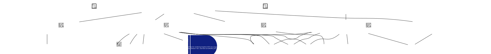

# MIS-003: CLI Tooling

**[Mission Card](MIS-003-CLI Tooling.md)**

Provide CLI tooling capable of managing, rendering, compressing, and updating Aurora model(s).

## Views

## Card Index

### ADR

### Activity

### Actor

- **[ACT-003 - Architect](MIS-003/Actor/ACT-003.md)**: Human operator responsible for authoring Aurora models and running CLI tooling (validate, render, compact) to maintain deterministic design artifacts.

### Application

- **[APP-002 - aurora_cli](MIS-003/Application/APP-002.md)**: Command-line interface that discovers Aurora model homes, validates mission-scoped models, renders Markdown + SVG views, and writes compact agent exports.

- **[APP-003 - aurora_shared](MIS-003/Application/APP-003.md)**: Shared domain library that implements model discovery, parsing, validation, rendering, and compact export helpers for Aurora tooling surfaces.

### Artifact

- **[ART-002 - Rendered Markdown Documentation](MIS-003/Artifact/ART-002.md)**: Per-card Markdown files and mission executive summary emitted by the renderer into docs/design/<MISSION_NAME>/...

- **[ART-003 - Rendered View Diagrams](MIS-003/Artifact/ART-003.md)**: Canonical view outputs emitted under Views/: DOT sources under Views/source and themed SVG diagrams under Views/.

- **[ART-004 - Compact Agent Export](MIS-003/Artifact/ART-004.md)**: Single-file compact model export emitted as AGENT-<MISSION_ID>.jsjson (default location: model home root).

### Asset

### Boundary

- **[BND-002 - Local Workspace](MIS-003/Boundary/BND-002.md)**: Trust and storage boundary for Aurora CLI execution: the repository working tree (model inputs, rendered docs, and compact exports) plus external tooling invoked during rendering.

### Capability

- **[CAP-002 - Model Discovery and Loading](MIS-003/Capability/CAP-002.md)**: Ability to locate Aurora model homes from a user-provided path and load all card JSON/JSJSON files into an indexed in-memory model.

- **[CAP-003 - Model Validation](MIS-003/Capability/CAP-003.md)**: Ability to validate Aurora model invariants and provide actionable diagnostics before any downstream rendering/export steps.

- **[CAP-004 - Markdown Rendering](MIS-003/Capability/CAP-004.md)**: Ability to render human-readable Markdown documentation for every card plus a mission-level executive summary.

- **[CAP-005 - View Rendering](MIS-003/Capability/CAP-005.md)**: Ability to render canonical Aurora views by generating DOT sources and producing SVG diagrams using a Graphviz-compatible renderer.

- **[CAP-006 - Compact Agent Export](MIS-003/Capability/CAP-006.md)**: Ability to write a compact, single-file snapshot of a mission-scoped model for agent consumption.

- **[CAP-007 - Audit Version Bumping](MIS-003/Capability/CAP-007.md)**: Ability to update card audit trail versions (patch/minor/major) and append an audit event in a deterministic, tool-driven manner.

- **[CAP-008 - Registry Backed Tooling](MIS-003/Capability/CAP-008.md)**: Ability to validate and render using embedded canonical registries for card definitions, relationship rules, and view specifications.

### Class

### Component

- **[COM-002 - CLI Command Runner](MIS-003/Component/COM-002.md)**: CLI entrypoint and command dispatcher (clap subcommands) that orchestrates discovery, validation, rendering, and compact export workflows and reports diagnostics and summaries.

- **[COM-003 - Model Discovery and Loading](MIS-003/Component/COM-003.md)**: Discovery and parsing layer that locates model homes (schema-based), loads card files (JSON/JSJSON) from disk, and builds a searchable AuroraModel index.

- **[COM-004 - Validation Engine](MIS-003/Component/COM-004.md)**: Validator that checks structural invariants (duplicate ids, mission presence, link targets, reachability) plus policy checks (secret asset ownership) and relationship-matrix compliance using embedded registries.

- **[COM-005 - Rendering Engine](MIS-003/Component/COM-005.md)**: Renderer that produces per-card Markdown documentation, executive summaries, canonical view DOT sources, and themed SVG diagrams; also writes compact agent exports.

- **[COM-006 - Embedded Registries](MIS-003/Component/COM-006.md)**: Compile-time canonical registries for card definitions (palette), relationship definitions (matrix rules), and view definitions (canonical view set) used by validation and rendering.

### Condition

### Constraint

### Control

### Data Store

- **[DTS-002 - Repository File System](MIS-003/Data Store/DTS-002.md)**: Filesystem-backed store that holds Aurora source cards (docs/design/aurora/), rendered artifacts (docs/design/*), and compact exports (AGENT-*.jsjson).

### Deployment

### Driver

- **[DRI-002 - Human Friendly Artifacts from Source of Truth](MIS-003/Driver/DRI-002.md)**: Avoid manual diagram maintenance by generating rendered documentation and agent-friendly exports directly from the authoritative Aurora card graph.

- **[DRI-003 - Automated Guardrails for Model Integrity](MIS-003/Driver/DRI-003.md)**: Provide deterministic, repeatable validation and canonical registries so Aurora models remain structurally sound (reachable, internally consistent, and relationship-matrix compliant) before rendering or publishing.

### Event

### Feature

- **[FEA-002 - Validate Models](MIS-003/Feature/FEA-002.md)**: Validate one or more mission-scoped models (discovered from an input path) and emit diagnostics; fail the command if errors are present.

- **[FEA-003 - Render Card Markdown](MIS-003/Feature/FEA-003.md)**: Render per-card Markdown documentation plus a mission executive summary into a chosen output directory.

- **[FEA-004 - Render View Diagrams](MIS-003/Feature/FEA-004.md)**: Render canonical Aurora views by writing DOT sources under Views/source and generating themed SVG diagrams under Views/.

- **[FEA-005 - Render All Artifacts](MIS-003/Feature/FEA-005.md)**: Render both card Markdown and view diagrams for each mission-scoped model into the chosen output directory.

- **[FEA-006 - Write Compact Export](MIS-003/Feature/FEA-006.md)**: Write a compact, single-file mission snapshot (AGENT-<MISSION_ID>.jsjson by default) for agent consumption.

- **[FEA-007 - Bump Audit Versions](MIS-003/Feature/FEA-007.md)**: Bump model audit trail versions (patch/minor/major). This feature is currently exposed as CLI commands but is not implemented yet.

- **[FEA-008 - Discover and Load Models](MIS-003/Feature/FEA-008.md)**: Discover model homes from an input path and load cards from disk into a mission-splittable AuroraModel structure.

- **[FEA-009 - Embedded Canonical Registries](MIS-003/Feature/FEA-009.md)**: Provide embedded registries for card definitions, relationship definitions, and view definitions for deterministic validation and rendering.

### Interface

- **[INT-002 - Graphviz DOT Renderer](MIS-003/Interface/INT-002.md)**: External executable interface for rendering Graphviz DOT into a layout used to generate themed SVG views (default: 'dot', override via AURORA_DOT_COMMAND).

### Mission

### Node

### Node Instance

### Note

### Predicate

### Process

### Requirement

- **[REQ-002 - Discover and Load Models](MIS-003/Requirement/REQ-002.md)**: The tooling SHALL discover one or more Aurora model homes from an input path (file, model-home directory, or ancestor directory) and load all card files under each model home. Discovery is schema-based (presence of Aurora.schema.*), supports a direct child 'aurora/' folder, and bounds directory walking (max depth) for predictable performance.

- **[REQ-003 - Validate Models and Emit Diagnostics](MIS-003/Requirement/REQ-003.md)**: The tooling SHALL validate loaded models for core invariants (unique ids, at least one Mission, valid link targets, reachability from the mission root) and SHALL emit structured diagnostics with severity (error|warning|info). Validation SHALL fail the command when errors are present and SHOULD still surface warnings (e.g., relationship matrix compliance).

- **[REQ-004 - Render Card Markdown](MIS-003/Requirement/REQ-004.md)**: The tooling SHALL render per-card Markdown documentation and a mission executive summary into a user-specified output directory. Rendered files SHOULD mirror the source card layout (card-type subfolders) and MUST be produced only after the model validates without errors.

- **[REQ-005 - Render View Diagrams](MIS-003/Requirement/REQ-005.md)**: The tooling SHALL render view diagrams (DOT sources plus SVG output) for the canonical view set. Rendering MUST use a Graphviz-compatible DOT renderer (default 'dot') and SHOULD allow overriding the executable via environment configuration (AURORA_DOT_COMMAND).

- **[REQ-006 - Write Compact Agent Export](MIS-003/Requirement/REQ-006.md)**: The tooling SHALL generate a single-file compact export suitable for agent consumption (AGENT-<MISSION_ID>.jsjson by default) by removing non-essential fields (e.g., $schema, audit trail metadata) while preserving the card graph structure.

- **[REQ-007 - Bump Model Audit Versions](MIS-003/Requirement/REQ-007.md)**: The CLI SHOULD support bumping model audit trail versions (patch, minor, major) with deterministic edits to affected cards and an appended audit history entry. The current aurora_cli surface exposes bump commands but does not yet implement them.

- **[REQ-008 - Embed Canonical Registries](MIS-003/Requirement/REQ-008.md)**: The tooling SHALL embed canonical registries for card types, relationship verbs, and view definitions so validation and rendering can operate deterministically without depending on external instruction files at runtime.

### Risk

### State

### State Machine

### Story

### System

- **[SYS-002 - Aurora Tooling System](MIS-003/System/SYS-002.md)**: System boundary for CLI-oriented Aurora model tooling, centered on the aurora_cli application and the reusable aurora_shared domain library.

### Test

### Threat

### Trigger
