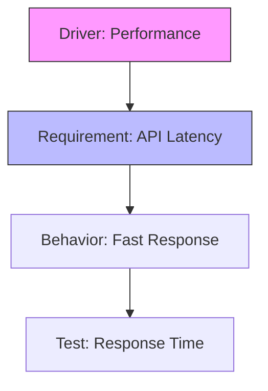
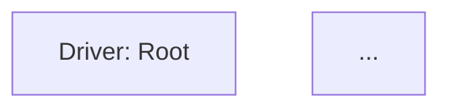

# AURORA Rendering Engine Design

**Component**: Rendering Engine | **Status**: Design | **Complexity**: High

---

## Overview

The Rendering Engine transforms AURORA architecture models into visual representations (diagrams, matrices, reports) and textual formats. It is view-agnostic: the same model can be rendered in multiple ways depending on the desired perspective.

---

## Rendering Pipeline

```
Model + View Specification
  │
  ├─→ [View Interpreter]
  │   Reads view constraints (scope, filter, format)
  │
  ├─→ [Projection Engine]
  │   Filters model to view-specific subset of cards/links
  │
  ├─→ [Graph Normalizer]
  │   Removes orphans, compresses transitive links, etc.
  │
  ├─→ [Layout Engine]
  │   Computes positions for nodes and paths for edges
  │
  ├─→ [Format Renderer]
  │   Renders to target format (Mermaid, SVG, HTML, etc.)
  │
  └─→ Output (Diagram, Matrix, Report, etc.)
```

---

## 1. Projection System

### Purpose

A projection is a deterministic, reproducible view of the model. Multiple projections can coexist from the same canonical model.

### Projection Types

#### Hierarchy View

Tree structure: Root Driver → Requirements → Behaviors → Tests

```typescript
projectHierarchy(options?: {
  rootId?: string
  maxDepth?: number
  filter?: FilterCriteria
  groupBy?: "type" | "status" | "owner"
}): HierarchyTree
```

Output:

```
driver:root
├── requirement:api-latency
│   ├── behavior:api-response
│   │   └── test:api-latency-check
│   └── constraint:latency-100ms
├── requirement:api-security
│   ├── behavior:authentication
│   │   ├── test:auth-token
│   │   └── test:auth-timeout
│   └── constraint:encryption-aes256
└── requirement:api-versioning
    └── behavior:version-negotiation
        └── test:version-mismatch
```

#### Matrix View (Traceability Matrix)

Table: rows × columns, cells indicate relationships

```typescript
projectMatrix(options: {
  rows: CardType         // e.g., "requirement"
  columns: CardType      // e.g., "test"
  relationship?: string  // e.g., "verified-by"
  filter?: FilterCriteria
}): Matrix
```

Output:

```
| Requirement        | test:latency-1 | test:latency-2 | test:security-1 |
|-------------------|----------------|----------------|-----------------|
| requirement:api-1  | ✓              |                | ✓               |
| requirement:api-2  |                | ✓              | ✓               |
| requirement:api-3  | ✓              | ✓              |                 |
```

#### Graph View (Dependency Graph)

Full or filtered dependency graph

```typescript
projectGraph(options?: {
  filter?: FilterCriteria
  maxDepth?: number
  groupBy?: string
  direction?: "forward" | "reverse" | "bidirectional"
}): DirectedGraph
```

#### Behavior Sequence View

Sequence diagram for interactions and state machines

```typescript
projectSequence(behaviorId: string): SequenceDiagram
```

Output:

```
participant User
participant API
participant Cache
participant DB

User ->> API: POST /users
API ->> Cache: get(user:123)
Cache -->> API: miss
API ->> DB: query user
DB -->> API: {user data}
API ->> Cache: set(user:123, data)
API -->> User: 200 {user data}
```

#### State Machine View

FSM diagram from behavior state_machine attribute

```typescript
projectStateMachine(behaviorId: string): StateMachine
```

#### Centered Element View

Selected card with neighbors at configurable depth

```typescript
projectCenteredElement(cardId: string, depth: number = 1): CenteredView
```

#### Custom View

User-defined projections via View cards

```typescript
projectCustom(viewCard: View): CustomOutput
```

### Filtering During Projection

Filters applied to reduce model to view scope:

```typescript
interface ProjectionFilter {
  byType?: CardType[]
  byStatus?: CardStatus[]
  byOwner?: string[]
  byConstraint?: string[]
  maxDepth?: number
  excludeOrphans?: boolean  // Don't render unconnected cards
  excludeTransitive?: boolean // Hide transitive dependencies
}
```

---

## 2. Layout Engine

### Purpose

Compute visual positions for nodes and routing for edges in a 2D plane.

### Layout Algorithms

#### Hierarchical Layout (Top-Down Tree)

For driver → requirement → test → behavior chains:

```
    driver:root
        ↓
  ┌─────┼─────┐
  ↓     ↓     ↓
req1  req2  req3
  ↓     ↓     ↓
 test  test  test
```

Algorithm:

1. Topologically sort nodes (respect DAG)
2. Assign layers (depth from root)
3. Position nodes in columns (minimize edge crossings)
4. Route edges with minimal slopes

#### Force-Directed Layout

For complex, non-hierarchical graphs:

```typescript
forceDirectedLayout(options: {
  repulsion?: number  // Node repulsion force
  attraction?: number // Link attraction force
  iterations?: number
  damping?: number
}): LayoutResult
```

Simulation:

- Nodes repel each other (avoid overlap)
- Links attract connected nodes
- Iteratively settle to equilibrium

#### Circular/Radial Layout

For centered element view:

```
        Root
         |
    ┌────┼────┐
    ↓    ↓    ↓
   N1   N2   N3
   ↓         ↓
  N4        N5
```

Center card positioned at origin, concentric rings for distance.

#### Layered Layout (For Behaviors)

Swim lanes for actors/components:

```
Actor1  │  Actor2  │  Actor3
───────────────────────────
  ↓ msg1    ↓             ↓
  ├────────→┤             │
  │         ├───────────→ ┤
  │ msg2    │             ↓
  │← ← ← ← ← ┤← ← ← ← ← ← ┤
```

### Layout Output

```typescript
interface LayoutResult {
  nodes: {
    id: string
    x: number
    y: number
    width: number
    height: number
  }[]
  
  edges: {
    id: string
    from: string
    to: string
    waypoints: [number, number][] // Path for edge routing
  }[]
  
  bounds: {
    minX: number
    minY: number
    maxX: number
    maxY: number
  }
}
```

### Layout Performance

- Linear time for tree layout: O(n)
- Polynomial for force-directed: O(n²) per iteration
- For 1000+ nodes, use hierarchical or optimize force-directed

---

## 3. Format Renderers

### Mermaid Renderer

Outputs Mermaid DSL (GitHub-compatible):

```typescript
class MermaidRenderer implements Renderer {
  render(diagram: Diagram, options?: RenderOptions): string
}
```

Example output:



**Advantages**:

- Native GitHub Markdown support
- Client-side rendering
- Simple DSL
- No external dependencies

**Limitations**:

- Limited layout control
- No custom styling
- Fewer diagram types

### SVG Renderer

Direct SVG generation for full control:

```typescript
class SVGRenderer implements Renderer {
  render(diagram: Diagram, layout: LayoutResult, options?: RenderOptions): string
}
```

Output:

```xml
<svg xmlns="http://www.w3.org/2000/svg" viewBox="0 0 800 600">
  <!-- Nodes -->
  <g class="node">
    <rect x="100" y="50" width="150" height="40" />
    <text x="175" y="75">driver:root</text>
  </g>
  <!-- Edges -->
  <g class="edge">
    <path d="M 175 90 Q 175 150 200 200" stroke="black" />
  </g>
</svg>
```

**Advantages**:

- Full control over styling
- Scalable to any size
- Can embed interactivity
- Export to PNG/PDF

**Limitations**:

- More complex generation
- Requires layout engine

### HTML Renderer

Interactive HTML with embedded CSS and JavaScript:

```typescript
class HTMLRenderer implements Renderer {
  render(diagram: Diagram, layout: LayoutResult, options?: RenderOptions): string
}
```

**Features**:

- Click cards to navigate
- Hover to highlight neighbors
- Zoom/pan controls
- Search/filter integration
- Dark mode support

### Matrix Renderer (CSV/HTML Table)

For traceability matrices:

```typescript
class MatrixRenderer implements Renderer {
  render(matrix: Matrix, options?: RenderOptions): string
}
```

Output (CSV):

```
Requirement,Test1,Test2,Test3,Coverage
requirement:api-1,✓,,✓,67%
requirement:api-2,,✓,✓,67%
requirement:api-3,✓,✓,,67%
```

### Markdown Renderer

Embedded diagrams in Markdown documentation:

```typescript
class MarkdownRenderer implements Renderer {
  render(diagram: Diagram, options?: RenderOptions): string
}
```

Output:

````markdown
## Architecture Overview



| Requirement | Status | Owner |
|-------------|--------|-------|
| req:api-1   | Approved | Team A |
````

### Renderer Registry

```typescript
class RendererRegistry {
  register(format: OutputFormat, renderer: Renderer): void
  get(format: OutputFormat): Renderer
  supported(): OutputFormat[]
}

// Usage:
registry.register("mermaid", new MermaidRenderer())
registry.register("svg", new SVGRenderer())
registry.register("html", new HTMLRenderer())

const renderer = registry.get("mermaid")
const output = renderer.render(diagram, options)
```

---

## 4. Styling & Theming

### Node Styling

```typescript
interface NodeStyle {
  fill: string          // Background color
  stroke: string        // Border color
  strokeWidth: number
  textColor: string
  fontSize: number
  borderRadius: number
  shadow?: boolean
  icon?: string         // Type icon (driver, requirement, etc.)
}

// Styles by type
const typeStyles = {
  driver: { fill: "#f9f", stroke: "#f00" },
  requirement: { fill: "#bbf", stroke: "#00f" },
  behavior: { fill: "#bfb", stroke: "#0f0" },
  test: { fill: "#ffb", stroke: "#ff0" },
}

// Styles by status
const statusStyles = {
  approved: { opacity: 1.0 },
  proposed: { opacity: 0.7, strokeDasharray: "4" },
  deprecated: { opacity: 0.5, fill: "#ccc" },
}
```

### Link Styling

```typescript
interface LinkStyle {
  stroke: string
  strokeWidth: number
  strokeDasharray?: string  // "4" for dashed
  arrowhead: "normal" | "hollow" | "filled"
  curve: "linear" | "curved" | "stepped"
  opacity: number
  color?: string  // For strength indication
}

// Colors by strength
const strengthColors = {
  weak: "#ccc",
  normal: "#999",
  strong: "#000",
}
```

### Themes

```typescript
interface Theme {
  colors: {
    background: string
    text: string
    cardBg: string
    border: string
  }
  fonts: {
    family: string
    sizes: { xs: number, sm: number, md: number, lg: number, xl: number }
  }
  spacing: { xs: number, sm: number, md: number, lg: number }
}

// Predefined themes
const lightTheme = { ... }
const darkTheme = { ... }
const printTheme = { ... }
```

---

## 5. Caching & Performance

### Cache Strategy

```typescript
class RenderingCache {
  // Cache rendered diagrams
  getCachedDiagram(viewId: string, format: OutputFormat): string | null
  cacheDiagram(viewId: string, format: OutputFormat, output: string): void
  
  // Invalidate on model changes
  invalidateView(viewId: string): void
  invalidateAll(): void
  
  // Stats
  hitRate(): number
  cacheSize(): number
}
```

### Incremental Rendering

For large diagrams, render progressively:

```typescript
renderIncremental(diagram: Diagram, callback: (progress: RenderProgress) => void) {
  // 1. Render skeleton (nodes only)
  callback({ stage: "nodes", progress: 20 })
  
  // 2. Render edges
  callback({ stage: "edges", progress: 50 })
  
  // 3. Apply styling
  callback({ stage: "styling", progress: 80 })
  
  // 4. Final output
  callback({ stage: "complete", progress: 100 })
}
```

### Lazy Rendering

For interactive viewers, render visible area only:

```typescript
class LazyDiagramRenderer {
  // Render viewport and buffer around it
  renderViewport(bounds: Bounds, bufferRatio: number = 0.2): void
  
  // Re-render on pan/zoom
  onViewportChange(newBounds: Bounds): void
}
```

---

## 6. Export & Publishing

### Export Formats

```typescript
interface ExportOptions {
  format: OutputFormat
  size?: { width: number, height: number }
  dpi?: number  // For PNG/PDF
  theme?: Theme
  quality?: "draft" | "normal" | "high"
}

export(diagram: Diagram, options: ExportOptions): Promise<Buffer>
```

### Publishing

```typescript
interface PublishTarget {
  type: "github" | "confluence" | "s3" | "filesystem"
  location: string
  auth?: Credentials
}

publish(diagram: Diagram, target: PublishTarget, format: OutputFormat): Promise<URL>
```

---

## 7. Implementation Notes

### Language: TypeScript

```typescript
class RenderingEngine {
  private projector: Projector
  private layoutEngine: LayoutEngine
  private renderers: RendererRegistry
  private cache: RenderingCache

  async render(viewCard: View, format: OutputFormat): Promise<string> {
    // Check cache
    const cached = this.cache.getCachedDiagram(viewCard.id, format)
    if (cached) return cached

    // Project model to view
    const diagram = this.projector.project(viewCard)

    // Compute layout
    const layout = this.layoutEngine.layout(diagram)

    // Render to format
    const renderer = this.renderers.get(format)
    const output = renderer.render(diagram, layout, viewCard.attributes)

    // Cache
    this.cache.cacheDiagram(viewCard.id, format, output)

    return output
  }
}
```

### Mermaid Integration

```typescript
class MermaidRenderer implements Renderer {
  render(diagram: Diagram): string {
    const lines = ['graph TD']
    
    for (const node of diagram.nodes) {
      lines.push(`  ${node.id}["${node.label}"]`)
    }
    
    for (const edge of diagram.edges) {
      lines.push(`  ${edge.from} --> ${edge.to}`)
    }
    
    return lines.join('\n')
  }
}
```

---

## 8. Testing

### Unit Tests

- Projection correctness (subset of model)
- Layout algorithm determinism
- Renderer output format validation
- Caching invalidation

### Integration Tests

- Full rendering pipeline
- Multiple view formats from same model
- Large diagram performance
- Export formats

---

## 9. Future Enhancements

1. **Interactive Diagrams**: Web-based viewers with zoom, pan, click-through
2. **Animation**: Transition diagrams (show progression over time)
3. **Comparison Diagrams**: Show changes between model versions
4. **3D Visualization**: For very large, complex architectures
5. **Export to Standards**: PlantUML, ArchiMate, SysML
