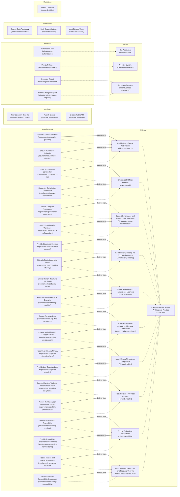

# Aurora Logical Diagram

This diagram is generated from `examples/cards/` and `examples/links/`.

```mermaid
flowchart LR

subgraph Drivers
  driver_automation["Enable Agent-Ready Automation\n(driver:automation)"]
  driver_formats["Enforce JSON-First Formats\n(driver:formats)"]
  driver_governance_collaboration["Support Governance and Collaboration Workflows\n(driver:governance-collaboration)"]
  driver_interoperability["Enable Interoperability via Structured Contexts\n(driver:interoperability)"]
  driver_readability["Ensure Readability for Humans and Machines\n(driver:readability)"]
  driver_security_and_privacy["Enforce Card-Level Security and Privacy Constraints\n(driver:security-and-privacy)"]
  driver_simplicity["Keep Schema Minimal and Composable\n(driver:simplicity)"]
  driver_testability["Treat Tests as First-Class Artifacts\n(driver:testability)"]
  driver_traceability["Enable End-to-End Traceability\n(driver:traceability)"]
  driver_versioning_lifecycle["Apply Semantic Versioning and Lifecycle Controls\n(driver:versioning-lifecycle)"]
  driver_root["Create a Unified, Simple Architectural Practice\n(driver:root)"]
end

subgraph Requirements
  requirement_automation_pipeline["Enable Tooling Automation\n(requirement:automation-pipeline)"]
  requirement_automation_reliability["Ensure Automation Reliability\n(requirement:automation-reliability)"]
  requirement_formats_json_first["Enforce JSON-Only Serialization\n(requirement:formats-json-first)"]
  requirement_formats_determinism["Guarantee Serialization Determinism\n(requirement:formats-determinism)"]
  requirement_governance_provenance["Record Complete Provenance\n(requirement:governance-provenance)"]
  requirement_governance_collaboration["Support Collaborative Workflows\n(requirement:governance-collaboration)"]
  requirement_interoperability_contexts["Provide Structured Contexts\n(requirement:interoperability-contexts)"]
  requirement_interoperability_stability["Maintain Stable Integration Points\n(requirement:interoperability-stability)"]
  requirement_readability_human["Ensure Human-Readable Descriptions\n(requirement:readability-human)"]
  requirement_readability_machine["Ensure Machine-Readable Examples\n(requirement:readability-machine)"]
  requirement_security_data_protection["Protect Sensitive Data\n(requirement:security-data-protection)"]
  requirement_security_privacy_audit["Provide Auditability and Access Controls\n(requirement:security-privacy-audit)"]
  requirement_simplicity_minimal_schema["Keep Core Schema Minimal\n(requirement:simplicity-minimal-schema)"]
  requirement_simplicity_usability["Provide Low Cognitive Load\n(requirement:simplicity-usability)"]
  requirement_testability_acceptance["Provide Machine-Verifiable Acceptance Criteria\n(requirement:testability-acceptance)"]
  requirement_testability_performance["Provide Test Execution Performance Targets\n(requirement:testability-performance)"]
  requirement_traceability_functional["Maintain End-to-End Traceability\n(requirement:traceability-functional)"]
  requirement_traceability_nonfunctional["Provide Traceability Performance Guarantees\n(requirement:traceability-nonfunctional)"]
  requirement_versioning_metadata["Record Version and Lifecycle Metadata\n(requirement:versioning-metadata)"]
  requirement_versioning_compatibility["Ensure Backward Compatibility Guarantees\n(requirement:versioning-compatibility)"]
end

subgraph Interfaces
  interface_admin_console["Provide Admin Console\n(interface:admin-console)"]
  interface_events_bus["Publish Events\n(interface:events-bus)"]
  interface_public_api["Expose Public API\n(interface:public-api)"]
end

subgraph Actors
  actor_business_stakeholder["Represent Business\n(actor:business-stakeholder)"]
  actor_end_user["Use Application\n(actor:end-user)"]
  actor_system_operator["Operate System\n(actor:system-operator)"]
end

subgraph Behaviors
  behavior_user_authentication["Authenticate User\n(behavior:user-authentication)"]
  behavior_deploy_release["Deploy Release\n(behavior:deploy-release)"]
  behavior_generate_report["Generate Report\n(behavior:generate-report)"]
  behavior_submit_change_request["Submit Change Request\n(behavior:submit-change-request)"]
end

subgraph Constraints
  constraint_compliance["Enforce Data Residency\n(constraint:compliance)"]
  constraint_latency["Limit Request Latency\n(constraint:latency)"]
  constraint_storage["Limit Storage Usage\n(constraint:storage)"]
end

subgraph Definitions
  aurora_definition["Aurora Definition\n(aurora:definition)"]
end

requirement_automation_pipeline -->|derived-from| driver_automation
requirement_automation_reliability -->|derived-from| driver_automation
requirement_formats_json_first -->|derived-from| driver_formats
requirement_formats_determinism -->|derived-from| driver_formats
requirement_governance_provenance -->|derived-from| driver_governance_collaboration
requirement_governance_collaboration -->|derived-from| driver_governance_collaboration
requirement_interoperability_contexts -->|derived-from| driver_interoperability
requirement_interoperability_stability -->|derived-from| driver_interoperability
requirement_readability_human -->|derived-from| driver_readability
requirement_readability_machine -->|derived-from| driver_readability
requirement_security_data_protection -->|derived-from| driver_security_and_privacy
requirement_security_privacy_audit -->|derived-from| driver_security_and_privacy
requirement_simplicity_minimal_schema -->|derived-from| driver_simplicity
requirement_simplicity_usability -->|derived-from| driver_simplicity
requirement_testability_acceptance -->|derived-from| driver_testability
requirement_testability_performance -->|derived-from| driver_testability
requirement_traceability_functional -->|derived-from| driver_traceability
requirement_traceability_nonfunctional -->|derived-from| driver_traceability
requirement_versioning_metadata -->|derived-from| driver_versioning_lifecycle
requirement_versioning_compatibility -->|derived-from| driver_versioning_lifecycle
behavior_user_authentication -.-> actor_end_user
behavior_deploy_release -.-> actor_system_operator
behavior_generate_report -.-> actor_business_stakeholder
behavior_submit_change_request -.-> actor_business_stakeholder
driver_automation -.-> driver_root
driver_formats -.-> driver_root
driver_governance_collaboration -.-> driver_root
driver_interoperability -.-> driver_root
driver_readability -.-> driver_root
driver_security_and_privacy -.-> driver_root
driver_simplicity -.-> driver_root
driver_testability -.-> driver_root
driver_traceability -.-> driver_root
driver_versioning_lifecycle -.-> driver_root
requirement_automation_pipeline -.-> driver_automation
requirement_automation_reliability -.-> driver_automation
requirement_formats_json_first -.-> driver_formats
requirement_formats_determinism -.-> driver_formats
requirement_governance_provenance -.-> driver_governance_collaboration
requirement_governance_collaboration -.-> driver_governance_collaboration
requirement_interoperability_contexts -.-> driver_interoperability
requirement_interoperability_stability -.-> driver_interoperability
requirement_readability_human -.-> driver_readability
requirement_readability_machine -.-> driver_readability
requirement_security_data_protection -.-> driver_security_and_privacy
requirement_security_privacy_audit -.-> driver_security_and_privacy
requirement_simplicity_minimal_schema -.-> driver_simplicity
requirement_simplicity_usability -.-> driver_simplicity
requirement_testability_acceptance -.-> driver_testability
requirement_testability_performance -.-> driver_testability
requirement_traceability_functional -.-> driver_traceability
requirement_traceability_nonfunctional -.-> driver_traceability
requirement_versioning_metadata -.-> driver_versioning_lifecycle
requirement_versioning_compatibility -.-> driver_versioning_lifecycle
```
