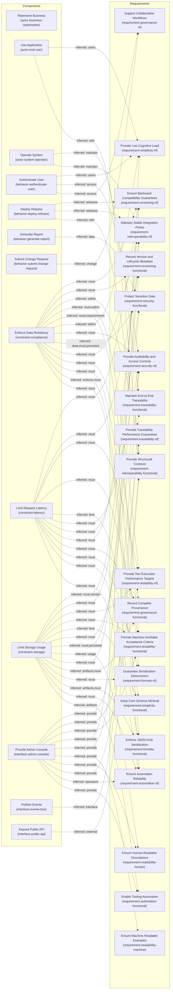

# Components → Requirements
Generated from `examples/cards/` and `examples/links/`

```mermaid
flowchart LR

subgraph Components
  actor_business_stakeholder["Represent Business\n(actor-business-stakeholder)"]
  actor_end_user["Use Application\n(actor-end-user)"]
  actor_system_operator["Operate System\n(actor-system-operator)"]
  behavior_authenticate_user["Authenticate User\n(behavior-authenticate-user)"]
  behavior_deploy_release["Deploy Release\n(behavior-deploy-release)"]
  behavior_generate_report["Generate Report\n(behavior-generate-report)"]
  behavior_submit_change_request["Submit Change Request\n(behavior-submit-change-request)"]
  constraint_compliance["Enforce Data Residency\n(constraint-compliance)"]
  constraint_latency["Limit Request Latency\n(constraint-latency)"]
  constraint_storage["Limit Storage Usage\n(constraint-storage)"]
  interface_admin_console["Provide Admin Console\n(interface-admin-console)"]
  interface_events_bus["Publish Events\n(interface-events-bus)"]
  interface_public_api["Expose Public API\n(interface-public-api)"]
end

subgraph Requirements
  requirement_automation_functional["Enable Tooling Automation\n(requirement-automation-functional)"]
  requirement_automation_nf["Ensure Automation Reliability\n(requirement-automation-nf)"]
  requirement_formats_functional["Enforce JSON-Only Serialization\n(requirement-formats-functional)"]
  requirement_formats_nf["Guarantee Serialization Determinism\n(requirement-formats-nf)"]
  requirement_governance_functional["Record Complete Provenance\n(requirement-governance-functional)"]
  requirement_governance_nf["Support Collaborative Workflows\n(requirement-governance-nf)"]
  requirement_interoperability_functional["Provide Structured Contexts\n(requirement-interoperability-functional)"]
  requirement_interoperability_nf["Maintain Stable Integration Points\n(requirement-interoperability-nf)"]
  requirement_readability_human["Ensure Human-Readable Descriptions\n(requirement-readability-human)"]
  requirement_readability_machine["Ensure Machine-Readable Examples\n(requirement-readability-machine)"]
  requirement_security_functional["Protect Sensitive Data\n(requirement-security-functional)"]
  requirement_security_nf["Provide Auditability and Access Controls\n(requirement-security-nf)"]
  requirement_simplicity_functional["Keep Core Schema Minimal\n(requirement-simplicity-functional)"]
  requirement_simplicity_nf["Provide Low Cognitive Load\n(requirement-simplicity-nf)"]
  requirement_testability_functional["Provide Machine-Verifiable Acceptance Criteria\n(requirement-testability-functional)"]
  requirement_testability_nf["Provide Test Execution Performance Targets\n(requirement-testability-nf)"]
  requirement_traceability_functional["Maintain End-to-End Traceability\n(requirement-traceability-functional)"]
  requirement_traceability_nf["Provide Traceability Performance Guarantees\n(requirement-traceability-nf)"]
  requirement_versioning_functional["Record Version and Lifecycle Metadata\n(requirement-versioning-functional)"]
  requirement_versioning_nf["Ensure Backward Compatibility Guarantees\n(requirement-versioning-nf)"]
end

actor_end_user -.->|inferred: with| requirement_interoperability_functional
actor_end_user -.->|inferred: users| requirement_simplicity_nf
actor_system_operator -.->|inferred: maintain| requirement_interoperability_nf
actor_system_operator -.->|inferred: maintain| requirement_traceability_functional
behavior_authenticate_user -.->|inferred: access| requirement_governance_nf
behavior_authenticate_user -.->|inferred: access| requirement_security_nf
behavior_authenticate_user -.->|inferred: users| requirement_simplicity_nf
behavior_deploy_release -.->|inferred: with| requirement_interoperability_functional
behavior_deploy_release -.->|inferred: releases| requirement_interoperability_nf
behavior_deploy_release -.->|inferred: releases| requirement_versioning_nf
behavior_generate_report -.->|inferred: data| requirement_security_functional
behavior_submit_change_request -.->|inferred: change| requirement_governance_nf
constraint_compliance -.->|inferred: must| requirement_automation_nf
constraint_compliance -.->|inferred: enforce,must| requirement_formats_functional
constraint_compliance -.->|inferred: must| requirement_formats_nf
constraint_compliance -.->|inferred: must| requirement_governance_functional
constraint_compliance -.->|inferred: must| requirement_interoperability_nf
constraint_compliance -.->|inferred: data,must,persisted| requirement_security_functional
constraint_compliance -.->|inferred: must| requirement_security_nf
constraint_compliance -.->|inferred: within| requirement_simplicity_nf
constraint_compliance -.->|inferred: must,requirements| requirement_testability_functional
constraint_compliance -.->|inferred: must,within| requirement_testability_nf
constraint_compliance -.->|inferred: within| requirement_traceability_nf
constraint_compliance -.->|inferred: must| requirement_versioning_functional
constraint_compliance -.->|inferred: must| requirement_versioning_nf
constraint_latency -.->|inferred: must| requirement_automation_nf
constraint_latency -.->|inferred: must| requirement_formats_functional
constraint_latency -.->|inferred: must| requirement_formats_nf
constraint_latency -.->|inferred: must| requirement_governance_functional
constraint_latency -.->|inferred: must| requirement_interoperability_nf
constraint_latency -.->|inferred: must| requirement_security_functional
constraint_latency -.->|inferred: must| requirement_security_nf
constraint_latency -.->|inferred: limit| requirement_simplicity_functional
constraint_latency -.->|inferred: must| requirement_testability_functional
constraint_latency -.->|inferred: must| requirement_testability_nf
constraint_latency -.->|inferred: must| requirement_versioning_functional
constraint_latency -.->|inferred: must| requirement_versioning_nf
constraint_storage -.->|inferred: artifacts| requirement_automation_functional
constraint_storage -.->|inferred: must| requirement_automation_nf
constraint_storage -.->|inferred: artifacts,must| requirement_formats_functional
constraint_storage -.->|inferred: must| requirement_formats_nf
constraint_storage -.->|inferred: artifacts,must| requirement_governance_functional
constraint_storage -.->|inferred: must| requirement_interoperability_nf
constraint_storage -.->|inferred: usage| requirement_readability_human
constraint_storage -.->|inferred: must,persisted| requirement_security_functional
constraint_storage -.->|inferred: must| requirement_security_nf
constraint_storage -.->|inferred: limit| requirement_simplicity_functional
constraint_storage -.->|inferred: must| requirement_testability_functional
constraint_storage -.->|inferred: must| requirement_testability_nf
constraint_storage -.->|inferred: must| requirement_versioning_functional
constraint_storage -.->|inferred: must,remain| requirement_versioning_nf
interface_admin_console -.->|inferred: provide| requirement_automation_functional
interface_admin_console -.->|inferred: operators| requirement_automation_nf
interface_admin_console -.->|inferred: provide| requirement_interoperability_functional
interface_admin_console -.->|inferred: provide| requirement_readability_human
interface_admin_console -.->|inferred: provide| requirement_readability_machine
interface_admin_console -.->|inferred: provide| requirement_security_nf
interface_admin_console -.->|inferred: provide| requirement_simplicity_nf
interface_admin_console -.->|inferred: provide| requirement_testability_functional
interface_admin_console -.->|inferred: provide| requirement_testability_nf
interface_admin_console -.->|inferred: provide| requirement_traceability_nf
interface_events_bus -.->|inferred: interface| requirement_traceability_functional
interface_public_api -.->|inferred: external| requirement_interoperability_functional
```
