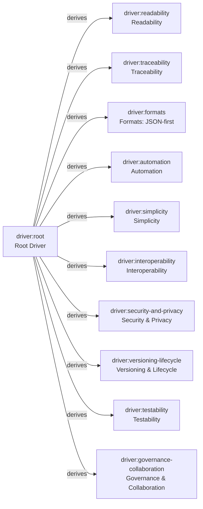

# Drivers (SysML Requirements View)

This diagram shows the AURORA Root Driver and the primary derived drivers as a SysML-style requirements view. Each node corresponds to a driver card (one element = one card). Links are typed as `derives` to indicate derivation from the Root Driver.

Notes:

- Node labels show the card `id` and a short name; update labels if you rename or add driver cards.
- This is a documentation view only; the canonical relationships live on the card `relations` and/or explicit `link` artifacts under `examples/cards/`.
- To render locally, use a Markdown viewer that supports Mermaid, or preview via GitHub Pages.
