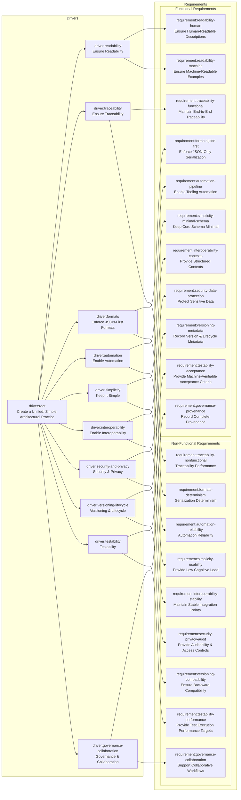

# Requirements View

This diagram shows drivers and their derived requirements (functional and non-functional).

```mermaid
graph LR
  subgraph Drivers
    D_ROOT["driver:root\nCreate a Unified, Simple Architectural Practice"]
    D_READ["driver:readability\nEnsure Readability"]
    D_TRACE["driver:traceability\nEnsure Traceability"]
    D_FORMATS["driver:formats\nEnforce JSON-First Formats"]
    D_AUTO["driver:automation\nEnable Automation"]
    D_SIMPLE["driver:simplicity\nKeep It Simple"]
    D_INTEROP["driver:interoperability\nEnable Interoperability"]
    D_SEC["driver:security-and-privacy\nSecurity & Privacy"]
    D_VER["driver:versioning-lifecycle\nVersioning & Lifecycle"]
    D_TEST["driver:testability\nTestability"]
    D_GOV["driver:governance-collaboration\nGovernance & Collaboration"]
  end

  subgraph Requirements
    subgraph Functional_Requirements[Functional Requirements]
      R_READ_H["requirement:readability-human\nEnsure Human-Readable Descriptions"]
      R_READ_M["requirement:readability-machine\nEnsure Machine-Readable Examples"]
      R_TRACE_F["requirement:traceability-functional\nMaintain End-to-End Traceability"]
      R_FMT_F["requirement:formats-json-first\nEnforce JSON-Only Serialization"]
      R_AUTO_F["requirement:automation-pipeline\nEnable Tooling Automation"]
      R_SIMPLE_F["requirement:simplicity-minimal-schema\nKeep Core Schema Minimal"]
      R_INTEROP_F["requirement:interoperability-contexts\nProvide Structured Contexts"]
      R_SEC_F["requirement:security-data-protection\nProtect Sensitive Data"]
      R_VER_F["requirement:versioning-metadata\nRecord Version & Lifecycle Metadata"]
      R_TEST_F["requirement:testability-acceptance\nProvide Machine-Verifiable Acceptance Criteria"]
      R_GOV_F["requirement:governance-provenance\nRecord Complete Provenance"]
    end

    subgraph NonFunctional_Requirements[Non-Functional Requirements]
      R_TRACE_N["requirement:traceability-nonfunctional\nTraceability Performance"]
      R_FMT_N["requirement:formats-determinism\nSerialization Determinism"]
      R_AUTO_N["requirement:automation-reliability\nAutomation Reliability"]
      R_SIMPLE_N["requirement:simplicity-usability\nProvide Low Cognitive Load"]
      R_INTEROP_N["requirement:interoperability-stability\nMaintain Stable Integration Points"]
      R_SEC_N["requirement:security-privacy-audit\nProvide Auditability & Access Controls"]
      R_VER_N["requirement:versioning-compatibility\nEnsure Backward Compatibility"]
      R_TEST_N["requirement:testability-performance\nProvide Test Execution Performance Targets"]
      R_GOV_N["requirement:governance-collaboration\nSupport Collaborative Workflows"]
    end
  end

  %% driver -> requirement edges (derived-from)
  %% root -> top-level drivers (derivation source)
  D_ROOT --> D_READ
  D_ROOT --> D_TRACE
  D_ROOT --> D_FORMATS
  D_ROOT --> D_AUTO
  D_ROOT --> D_SIMPLE
  D_ROOT --> D_INTEROP
  D_ROOT --> D_SEC
  D_ROOT --> D_VER
  D_ROOT --> D_TEST
  D_ROOT --> D_GOV

  D_READ --> R_READ_H
  D_READ --> R_READ_M
  D_TRACE --> R_TRACE_F
  D_TRACE --> R_TRACE_N
  D_FORMATS --> R_FMT_F
  D_FORMATS --> R_FMT_N
  D_AUTO --> R_AUTO_F
  D_AUTO --> R_AUTO_N
  D_SIMPLE --> R_SIMPLE_F
  D_SIMPLE --> R_SIMPLE_N
  D_INTEROP --> R_INTEROP_F
  D_INTEROP --> R_INTEROP_N
  D_SEC --> R_SEC_F
  D_SEC --> R_SEC_N
  D_VER --> R_VER_F
  D_VER --> R_VER_N
  D_TEST --> R_TEST_F
  D_TEST --> R_TEST_N
  D_GOV --> R_GOV_F
  D_GOV --> R_GOV_N

```
