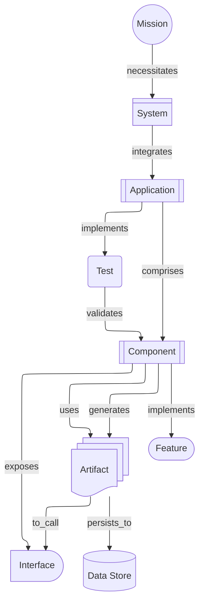

# Component View

A Component View shows the system's runtime and logical components, their public interfaces, and how they compose and depend on each other to realize features and services.

- **Cards**: `system`, `application`, `component`, `interface`, `test`, `artifact`, `data_store`
- **Optional Cards**: `mission`, `feature`

