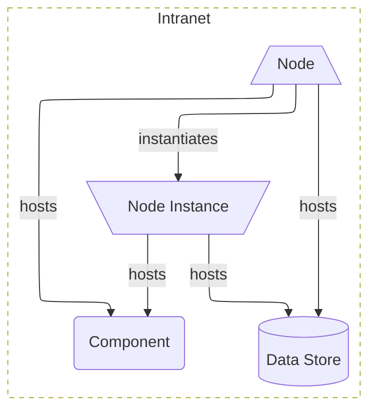

# Deployment View

A Deployment View shows the hosting topology—nodes, boundaries, and where components and applications are deployed.

- **Cards**: `component`, `data_store`, `node`, `node_instance`

> This diagram shows the rendering of a `boundary` card for the "Internet" zone. The links are `application` -- includes --> `boundary` -- contains --> `node`. The `boundary` has the property `"name": "Intranet"`, and the attribute `"recursive": true`. This gets interpreted as the boundary containing `node` and everything it links to, recursively, that is on the diagram.

