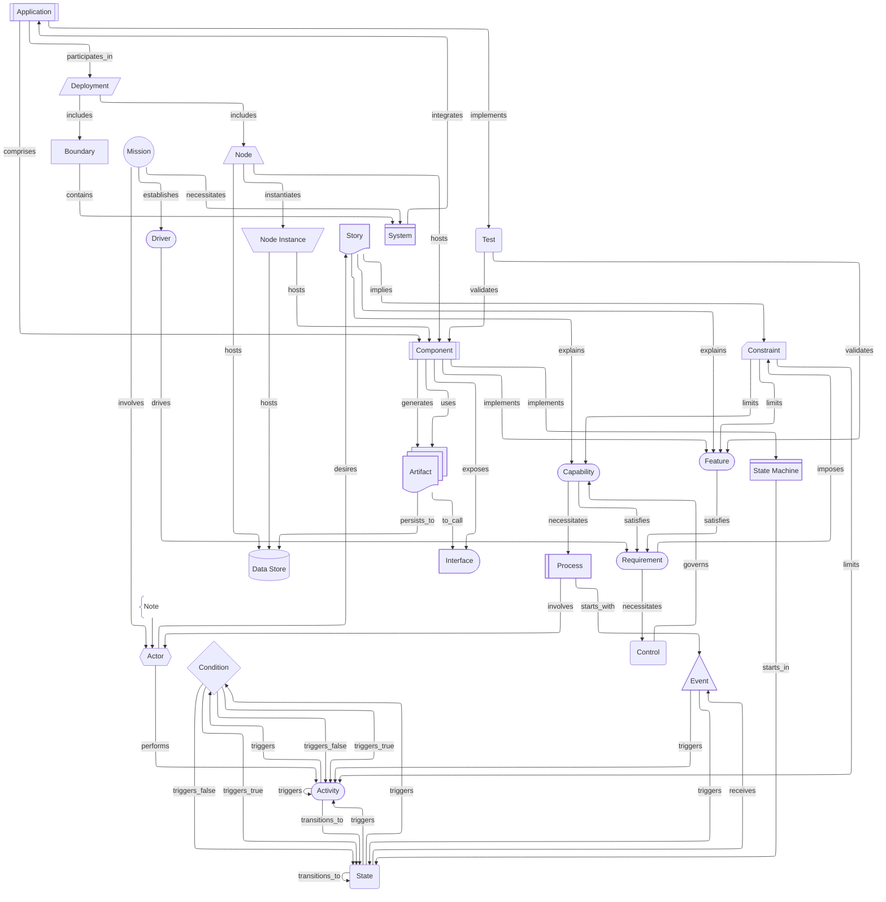

# Everything View

This view includes all cards and all links. For anything more than the simplest architectures, this will be a very noisy view.

- The `boundary` card is special. It can be inserted in between any two cards, generally alongside a direct link between them. It is linked `source -- includes --> boundary -- contains --> target`. It also has the attribute `"recursive"` which, if true, recursively includes all descendents of target _in the current view_ within the boundary. We render the `boundary` as a dashed box around the contents.
- The `note` card is also special. It does not have incoming links, only a single outgoing one. The outgoing link has the relationship `annotates`.We usually render is using a curly brace and unlabeled edge. The `note` card can link to _any_ other card, even `mission` and is not considered part of the graph.

This example shows, generally, how all default card types relate to each other. The boundary is rendered here as a card for visibility.

