# Requirements View

A Requirements View captures the system goals and constraints as testable, traceable requirements, showing their relationships to drivers, features, and tests.

- **Cards**: `mission`, `driver`, `capability`, `feature`, `requirement`, `constraint`, `test`, `control`
- **Optional Cards**: `actor`, `story`

```mermaid
---
config:
  layout: elk
---
%%{init: {'themeVariables': { 'clusterBkg': 'transparent' }}}%%
graph
	mission((Mission))
	driver([Driver])
	capability([Capability])
	feature([Feature])
	requirement([Requirement])
	constraint[Constraint]@{shape: card}
	test(Test)
	story[Story]@{shape: document}
	control(Control)

	subgraph Team
		actor{{Actor}}
	end

	mission -- establishes --> driver
	mission -- involves --> actor
	driver -- drives --> requirement
	capability -- satisfies --> requirement
	feature -- satisfies --> requirement
	requirement -- imposes --> constraint
	constraint -- limits --> capability
	constraint -- limits --> feature
	test -- validates --> feature
	actor -- desires --> story
	story -- explains --> feature
	story -- explains --> capability
	requirement -- necessitates --> control
	control -- governs --> capability
classDef dashed stroke-dasharray:5 5;
class Team dashed
```

