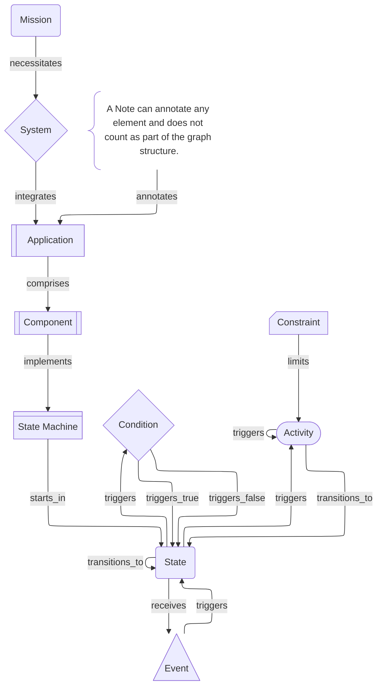

# State Machine View

A State Machine View models the lifecycle and valid transitions of a runtime element, showing its states, the conditions that guard transitions, events that trigger changes, and activities that occur within states.

- **Cards**: `component`, `state_machine`, `state`, `condition`, `activity`, `event`, `constraint`, `note`, `boundary`
- **Optional Cards**: `mission`, `system`, `application`

