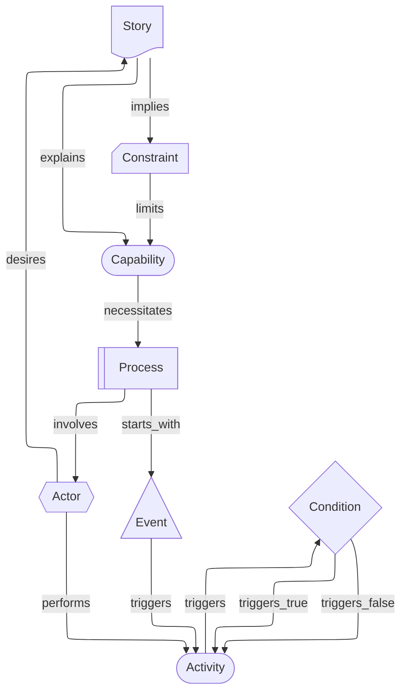

# Story View

A Story View captures user-centric scenarios combining use-case narratives and activity sequences, showing actors, goals, and step-by-step flows.

- **Cards**: `actor`, `story`, `activity`, `event`, `condition`, `constraint`, `process`, `capability`

